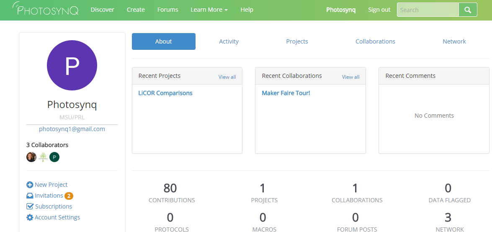

# Project Invitations

If somebody wants you to join a project that is not open to everyone, you will receive an invitation as a collaborator or admin.

## Accept Invitations

1. Open your user page by clicking on your name in the top **Menu**.
2. On the left hand side click on **Invitations**. The little badge indicates if there are new invites.
3. Check your list of available invitations and click on **Join** if you want to collaborate.

::: tip
**Tip:** Below the Project name it is indicated if you are invited as a **Collaborator** or **Administrator**.
:::

::: tip
**Tip:** You will receive an email as well. Click on the link inside the email to join the Project.
:::

## Decline Invitations

1. Open your user page by clicking on your avatar in the top **Menu**.
2. On the left hand side click on **Invitations**. The little badge indicates if there are new invites.
3. Check your list of available invitations and click on **Decline Invitation** if you don't want to collaborate on this Project.
