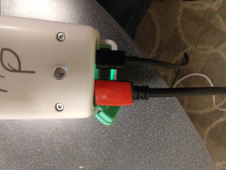
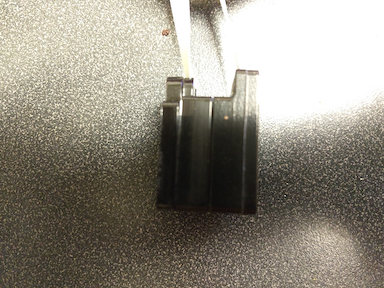

# CaliQ Calibration

Before getting started with the calibration, make sure you followed all the steps listed in the [Overview](./overview.md) and you have an external PAR sensor at hand.

::: warning External PAR Sensor Required!
If you don't have an external PAR sensor at hand, you are not able to recalibrate the CaliQ at this point.
:::

## External PAR sensor

In order to calibrate the CaliQ you require an additional external PAR sensor (not included with the CaliQ). One possible sensor would be the LI-COR® LI-190R. The MultispeQ PAR sensor can not be used as an external PAR sensor.

## Calibration Routine

### Select Protocol

Open the Desktop Application, connect the MultispeQ via USB to your computer and then establish a [connection to the Desktop Application](../desktop-application/connect-an-instrument.md).

#### Calibration Menu

Select <i class="fa fa-sliders"></i> **Settings** from the side menu on the left. Then select <i class="fa fa-bar-chart"></i> **Instrument Calibrations**. Scroll down and select the **Start** button to **Recalibrate CaliQ**.

#### Manual Selection

Select <i class="fa fa-area-chart"></i> **Protocols** from the side menu on the left. Then select <i class="fa fa-search"></i> **Explore** from the menu above the Protocol list and find the Protocol called **CALIQ CALIBRATION #1: Manually calibrate the CaliQ PAR sensor using External PAR with CaliQ LEDs (ONLY IF CALIQ NEEDS CALIBRATION)** and select **Run** from the side bar.

### Run Calibration Protocol

#### Step 1

The Protocol will prompt you to **“attach CaliQ device to the MultispeQ. Be sure to place connector in correct orientation”**. Attach the CaliQ to the instrument using a USBC cable. For a v2 device, make sure the Red side of the cable is facing up when attached to the MultispeQ. For a v1 device, make sure the White side is facing up. Select **OK** to make to continue.

::: tip Test CaliQ Connection
In case you have problems with the cable orientation, navigate to <i class="fa fa-sliders"></i> **Settings** and then <i class="fa fa-cogs"></i> Instrument Settings *before* starting the calibration. Scroll to down to **Instrument Information** and check the CaliQ connection by clicking on **Test**.
:::

#### Step 2

Next you will be prompted to **“Attach CaliQ LED light source to external PAR sensor. Allow to settle. ENTER VALUE INTO BOX”**. Press the external PAR sensor to the CaliQ LED Housing, and enter the value read by the PAR sensor into the prompt. Wait a little for the value to settle. Click **OK** to continue.

#### Step 3

Last the Protocol will prompt you to **“attach CaliQ LED light source to CaliQ PAR sensor”**. Take the CaliQ PAR Sensor (labeled with Yellow Tape), and attach it to the CaliQ LED module (Labeled with Blue Tape). Then, click **OK** to continue.

### Save Calibrations

Save the calibration results to the instrument by selecting the **Save to Instrument** button from the menu above the results. Confirm the popup dialog by selecting the **OK** button. The data shown in the dialog are the results and commands to save the calibrations.
