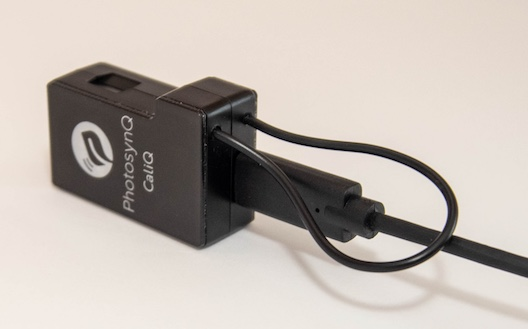

# CaliQ Calibration

Before getting started with the calibration, make sure you followed all the steps listed in the [Overview](./overview.md) and you have an external PAR sensor at hand.

::: warning External PAR Sensor Required!
If you don't have an external PAR sensor at hand, you are not able to recalibrate the CaliQ at this point.
:::

## External PAR sensor

In order to calibrate the CaliQ you will require an additional external PAR sensor (not included with the CaliQ). Possible sensors would be the LI-COR® LI-190R, the Walz GmbH MQS-B, or a similar cosine corrected light probe. The MultispeQ PAR sensor can not be used as an external PAR sensor.

## Calibration Routine

Open the Desktop Application, connect the MultispeQ to your computer and then establish a [connection to the Desktop Application](../desktop-application/connect-an-instrument.md). In this case a USB connection is preferred over Bluetooth.

### Start Calibration Protocol

The Protocol to run the calibration can be accessed in two ways, by navigating to the **Instrument Calibrations** under **Settings** or selecting the Protocol from the list of protocols directly. In any case the instructions on how to proceed after the calibration protocol is started, are the same.

#### Instrument Calibrations

Select <i class="fa fa-sliders"></i> **Settings** from the side menu on the left. Then select <i class="fa fa-bar-chart"></i> **Instrument Calibrations**. Scroll down and select the **Start** button to **Recalibrate CaliQ**.

#### Protocol List

Select <i class="fa fa-area-chart"></i> **Protocols** from the side menu on the left. Then select <i class="fa fa-search"></i> **Explore** from the menu above the Protocol list and find the Protocol called **CALIQ CALIBRATION #1: Manually calibrate the CaliQ PAR sensor using External PAR with CaliQ LEDs (ONLY IF CALIQ NEEDS CALIBRATION)** and select **Run** from the side bar.

### Protocol Steps

#### Step 1

The Protocol will prompt you to **“attach CaliQ device to the MultispeQ. Be sure to place connector in correct orientation”**. Attach the CaliQ to the instrument using a USB-C cable. Select **OK** to continue.

::: tip Test CaliQ Connection
In case you have problems with the cable orientation, please follow the instructions on [how to test the connection](../instruments/caliq.md#test-the-connection) *before* starting the calibration protocol.
:::

#### Step 2

Next you will be prompted to **“Attach CaliQ LED light source to external PAR sensor. Allow to settle. ENTER VALUE INTO BOX”**. Press the external PAR sensor to the CaliQ LED Housing, and enter the value read by the PAR sensor into the prompt. Wait a little for the value to settle.

Click **OK** to continue (in the picture a LI-COR® LI-190R was used, but any similar cosine corrected PAR sensor will work).

#### Step 3

Last the Protocol will prompt you to **“attach CaliQ LED light source to CaliQ PAR sensor”**. Take the CaliQ PAR Sensor and attach it to the CaliQ Light Source. Then, click **OK** to continue.

### Save Calibrations

Save the calibration results to the instrument by selecting the **Save to Instrument** button from the menu above the results. Confirm the popup dialog by selecting the **OK** button. The data shown in the dialog are the results and commands to save the calibrations.
