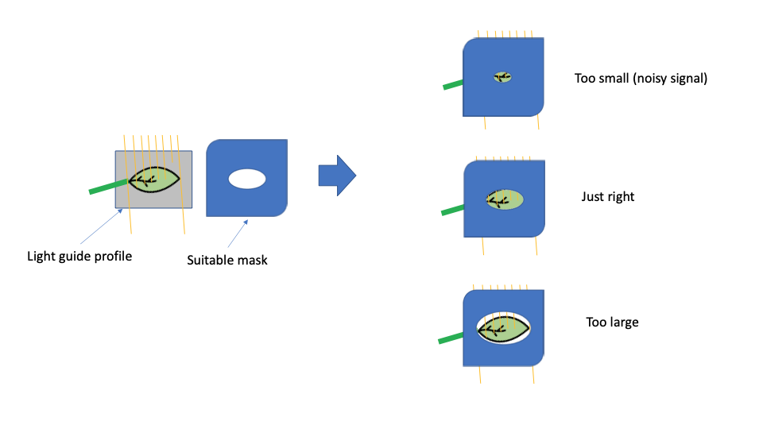

# Light Guide Mask Calibration

> Calibrating the Instrument to work with small leaves.

There have been several people who asked about using MultispeQ with a small leaf mask. Here is what you need to know and do:

Fluorescence-based measurements should be relatively unaffected by the size of the leaf (within reason), even if the leaf doesn’t completely cover the light guides.

However, all absorbance-based measurements can be strongly affected. These include:

1. SPAD, other pigment absorbance measurements
2. ECS signals
3. P700 and other IR signals. 

To use these, you should make a mask that covers the light guide with a hole as large as possible without letting light go around the leaf. The mask needs only to be applied to one side of the leaf clamp, just to prevent light from bypassing the leaf. We do not recommend using adhesive tape directly on the light guide and this will affect its optical properties and could result in damage. 

An example is given in the figure below. 

The addition of the mask will (obviously) change the light throughout, with the following consequences:

1. The smaller the hole, the less light will get through, so the signal-to-noise ratio will decrease. (your signals will look noisier). This effect can be ameliorated by making the mask hole as large as possible.

2. SPAD measurements will need to be recalibrated. Recalibrating the old style (e.g. Leaf Photosynthesis 1.0) SPAD measurements will be very tricky and we do not recommend using these any more, especially with leaf masks. We do not recommend using these old protocols with leaf masks. Instead, the new SPAD method can be readily recalibrated and will be much better (see Photosynthesis RIDES new SPAD DMK, below).

3. Leaf thickness measurements will also need to be recalibrated because the clamp will not close to the same level. 

4. Almost all absorbance measurements with the old style “Leaf Photosynthesis” protocols will not work. We do not recommend using these old protocols with leaf masks. Instead, the new protocols that use the auto_gain method (e.g. RIDES Photosynthesis) will automatically adjust the LED intensities and detector gains to match the light throughput (see below).

To calibrate you MultispeQ for Small Leaf Measurements, please follow these steps:

Update your device’s version to v2.16. This will require a CaliQ to ensure your device’s calibration is intact. Starting from v2.16, the MultispeQ’s primary SPAD measurement has been altered to be more accurate, and easier to implement into future protocols. To get accurate Small Leaf Measurements, we recommend using this newer SPAD method.

There are two ways to update firmware:
Send the device to PhotosynQ. For now, we recommend this approach because the team can make sure the device is fully working.
Get hold of a CaliQ device (coming soon!) and do it yourself.

Calibrate your MultispeQ up to the SPAD calibrations. It is important that the LEF PAR output is calibrated without the leaf mask! 

Remove the rubber Light Shields from the MultispeQ’s clamp, and insert the Small Leaf Mask over the upper or lower clamp’s light guide. The masks may need tape to fix securely to the clamp.

Connect the MultispeQ to the Desktop app.

Run the protocol “CAL#9: Spad Calibration (V3)”. Use the SPAD Calibration Cards shipped with your Instrument as instructed.

Click “Save to Instrument”.

The Device should now be calibrated for Small Leaf Measurements. Please use the protocol “Photosynthesis RIDES new SPAD DMK” for measurements with the Small Leaf Mask.

However, be aware that changing the mask position will alter the light throughput and require re-calibration*. 

*We are developing a set of masks that should be stably inserted, but for the present, we recommend taping the mask to the device so that it does not move between measurements. 

