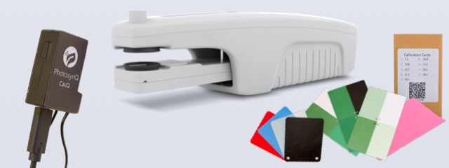
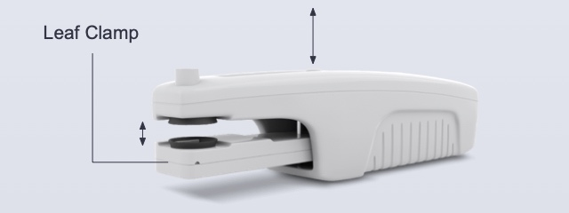
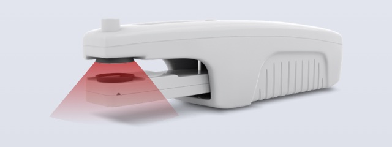
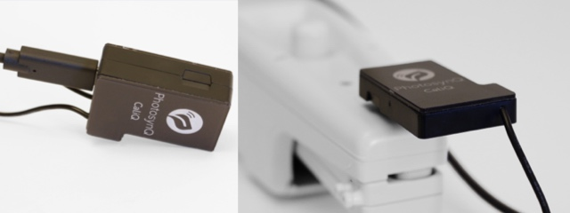
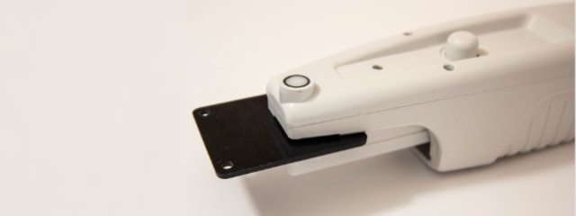
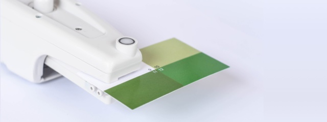

# MultispeQ v2.0 Calibration

Before getting started with the calibration, make sure you followed all the steps listed in the [Overview](./overview.md).

## Calibration Assistants

| Assistant | Description |
| :-------- | :---------- |
| **Complete Recalibration**   | Complete recalibration of the MultispeQ Instrument including the PAR Sensor, the LEDs of the main body and the Leaf Clamp, the Leaf Thickness Gauge, Relative Chlorophyll (SPAD), the Internal Compass and the Leaf Clamp's Open/Close position.  **Requirements:** &square; CaliQ Instrument &square; Chlorophyll Calibration Cards &square; Fluorescent Card (pink) &square; Thickness Calibration Cards |
| **Open & Close Positions**   | Set the open and close position of the Leaf Clamp. This becomes important when using the start protocol on open and/or close functions. This is not for calibrating the Leaf Thickness Gauge.|
| **LEDs**   | Recalibrate the Instrument’s LEDs to match the set light intensities defined in measurement protocols. LEDs with an emission peak between 400nm and 700nm are calibrated to output intensities in PAR.  **Requirements:** &square; CaliQ Instrument &square; Chlorophyll Calibration Cards &square; Fluorescent Card (pink) |
| **PAR Sensor**   | Calibrate the Instrument's PAR sensor.  **Requirements:** &square; CaliQ Instrument |
| **Leaf Thickness**   | Calibrate the Instrument's Leaf Thickness Gauge.  **Requirements:** &square; Thickness Calibration Cards |
| **Relative Chlorophyll (SPAD)**   | Calibrate the MultispeQ for relative Chlorophyll measurements (Minolta SPAD).  **Requirements:** &square; Chlorophyll Calibration Cards |

## Manual Calibrations

::: tip Note
Make sure to follow the steps in the correct order when a calibration contains multiple steps. The same is the case for steps within a calibration routine.
:::

### Calibrate PAR Sensor

| Calibrate PAR Sensor | Description | Details | Firmware |
| :------------------- | :---------- | :-----: | :------: |
| **Step 1:** Calibrate PAR Sensor | Follow the instructions prompted by the protocol. | [view](https://photosynq.org/protocols/2225) | `>=2.34` |

When using the CaliQ for calibrating the PAR sensor, make sure it is connected and communicating before starting the calibration procedure. To check if it is properly connected, go to [Instrument Settings](https://help.photosynq.com/instruments/instrument-settings.html) and test the connection.

`Note:` *These calibration steps require a CaliQ*

### Calibrate LEDs

| Calibrate LEDs | Description | Details | Firmware |
| :------------- | :---------- | :-----: | :------: |
| **Step 1:** Main Body LEDs | Follow the instructions prompted by the protocol. Make sure the CaliQ sensor has a snug fit. | [view](https://photosynq.org/protocols/2280) | `>=2.34` |
| **Step 2:** Leaf Clamp LEDs | Follow the instructions prompted by the protocol. Make sure the CaliQ sensor has a snug fit. | [view](https://photosynq.org/protocols/2279) | `>=2.34` |
| **Step 3:** IR LEDs | Follow the instructions prompted by the protocol. | [view](https://photosynq.org/protocols/2229) | `>=2.34` |

`Note:` *These calibration steps require a CaliQ*

### Electronic Offsets

| Electronic Offsets | Description | Details | Firmware |
| :----------------- | :---------- | :-----: | :------: |
| **Step 1:** Detector Offsets | Follow the instructions prompted by the protocol. | [view](https://photosynq.org/protocols/2230) | `>=2.34` |
| **Step 2:** Detector Offsets - Fluorescence | Follow the instructions prompted by the protocol. | [view](https://photosynq.org/protocols/2231) | `>=2.34` |

`Note:` *These calibration steps require the chlorophyll calibration and the pink fluorescent cards*

### Calibrate Leaf Thickness

| Calibrate Leaf Thickness | Description | Details | Firmware |
| :----------------------- | :---------- | :-----: | :------: |
| **Step 1:** Leaf Thickness Gauge | Follow the instructions prompted by the protocol. Make sure the r² value is 0.98 or higher. If it is not the case, repeat the calibration. | [view](https://photosynq.org/protocols/2232) | `>=2.34` |

`Note:` *These calibration steps require the thickness calibration cards*

### Calibrate Relative Chlorophyll

| Calibrate Relative Chlorophyll | Description | Details | Firmware |
| :----------------------------- | :---------- | :-----: | :------: |
| **Step 1:** Relative Chlorophyll (SPAD) | Follow the instructions prompted by the protocol. Make sure the panels of the calibration cards are properly clamped. | [view](https://photosynq.org/protocols/1890) | `>=2.34` |

`Note:` *These calibration steps require the chlorophyll calibration cards*

### Reset Instrument

| Reset Instrument | Description | Details | Firmware |
| :--------------- | :---------- | :-----: | :------: |
| Reset to Default | Reset the MultispeQ to its default settings and remove all calibrations | [view](https://photosynq.org/protocols/2221) | `>=2.34` |

`Note:` *After this step you must finish all further recalibration steps to use the MultispeQ!*

