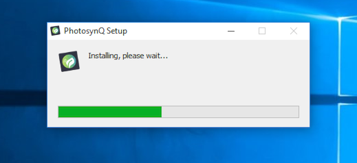
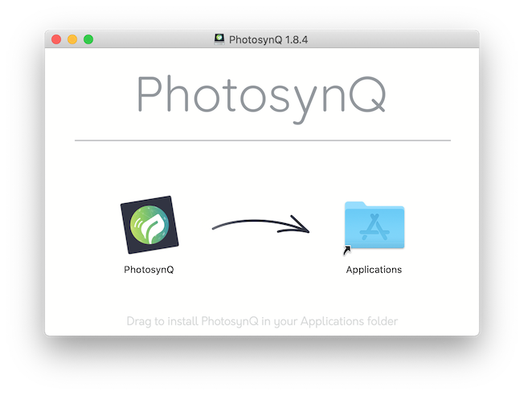
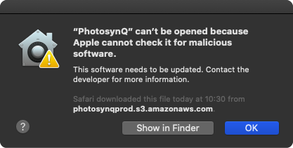
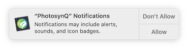
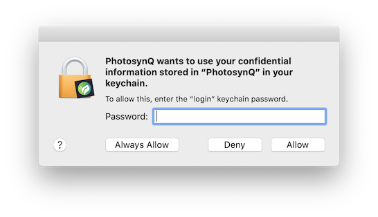

# Installing the Application

Taking measurements in the lab or developing new measurement protocols and macros? The desktop application allows you to do that amongst many other bench top related tasks.

## Download the PhotosynQ Application

1. Go to [https://photosynq.org/software](https://photosynq.org/software/#desktop) and scroll to the **Desktop App**.
2. Download the application for your operating system.

## Installation

### Windows

1. Navigate to the file you just downloaded.
2. Double click on the executable file to start the installation.
3. The application gets installed into the default windows application folder (e.g. `C:\Program Files`).
4. A short-cut is added to the Desktop.
5. Double click the shortcut on your Desktop to start the application.

::: warning Note
When using Windows older than Windows 10, a serial driver needs to be installed. Download the [Windows Serial Installer](https://www.pjrc.com/teensy/serial_install.exe) from the PJRC website (Teensy Micro Controller).
:::

***

### macOS

1. Navigate to the file you just downloaded, usually your downloads folder.
2. Double click the file to open the disk-image.
3. Drag 'n drop the application icon onto the application icon to install the application
4. Navigate to your desktop and drag 'n drop the disk image icon from your desktop onto the trash bin to eject the mounted disk image.
5. Open your "Applications" folder and double click the icon to start the application.
6. If a notification comes up prohibiting the application to start, please see **Security and privacy** below.

::: warning Security and Privacy
In macOS Catalina (v 10.15), the gatekeeper will not allow to start applications that have been installed from outside the Apple App Store right away with the Notification **"PhotosynQ" can't be opened because Apple cannot check it for malicious software.** 

Please find the instructions in the [macOS User Guide](https://support.apple.com/guide/mac-help/open-a-mac-app-from-an-unidentified-developer-mh40616/mac) on how to start the application. This warning will only appear the first time you open the application.
:::

#### Notifications

When using macOS Catalina (v 10.15) you will be asked if you want to allow **Notifications** from the PhotosynQ application. You can adjust the settings at any time by opening the **System Preferences** and selecting the **Notifications** menu.

#### Keychain Access

MacOS users will be asked if they want to give the application access to their keychain. Please select **Always Allow** to give permission to the PhotosynQ application to safely store and access the login information from the keychain.

***

### Linux

::: warning Note
Right now there is no stable version available. If you are interested in helping us testing, please send a request to <support@photosynq.org>.
:::

## Minimum Requirements

| Operating System |    Requirements     |
| :--------------- | :------------------ |
| macOS            | macOS 10.10 and later |
| Windows (x86)    | Windows 7 and later  |
| Linux (x64)      | Ubuntu 12.04, Fedora 21, Debian 8 and later |

## Starting the application for the first time

When you are starting the application for the first time you will be asked for your login credentials. If you don't already have an account, please follow the **sign up** link in the login dialog to create an account. After that use the login credentials to sign in to the application.

Further, you will be asked if you want to activate the location services. The location is used together with measurements in projects. You can activate or deactivate the services at any time in the [application settings].

## Updates

Updates are downloaded and installed automatically to make sure, you always have the latest version of the application.

::: tip Tip
You can activate / deactivate the automatic updates in the [application settings] at any time.
:::

### Troubleshooting

Sometimes the application does not work as expected. Please try this first:

- Make sure you have the latest version of the application.
- Make sure you have sufficient storage.
- Make sure you have an internet connection.
- Restart the device before installing.

[application settings]: ./settings.md
