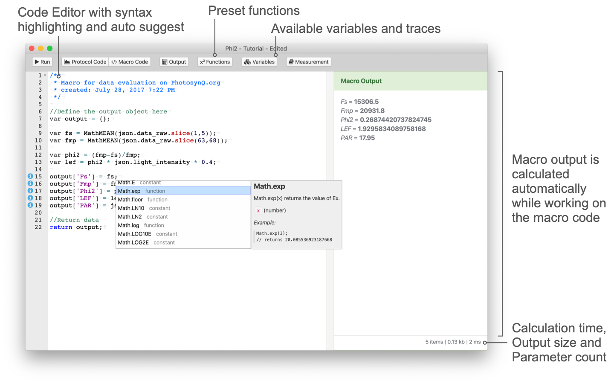
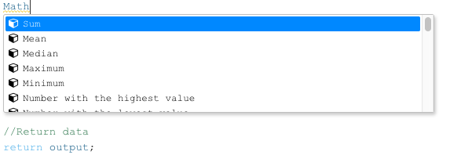

# Macro Editor

## Menu Bar

The **Menu Bar** holds dropdown menus, that allow you to write your Macro faster and make the underlying measurement data structure more accessible.

Use the **Measurement** button to select a measurement from your Notebook that you want to use as a template for your Macro. You can pick a new measurement at any time. When you load an existing Macro, the measurement saved along with the macro is automatically loaded.

The **Functions** dropdown contains all the preset functions that are supplied by PhotosynQ to make calculations faster and avoid recurring programming tasks. Find a list of all available functions [here](../macros/provided-functions.md).

The **Variables** dropdown contains the variables accessible from the underlying measurement. When using a measurement with a protocol set, the variables depend on the selected set.

Some parameters you want to output are using greek characters like delta (Δ). Use the **Symbols** dropdown to add them into your parameter names (e.g. ΔAbsorbance instead of delta Absorbance ).

## Code Editor

This is the place to write your Macro code. When you create a new Macro, the minimal required code is already added to this workspace. If you are new to coding, please see the tutorials on how to get started with a Macro.

If you start creating Macros, you will quickly realize, that some of the programming tasks are quite repetitive, like calculating a sum or mean, find the smallest or highest value, etc. The **Functions** from the **Menu Bar** allow you to skip these tasks and use preset functions. These functions vary from simple ones like find the highest value `MathMax()` or use Euler's number `Math.E`, to complex functions to transform traces `TransformTrace()` or Regressions `MathLinreg`. Selecting these functions from the menu will insert them at the current cursor position. The same applies to selecting anything from the autocomplete menu that appears while typing.

Protocols contain a variety of key value pairs like `data_raw` (array) containing the trace recoded by a detector or `time` (number - Unix timestamp in ms). You can simply select these from the **Variables** dropdown in the **Menu Bar** where they get inserted at the current cursor position or the autocomplete menu while you are typing. When you are writing a macro for a protocol set, the content of the menu will change depending on the set you have selected from the **Menu Bar**.

On the left hand-side there are not only the row numbers indicated, but also potential issues (warnings) and errors. Hover over the indicator with the mouse cursor to get an issue explanation. In case of errors, the error message will also be shown in the macro output when the automatic calculation is activated.

Sometimes the Macro code can be quite extensive. Use the keyboard shortcut `Ctrl+F / ⌘F` to search your code. Further the autosuggest function will list available functions, measurement variables and local variables as you type. You can bring up the autosuggest menu at any time using the shortcut `Ctrl+Space / ⌥Space`.

## Traces

Most Protocols use at last one of the Instrument's detectors to record traces or spectra. To make it easier to work with those traces, you can simply click on a trace and the variable with the array position is added to your code (eg `json["data_raw"][59]`). Yet, most of the times you will be more interested in a subsection of your trace. Use the **Range** checkbox. Now you can highlight a range by clicking and dragging to insert it into your code (e.g. `json["data_raw"].slice(56,66)`). And of course you can use click and drag to zoom into your trace as long as **Range** is not active.

## Macro Output

The Macro is executed as you are writing the code, so you can see, for example, how changes in an equation affect the output in real time. By default this automatic calculation is activated, indicated by the checkbox labeled with **Auto**. In some cases, the calculations can cause the editor to behave sluggish, especially when you output a lot of traces. In this case you can deactivate the automatic calculations by removing the check from the checkbox. To see the Macro output you can run a calculation using the keyboard shortcut `Ctrl+Shift+R / ⌥⇧R` or `Ctrl+Enter / ⌘Enter`.

::: tip Tip
Make sure you test your Macro extensively, using multiple measurements. Otherwise, you might end up with a large number of failed calculations.
:::
