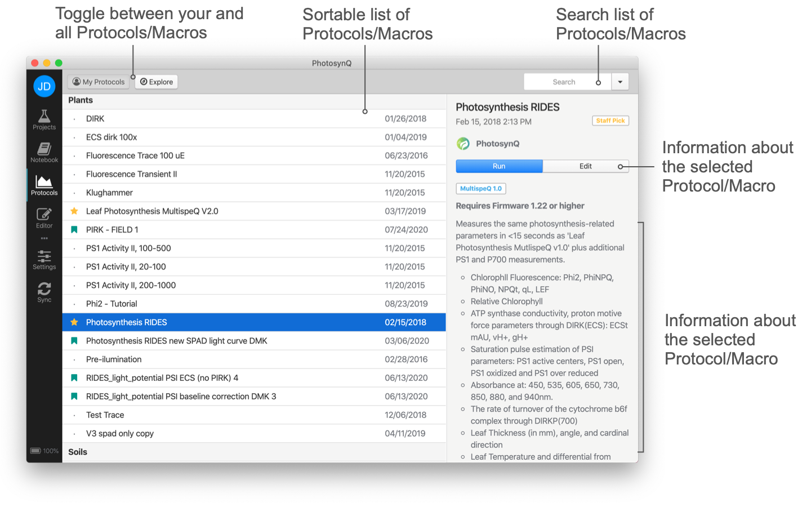

# Macros

Macros are used to calculate parameters from a measurement. To work with Macros you have to select **Protocols** from the left side bar, or you can select **View → Protocols** from the top menu bar or you can use the shortcut <kbd>Ctrl/⌘</kbd>+<kbd>3</kbd>.

**My Protocols** shows a list of Protocols with Macros you have created. **Explore** will provide a list of all Protocols with Macros currently available on the Platform. Click on the list headers to sort the list of Protocols by name, creator, and date.

A **single click** on a Protocol from the list will bring up details about the Protocol in the right side bar. Here you can also see the discussion around the Protocol/Macro as well as add new comments. A **double click** will run the Protocol. To open the Macro, click on the **Edit** button in the side bar and then select **Macro Code** from the top Menu.

Select the search field in the top right corner <kbd>Ctrl/⌘</kbd>+<kbd>F</kbd> to enter a search query followed by the enter key to search the list of Protocols with Macros. Use the <i class="fa fa-times-circle"></i> button inside the input field or the <kbd>Esc</kbd> key to reset the search.

## Create a new Macro

Marcos are part of a measurement Protocol. You can only create a new Macro as part of a Protocol by opening the Protocol editor selecting **File → New Protocol...** from the main menu. The Protocol and Macro template will be automatically added to your Protocol Editor and you are ask to pick a measurement from your Notebook to use as your measurement template. You can select that measurement at any time by selecting **Measurement** from the **Menu Bar**, or you can run the Protocol from the Editor and add the measurement to the Editor when the measurement is done.

## Editing an existing Macro

You can edit a Macro simply by selecting the Protocol that the Macro is attached to by selecting the Protocol from the list of Protocols and open the Editor by clicking on the **Edit** button on the side bar.
