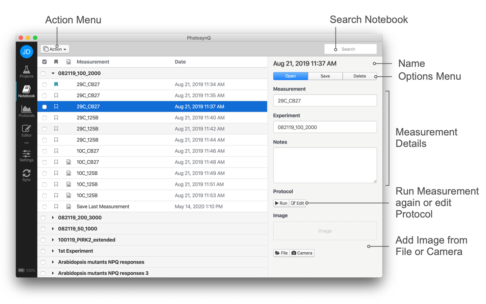

# The Notebook

If you are using the Desktop app you don't have to use **Projects** to save measurements. The **Notebook** allows save individual measurement along with notes and images. This is made for small scale experiments, as well as for testing and developing new measurement protocols.

## Take a Measurement

To take measurements and save them you have to run a Protocol from the **Protocol List** or the **Protocol Editor**. Measurements taken using **Projects** can't be saved to the Notebook.

## Save to Notebook

After the measurement is done, select the **Save** button or shortcut <kbd>Ctrl/⌘</kbd>+<kbd>S</kbd> to bring up the save dialog. Add a name for the measurement, as well as a name for the experiment. Further, you can add notes and attach an image by selecting a file from your local disk or using your webcam. Use the **Save** button at the bottom of dialog to save the measurement to the Notebook.

::: tip Tip
Notebook measurements are saved with the protocol used in the measurement. This is helpful, when developing a new Protocol and comparing variables.
:::

## View Measurements

To view a list of your taken measurements you can select **Notebook** from the left side bar, you can select **View → Notebook** from the top menu bar or you can use the shortcut <kbd>Ctrl/⌘</kbd>+<kbd>2</kbd>.

The measurements you have taken, are listed by experiments. If you want to change the sorting, use the **Sort by** dropdown menu above the table.
A click on a measurement will bring up details in the side bar on the right. You can also use the up and down arrow keys to navigate within the list.

To open and view a measurement, click on a measurement in the list and select **Open** from the side bar on the top or double click on the measurement in the list. A new window will open and show the measurement results. Multiple measurements can be opened at the same time. Simply check all the checkboxes for the measurements you want to open. Then pick **Open Selected** from the **Action** dropdown menu above the list of measurements. If measurements use the same protocol, traces will be displayed in the same graph, otherwise there will be a panel for each protocol.

## Re-Run a Measurement

With every measurement in the Notebook, the Protocol used gets saved as well. When you select a measurement, in the side bar on the right under Protocol, you can re-run the Protocol that was used for that particular measurement by selecting **Run**. You can also view or edit the Protocol by selecting **Edit**.

## Edit Measurement

In contrast to Projects, measurements inside the **Notebook** can be edited. Select a measurement with a click from the list to bring up the details in the sidebar on the right. Now you can change the **Name**, **Experiment** and **Notes** for the measurement. Also, you can add an image from a local source or your webcam or delete an existing one. When changing an image, the changes get saved automatically, otherwise you have to confirm your changes using the **Save** button at the top.

## Delete Measurement(s)

Select the measurement you want to delete from the list with a click to bring up the details in the sidebar on the right. Then, select the **Delete** button at the top. You will be asked to confirm the deletion of the measurement. This step can't be undone.

To delete multiple measurements, select the measurements to delete, by checking the checkboxes in the measurement list. Then pick **Delete Selected** from the **Action** dropdown menu above the measurement list to delete the measurements. You have to confirm the action before the measurements get deleted. This step can't be undone.

## Search

You can search the list of measurements by clicking into the input field or using the shortcut <kbd>Ctrl/⌘</kbd>+<kbd>F</kbd> and entering the search term followed by the enter key. Further, you can select all measurements with an image attached, all your favorites or all measurements from a specific experiment by selecting it from the dropdown menu next to the search field. Use the <i class="fa fa-times-circle"></i> button inside the input field or the <kbd>Esc</kbd> key to reset the search and show the complete list again.

## Favorite Measurement(s)

To more easily find important measurements, you can mark them as favorites by selecting the bookmark icon <i class="fa fa-bookmark-o"></i>. To mark multiple measurements as favorites, select the measurements by checking the checkboxes in the measurement list. Then pick **Favorite Selected** from the **Action** dropdown menu above the measurement list.

## Export Measurement(s)

You can share measurements with others, by exporting them from the Notebook. Select the measurements by checking the checkboxes in the measurement list. Then pick **Export Selected** from the **Action** dropdown menu above the measurement list. Enter a filename and save the selected measurements to a location on your hard-drive.

You can export the whole Notebook (consider this a backup), by selecting **File → Export Notebook...** from the main menu bar. Enter a filename and save the entire notebook to a location on your hard-drive.

## Import Measurement(s)

To import a set of exported measurements or an entire Notebook, simply select **File → Import Notebook...** from the main menu bar. Select the file you want to import from your local hard-drive and data will be imported into your Notebook.

::: warning Note
Duplicates will be imported without a warning.
:::
