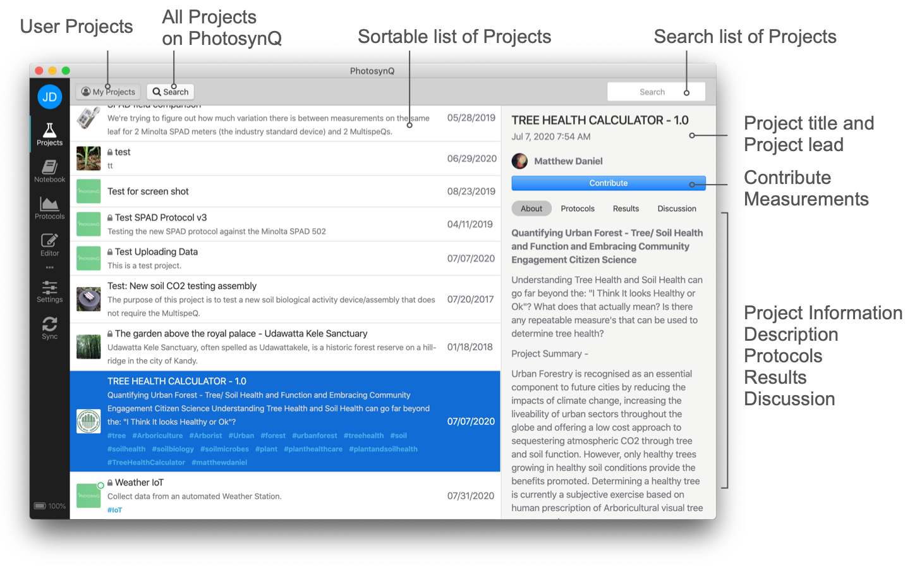
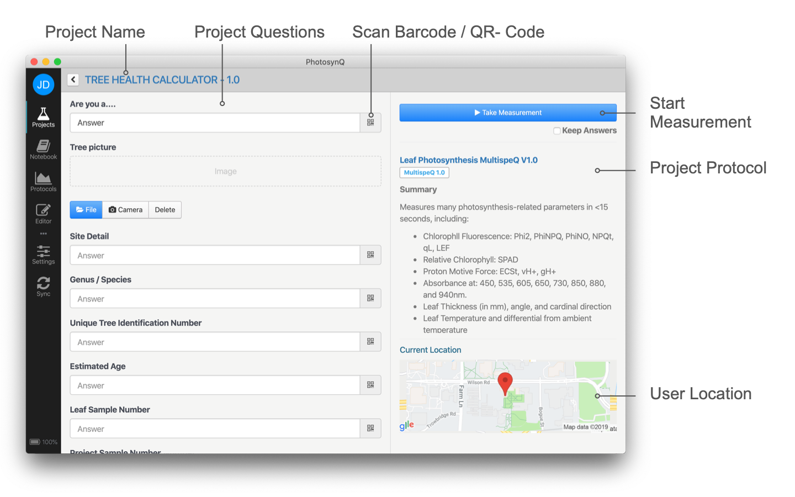

# Projects

While most users will use a mobile device in the field to collect data for Projects, the Desktop App provides almost all the features of the mobile app for data collection, as well as a few more for managing Projects.

To work with Projects you can select **Projects** from the left side bar, you can select **View → Projects** from the top menu bar or you can use the shortcut `Ctrl+1 / ⌘1`.

## My Projects

When working with Projects, you will find a list of all the Projects you have join under **My Projects**. You can sort the list of Projects, by clicking on the table headers.

A **single click** will bring up details about the Project in the right side bar, a **double click** will bring up the Project contribution with the Project questions. You can use the up and down arrow keys to navigate within the list.

If you create a new Project on the website, it will be automatically listed in your Desktop app under *My Projects** as well. In case the Project is not available in the list, try to synchronize the app, selecting **Synchronize** from the left menu bar, **File → Synchronize** from the top menu bar or the shortcut `Ctrl+Alt+S / ⌥⌘S`.

## Select a Project

When you select a Project from **My Projects** or from search results, details about the Project will be displayed in the right side bar. Under the **Contribute** or **Join** button, you will find the tabs **About**, **Protocols**, **Results** and **Discussion**.

### About

The **About** tab will provide the description of the project, as well as a map with the project locations.

### Protocols

The **Protocols** tab list the protocol(s) used in the Project. Click on the Protocol title to show Protocol in the apps **Protocol** list.

### Results

The **Results** tab will list the number of contributions made to the Project so far, as well as a button labeled **View Data** to access and analyze the collected data on the website (make sure you are signed in on the website). If the project lead has provided result, they will be displayed underneath as well.

### Discussion

The **Discussion** tab allows to discuss the Project in the same way as you can discuss it on the website. You can start a new thread using the **New Top** button, or you can select an existing thread and reply to a comment. If you want to attach images to your comment, you can click on the **picture** icon next to the comment field and attach up to three images to you comment. You can use markdown to format your comment.

### Editing a Project

In case you are the Project Lead, you will see an **Edit** button next to the **Contribute** button. When you select the **Edit** button, it will bring up the Project on the website so you can edit it (make sure you are signed in on the website). The changes to the Project will be synchronized with the app automatically. In case you cannot see the changes, try to synchronize the app, selecting **Synchronize** from the left menu bar, **File → Synchronize** from the top menu bar or the shortcut `Ctrl+Alt+S / ⌥⌘S`.

## Search

If you have long list of Projects, you can use the search field in the top left corner, by clicking into the input field or using the shortcut `Ctrl+f / ⌘f` and entering the search term followed by the enter key. Use the `×` button inside the input field or the `ESC` key to reset the search and show the complete list again.

To find new Projects select the **Search** button from above the list of **My Projects** and the search field in the upper right corner will be automatically selected. Type in your search term followed by the enter key. The first 10 search results are shown. Scroll to the end of the list and click on the **Load More** button to see more results. More Projects will be shown in increments of 10 and more result are loaded as you reach the end of the list.

Click on a Project in the list of search results to see detailed information in the right side bar.

## Join a Project

If you search for Projects and you find a Project you would like to participate in, you can join them from the app using the **Join** button. The Project will be automatically added to your list of **My Projects**, as well as in the mobile application and will also be available under **Collaborations** on your user profile at the website.

Some Projects cannot be joined, since they are only accessible to a small group of people. These Projects are indicated by a small **lock** icon in front of the Project title.

## Contributing to a Project

To contribute to a Project, select a Project from the **My Projects** list and click on the **Contribute** button in the right side bar or just double click on the Project in the list. You can always go back to the list of your Projects by clicking on the **back** button in front on the Project title on the top.

A list of all available Project questions will be displayed and depending on the type of question you will have the following input options:

+ A dropdown list with available answers.
+ An input field, if you have to enter an individual answer. A list of already given answers will be shown as you type.
+ If the Project has images attached to the list of answers, select an image to answer the question.

### Answering Questions

You have to answer all **Project Questions** in order to contribute a measurement. You can select **Keep Answers** below the **Take Measurement** button, if you take multiple measurements with the same set of answers.

### Scan Codes

Answers can also be given, by scanning Bar or QR codes (requires webcam). Select the scan icon next to the input field to use your webcam to scan a code. A dialog will be open up and you can select the input source if you have multiple cameras, otherwise the standard camera will be selected. Hold the code in front of the camera to scan it. When the code was read successfully, the dialog will be closed and the code content added into the input field. You can close the dialog at any time using the **Esc** key.

### Taking a Measurement

Once you have answered all the **Project Questions** you can select the **Take Measurement** button in the right side bar. The measurement will use the protocols listed underneath the button, as well as your **Current Location** as indicated on the small map. If no location information is available, you will see the warning **Unknown Location**. In this case you can still contribute a measurement, just laking the geo tag.

::: warning Note
When you push the **Take Measurement** button, the measurement, depending on the Protocol, might start right away.
:::

### Save Contribution

After the measurement has been taken, you can save the results to the Project using the **Save** button above the measurement results or you can **Discard** the measurement and repeat it. When you want to save your measurement, you can add notes and an image either using a local file or your webcam and then save it to the Project using the **Save** button at the bottom of the dialog. When you don't have an internet connection your measurement will be cached and submitted to the Project the next time you have a connection and the app is able to synchronize.
