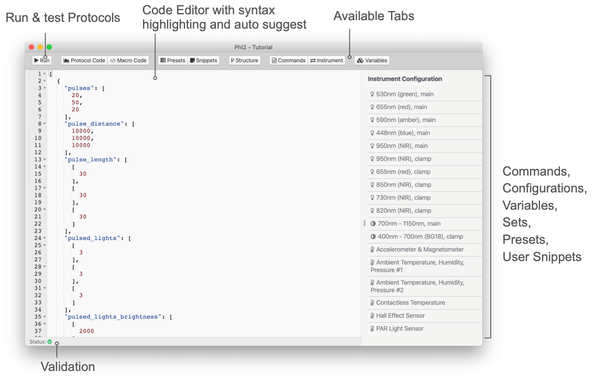

# Protocol Editor

The **Protocol Editor** allows you to build new Protocols with Macros or modify existing ones. Every Protocol has a Macro attached to calculate parameters from the recorded measurement results.

:::: tabs type:card

::: tab Protocol Code



:::

::: tab Macro Code


::::

## Protocol Code

The Code Editor in general works like any other text or code editor. It has syntax highlighting as well as error checking so you know at any time if the protocol has a valid format or not. Also, it is helpful when it comes to formatting and working with the code. If a red icon <i class="fa fa-times-circle"></i> appears next to the line number, there is an error in the code either in that line or above. If there is a yellow warning icon <i class="fa fa-exclamation-triangle"></i>, the structure of the protocol is correct but a command used is incorrect, or a value provided is incorrect. In that case, you might be able to run the protocol, but it might not work as expected. When you have an Instrument connect, you will also get the commands for LEDs, Detectors and Miscellaneous Sensors. They are available in the auto-suggest popup (<kbd>Ctrl/^</kbd>+<kbd>Space</kbd>), as well as in the sidebar selecting **Instrument** from the top menu.


### Snippets

In order to get started or to avoid typing the same code over and over again, snippets can be used to make your work more efficient. Just hover over a snippet in the list to see a description, or double click on it to insert it into the code at the cursor position.

**Presets:** These presets are snippets of code provided by PhotosynQ to make it easier to create protocols. You cannot modify the presets. To save your own snippets, use **My Snippets**. To add a preset to the code, just position the cursor where you want to insert it in the code. Double click on the preset in the list to insert it.

**My Snippets:** Here you can save your own snippets. Just highlight the code you want to save and select the **Add** button. Give it a name and hit Enter to save it or ESC to cancel. When hovering over a snippet, use **&times;** to delete a snippet. To add your snippet to the code, just position the cursor where you want to insert the snippet in the code. Double click on the snippet in the list to insert it.

::: warning Note
Snippets saved under **My Snippets** are saved locally only.
:::

### Structure

Protocols using `_protocol_sets_` can get very complicated. In this tab a list of available protocols within the set is shown. Drag and Drop the elements of the list to re-arrange the protocols within the set or to delete them click the **&times;** icon. You will not be asked if you want to delete the set, instead use the shortcut <kbd>Ctrl/⌘</kbd>+<kbd>Z</kbd> to undo the last step. Double click a Protocol to set the cursor to the beginning of the selected protocol within the code.

::: tip Tip
Use the command `label` to name your protocols within the set and to have easy access to their output within a Macro.
:::

### Commands

The list of [Protocol Commands](../protocols/commands.md) available for the Instrument. Hover over a command on the list to get detailed information. Double click the command to insert it into the code at your cursor position.

### Instrument

The Instrument configuration is listed (e.g. [MultispeQ v2.0](../instruments/multispeq-v2.0-configuration.md)) when an Instrument is connected. You can double click on each element in the list to add the commands into your code. LED's and Detector's are indicated by numbers, whereas sensors are indicated by strings.

### Variables (v_arrays)

The `v_arrays` holds values that can be used together with [variables](../protocols/variables.md). When pointing to a specific value in an array, you can use the `@n` followed by the number of the array starting at 0 followed by a `:` and the number of the element in the array starting at 0 (e.g. `@n1:0`). 

```javascript
...
"v_arrays": [
    [           // Array (1st)  "@s0"
        10,     // Variable     "@n1:0"
        200,
        ...
    ],
    [           // Array (2nd)  "@s2"
        20,     // Variable     "@n2:0"
        400,
        ...
    ],
    ...
],
...
```

Once you have a `v_arrays` defined, you can find a list of all available variables in this tab. Just double click on a set or value to insert into the code.

## Macro Code

When you start creating Macros, you will quickly realize, that some of the programming tasks are quite repetitive, like calculating a sum or mean, find the smallest or highest value, etc. The **Functions** from the **Menu Bar** allow you to skip these tasks and use preset functions. These functions vary from simple ones like find the highest value `MathMax()` or use Euler's number `Math.E`, to complex functions to transform traces `TransformTrace()` or Regressions `MathLinreg`. Selecting these functions from the menu will insert them at the current cursor position. The same applies to selecting anything from the autocomplete menu that appears while typing.

Protocols contain a variety of key value pairs like `data_raw` (array) containing the trace recoded by a detector or `time` (number - Unix timestamp in ms). You can simply select these from the **Variables** dropdown in the **Menu Bar** where they get inserted at the current cursor position or the autocomplete menu while you are typing. When you are writing a macro for a protocol set, the content of the menu will change depending on the set you have selected from the **Menu Bar**.

On the left-hand side there are not only the row numbers indicated, but also potential issues (warnings) and errors. Hover over the indicator with the mouse cursor to get an issue explanation. In case of errors, the error message will also be shown in the macro output when the automatic calculation is activated.


Sometimes the Macro code can be quite extensive. Use the keyboard shortcut <kbd>Ctrl/⌘</kbd>+<kbd>F</kbd> to search your code. Further, the autosuggest function will list available functions, measurement variables, and local variables as you type. You can bring up the autosuggest menu at any time using the shortcut <kbd>Ctrl/^</kbd>+<kbd>Space</kbd>.


### Output

The Macro is executed as you are writing the code, so you can see, for example, how changes in an equation affect the output in real time. By default this automatic calculation is activated, indicated by the checkbox labeled with **Auto**. In some cases, the calculations can cause the editor to be sluggish, especially when you output a lot of traces. In this case you can deactivate the automatic calculations by removing the check from the checkbox. To see the Macro output you can run a calculation using the keyboard shortcut <kbd>Ctrl/⌘</kbd>+<kbd>Shift/⇧</kbd>+<kbd>R</kbd> or <kbd>Ctrl/⌘</kbd>+<kbd>↵</kbd>.

::: tip Tip
Make sure you test your Macro extensively, using multiple measurements. Otherwise, you might end up with a large number of failed calculations.
:::

### Functions

The **Functions** tab contains all the preset functions that are supplied by PhotosynQ to make calculations faster and avoid recurring programming tasks. Find a list of all available functions [here](../macros/provided-functions.md).

### Variables

The **Variables** tab contains the variables accessible from the attached measurement. When using a measurement with a protocol set, the variables depend on the selected set.

Some parameters you want to output are using greek characters like delta (Δ). You can use Unicode **Symbols** (UTF-8) as you would use them in word processors like MS Word to add them into your parameter names (e.g. ΔAbsorbance instead of delta Absorbance). On macOS you can use **Edit Emoji & Symbols** <kbd>⌘^Space</kbd> to bring up the *Character Viewer* for an easier selection. On Windows use <kbd>Windows key</kbd>+<kbd>R</kbd> to launch Run, type `charmap` and hit Enter to open the *Character Map*.

Most Protocols use at last one of the Instrument's detectors to record traces or spectra. To make it easier to work with those traces, you can simply click on a trace and the variable with the array position is added to your code (eg `json["data_raw"][59]`). Yet, most of the time you will be more interested in a subsection of your trace. Use the **Range** checkbox. Now you can highlight a range by clicking and dragging to insert it into your code (e.g. `json["data_raw"].slice(56,66)`). Of course you can also use click and drag to zoom into your trace as long as **Range** is not active.

### Measurements

Use the **Measurement** button to select a measurement from your Notebook that you want to use as a template for your Macro. You can pick a new measurement at any time. When you load an existing Macro, the measurement saved along with the macro is automatically loaded.
