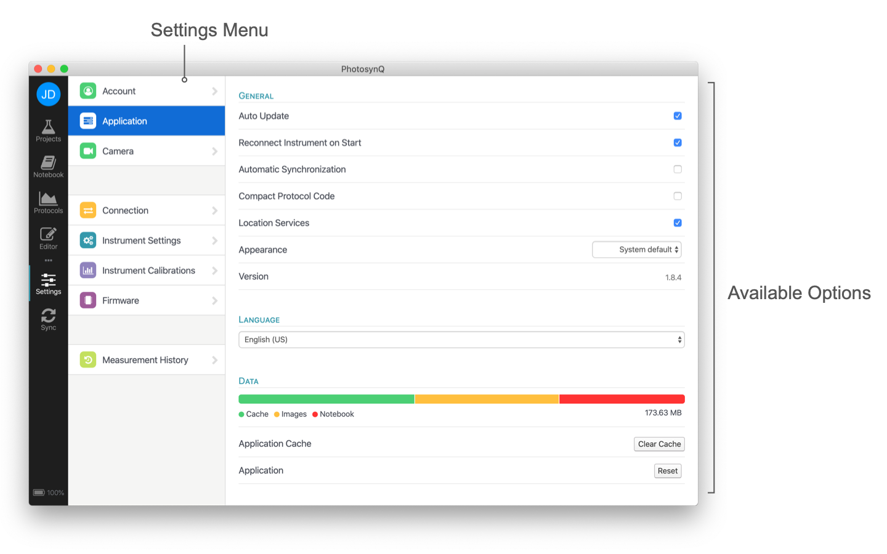

# Settings

You can find the Applications Settings under the **Settings dialog** by clicking on **Application**. You can bring up the Settings dialog by doing the following:

+ Left Menu bar <i class="fa fa-sliders"></i> Settings Icon
+ **Windows & Linux** Menu → Edit → Preferences
+ **Mac** Menu → PhotosynQ → Preferences

## Account

Information about your PhotosynQ account is listed here. Use **View Profile** to view your Profile on the PhotosynQ website, as well as edit information there. **Sign Out** will sign you out of the app which is also available through the menu by selecting **File → Sign Out**.

## Application

### Auto Update

Updates are automatically downloaded when available helping you to keep your Application up to date. When the download is finished, you can restart the Application to install the update, or wait until you start it up the next time.

When you deactivate the Auto Updates, you will be asked if you want to download the update and install it.

Every time you open the Application it will check for new updates. If you want to check in between, just select *Check for Updates...* from your Menu.

+ **Windows & Linux** Menu → Edit → Check for Updates...
+ **Mac** Menu → PhotosynQ → Check for Updates...

### Reconnect Instrument on Start

When activated, the next time you start the Application, it will try to reconnect to the last connected Instrument.

### Compact Protocol Code

When activated, the code in the Protocol Editor will be shown more compact (350 characters/row) to have a better overview. You can change back and forth at any point.

### Location Services

The Location Services are deactivated by default. We strongly recommend to activate them, so your location is attached to your measurements. This becomes very handy, if you have collaborations across multiple locations.

### Appearance (macOS)

By default, the Application's appearance is the system default, but you can switch between **Dark** and **Light** mode independent of your system settings. When switching, no restart of the Application is required.

### Version

Simply the released version of the Application.

### Language

The language used inside the Application. Currently, only English is supported. We are planing on providing multi language support. If you are interested in helping us making the application more accessible, please send us an email at <support@photosynq.org>.

### Data

The disk-space used by the Application to save things like Projects, Protocols and Macros, as well as images and your Notebook.

**Clear Cache**
All Projects, Protocols, Macros and images will be deleted and your data from PhotosynQ will be synchronized again.

::: warning Note
Your Notebook and cached Measurements will not be deleted.
:::

**Reset**
All Projects, Protocols, Macros, images, cached Measurements and your Notebook will be deleted. Also you will be signed out. To synchronize your data from PhotosynQ you have to sign in again.

::: warning Note
Make sure you have your Notebook exported, in case you want to use it in the future.
:::

## Camera

When a camera is available, either a built in webcam or an external camera, you can select and save the source here. The camera is used to scan QR- or Bar-Codes or save images of plants or what is needed to be documented. The camera will turn off, as soon as the camera settings are closed.

## Connection

Connect an Instrument via USB or Bluetooth here. Select the port the Instrument is connected to and select the **Connect** button. In case the port is not showing, use the refresh <i class="fa fa-refresh"></i> button to update the list. Backups are created, each time before firmware update.

Once an Instrument is connected, an image of the Instrument, its name, and the information as listed below are available. When clicking on the information icon behind the Instrument name, a browser window is opened with the Instrument configuration page of this documentation. Some Instruments are modified for special applications. In that case, *modified* is shown behind the Instrument's name as well.

| Item | Description |
| ---- | ----------- |
| Instrument ID | The ID of the connected Instrument. Every PhotosynQ Instrument has a unique ID. |
| Firmware | The current version of the firmware installed on the Instrument. |
| Updates | Manually check for updates or install an update manually. |
| Memory Backup | Date and Time of the last Instrument Memory Backup. A double click on the date/time will load the saved local file. |

::: tip
Go to [Connect an Instrument](./connect-an-instrument.md) for more details.
:::

## Instrument Settings

When an Instrument is connected, the available Settings are listed here. Depending on the type of Instrument and the firmware version installed on the Instrument this list might different. When Settings are changed, the [Console](./console.md) will open to confirm changes are made, requesting further input or providing information like the Instruments memory content. Most settings are available through [Console Commands](../instruments/console-commands.md) as well.

::: tip
Go to [Instrument Settings](../instruments/instrument-settings.md) for more details.
:::

## Instrument Calibrations

When an Instrument is connected, the available Calibration routines are listed here. Depending on the type of Instrument and the firmware version installed on the Instrument this list might different. Most Calibration steps run a measurement protocol. After the protocol is done, make sure to use the **Save to Device** button from the menu to finish the calibration. After that, return to the calibration list by selecting **Discard**.

::: tip
Go to [Instrument Calibrations](../instruments/instrument-calibrations.md) for more details.
:::

## Firmware

When an Instrument is connected and a new firmware version is available for the Instrument, you can find the details about the update, as well as source of the update here. The update process can be started from here as well as from the [Connection](#connection) menu.

::: tip
Go to [Firmware Updates](../instruments/firmware-updates.md#desktop-app) for more details.
:::

## Measurement History

Measurements without an internet connection for a Project will be cached and listed in the measurement history. These Measurements can be viewed (**View**) and deleted (**×**), but not edited. The next time an internet connection is available, the measurements are uploaded to the PhotosynQ cloud.

When taking Measurements directly from the list of [Protocols](./protocols.md) or the [Protocol Editor](./protocol-editor.md), the latest measurement will be available here. You can view (**View**) and delete (**×**) this Measurement. When viewing it, you can save the Measurement to the [Notebook](./notebook.md).

## What's New

Here you find the latest four posts from the [PhotosynQ Blog](https://blog.photosynq.org) so you will not miss news around PhotosynQ. It is also indicated, if there are new posts available.
