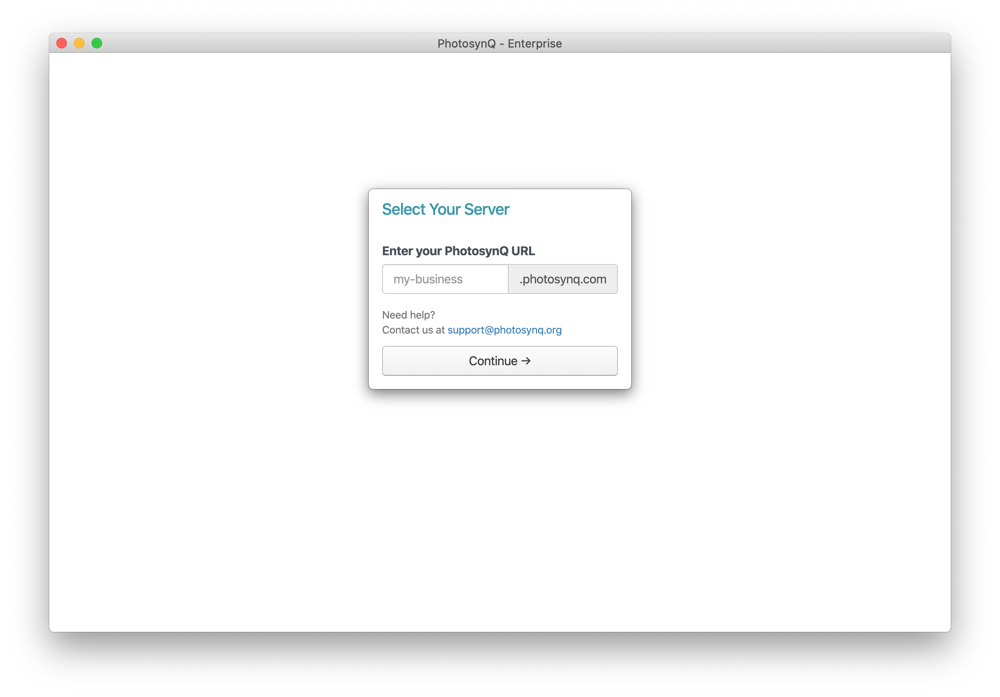

# Applications

When using the **Enterprise Edition** you will have to install custom applications that are only linked to your instance of PhotosynQ. You can download the applications simply by navigating to your instances url e.g. **https://my-instance.photosynq.com** and select **Software** from the top menu.

## Mobile Application

The Mobile Application is not distributed through the **Google Play Store**, but you are downloading an **APK** file, that you have to install on your Android device.

### Setting up the Device

1. Open your Android's Settings.
2. Find and tap **Apps and notifications**.
3. Find and tap **Install unknown apps or Install other apps**.

### Installing the APK

Select your browser and navigate to **https://my-instance.photosynq.com/software** replacing **"my-instance"** with your actual instance name. Download the file and confirm that you want to install the unknown application you just downloaded. After the installation is finished, the app will work in the same manner as the community version.

::: tip Resources
More on how to install APK's on Android devices you can find here: <https://www.wikihow.tech/Install-APK-Files-on-Android>.
:::

## Desktop Application

The installation of the Desktop Application works the same way it does for the community version. Select the application for the operating system you are using and download it. [Installation](../desktop-application/installation.md) as well as all other functions work the same way they do in the community version, including automated updates.

### Signing In

In contrast to the community version, the enterprise version of the app is accessing your own dedicated server. When using the Desktop Application in for the first time, you have to provide the URL for your enterprise, selecting the part of the url before `.photosynq.com` without the `https://`. After that you can just sign in with your email address and password.

