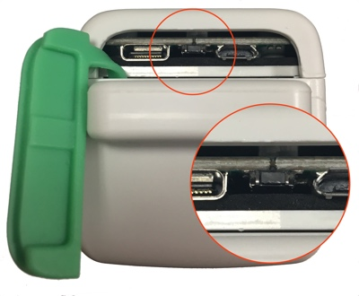
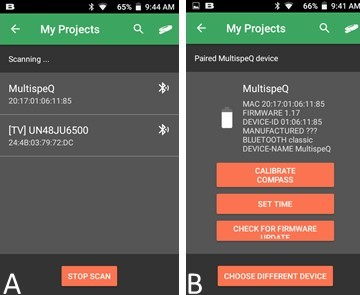
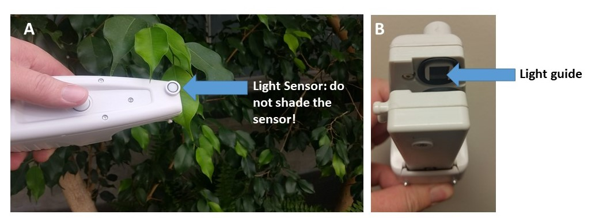
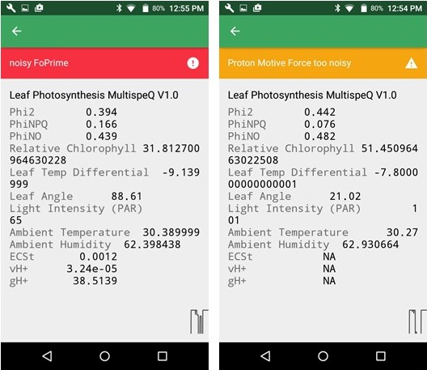
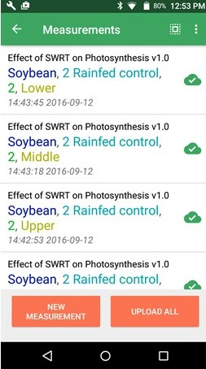
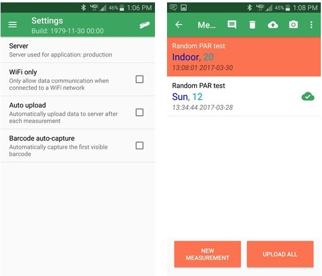

# Collecting Data

Once you have selected the Project that you want to contribute measurements to, you can start taking quality measurements by following these steps:

1. Before clamping the leaf, answer all of the questions listed in the Project
2. Select **measure.**
3. Clamp the leaf using the **Best Measurement Practices** listed below. The MultispeQ measures the leaf in its natural state. This means that changing the state of the leaf to take a measurement can affect your results!
4. Once the measurement is complete, confirm that the measurement quality is good (Some protocols wait for the clamp to be open and closed before they start).
5. Select **ACCEPT** if you want to submit the measurement to the website or **DISCARD** if you want to discard the measurement and try again.

::: tip Tip
If you are using the default protocol **Photosynthesis RIDES** the measurement will automatically start once you have opened the clamp and closed it over the leaf. Other protocols the measurement may begin as soon as you select **Take Measurement**. - **Make sure you know when the protocol you are using begins!**
:::

## Connect an Instrument

You can use Bluetooth or USB to connect your Instrument with your device. Depending on the Instrument and device, some connection options may not be available.

For data collection in the field, most people will use the mobile app. So lets focus on connecting the MultispeQ to your android phone. For tips on how to connect to the PhotosynQ desktop app please check out [Connect an Instrument - Desktop](../desktop-application/connect-an-instrument.md) or [Connect an Instrument - Mobile](../mobile-application/connect-an-instrument.md).

**Before connecting your MultispeQ to the Android or Desktop App you need to turn on the MultispeQ by pressing and holding the power button for 5 seconds.** The indicator light will blink once every ten seconds to let you know if it is turned on.

1. In the app, select the Instrument icon on the top right corner.
2. A list of available Bluetooth Instruments will appear.
3. Below the Instrument name will be its ID. This should match the MAC address on your Instrument (screen A, below)
   - If your Instrument does not appear, click on **SCAN DEVICES**
   - You may have to click **SCAN DEVICES** multiple times before your Instrument appears.
4. Select on the appropriate Instrument.
5. If this is your first time connecting this MultispeQ, a pop-up will appear asking to pair the device by entering the Instrument PIN. **The PIN is 1234 and is the same for every MultispeQ.**
6. After pairing the MultispeQ, you will be taken back to the Device list. Select your MultispeQ from the list, if the screen B (below) appears your device is connected.

**You are now ready to take measurements with your MultispeQ!**

::: tip
If you are having trouble connecting to the MultispeQ, please look for trouble shooting tips on [Connect an Instrument - Desktop](../desktop-application/connect-an-instrument.md) or [Connect an Instrument - Mobile](../mobile-application/connect-an-instrument.md)
:::

## Best Measurement Practices

+ Do not position your body so you are shading the leaf or the light sensor (A)
+ Do not pull the leaf out of the shade and into the sun or vice versa
+ Do not change the angle of the leaf, this will change how the leaf is intercepting light
+ In order for the compass measurement to be accurate, clamp the leaf on the left side when facing the stem.
+ Make sure the leaf completely covers the light guide (B). If the leaves you are measuring are too small, you may need to [mask](https://photosynqprod.s3.amazonaws.com/files/specialfeatures/measuring-small-leaves.pdf) the light guides and recalibrate the MultispeQ

## Understanding a Measurement

Once you have completed a measurement you will have the opportunity to examine it before submitting it to the website. Lets take a quick tour of your measurement!

::: warning Note
This section of the tutorial covers the default MultispeQ plant health protocol: **Photosynthesis RIDES**, and may not represent the results from other protocols.
:::

The graphical representation of the measurement is called a **trace**. The parameters output by the PhotosynQ platform are generated from values within this trace.

### Most Common Parameters

The MultispeQ returns a large number of parameters, including abiotic, fluorescence and absorbance based measurements. Which parameters are returned depends on the selected measurement Protocol and its Macro for evaluating the measurement. The following table just lists the most common parameters.

| Type         | Parameters                                                                                                                |
| :----------- | :------------------------------------------------------------------------------------------------------------------------ |
| Abiotic      | Ambient temperature, relative humidity, atmospheric pressure, leaf temperature, Photosynthetically Active Radiation (PAR) |
| Fluorescence | ΦII, ΦNPQ, ΦNO, LEF, NPQt [Φ most of the time written as *Phi*]               |
| Absorbance   | Relative Chlorophyll Content (SPAD), ECSt, vH⁺, gH⁺                                                            |

Additional parameters, information on how they can be derived, and references for them can be found [here](../view-and-analyze-data/references-and-parameters.md).

## Submitting Quality Measurements

Now that you are familiar with the parameters, you can check the quality of each measurement. If a measurement is out of the acceptable range or is too noisy a red **danger** or yellow **warning** notification will pop up describing the problem. Blue notifications are for information only.

::: tip Tip
The easiest way to ensure quality data is to discard poor data before it gets submitted to the website!
:::

One of the most common warning messages you will receive is that your data is too noisy. Noise can come from the sample shaking in the wind, the leaf slipping in the measurement chamber or a shaky hand. Stabilizing your hand and leaf stem often helps, but sometimes things are more complex. For example, if you measure a dead leaf, the app informs you that the values are very low, meaning that either you didn't measure a plant or something is probably wrong.

You can chose to keep the measurement from a dead leaf as a legitimate value or discard it. It depends on your Project goals.

If the measurement seems okay, values are in the reasonable range and there are no warnings you can go ahead and submit the measurement.

Once you submit the measurement you can see it in the **Measurements** tab, available in the menu on the android app. If there is a check next to the measurement, it has been submitted to the website.

To take another measurement, click on **new measurement**.

### Submit Cached Data

If you would prefer to manually submit your data, or to limit the auto upload feature to when you have wifi connection only (to avoid using mobile data), go to the **Settings** tab in the mobile app menu.This provides you more freedom to reconfirm all the measurements before submitting them to the website.

Before measurements are submitted to the website, you can also add notes, pictures, or even delete measurements directly from the **Measurements** tab.

## Methods of Data Collection

<iframe width="560" height="315" src="https://www.youtube.com/embed/4ylOPRLrS-s" frameborder="0" allowfullscreen></iframe>
