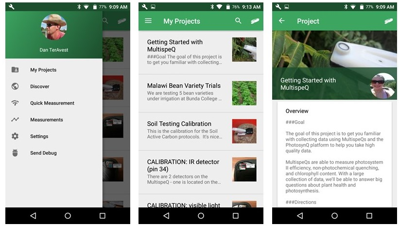
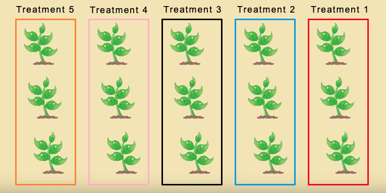
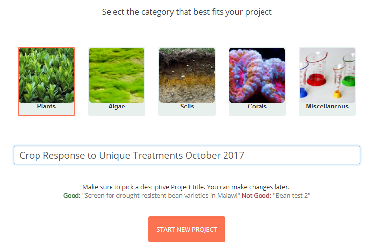
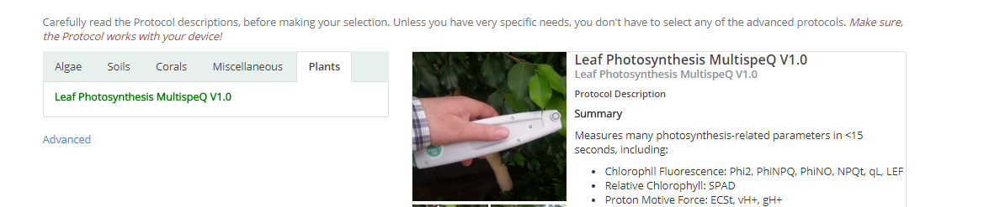
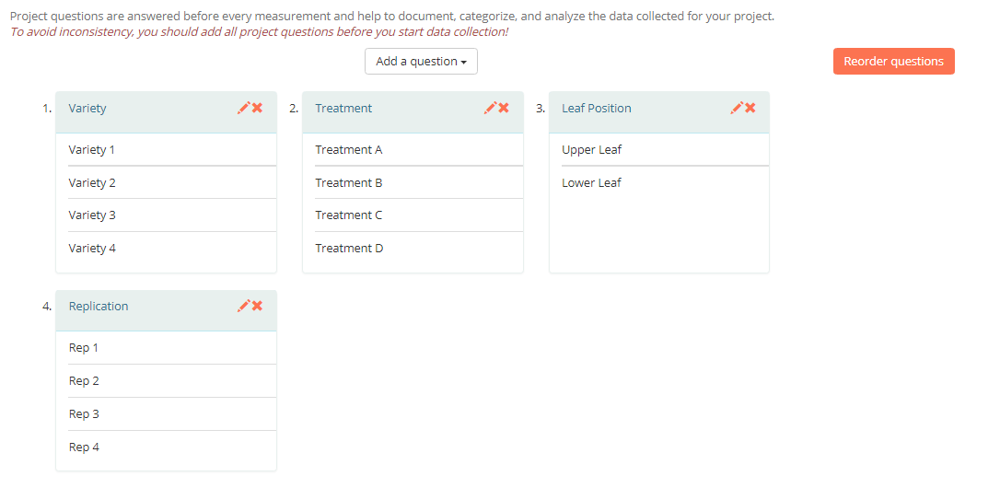
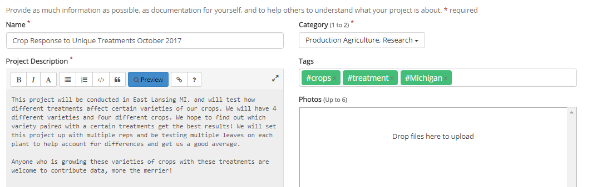
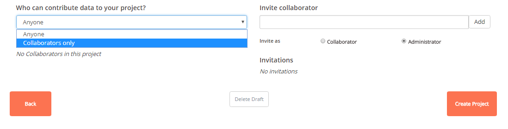
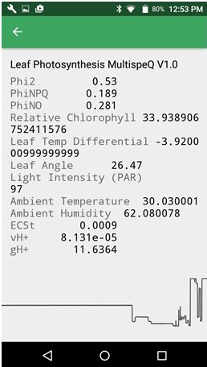

# Starting a Project

**Projects are the lifeblood of PhotosynQ, so it is important to understand what you are looking at!**

Inside the mobile app, you can find all the projects you have either created or joined. You can do this by selecting the menu in the upper left corner of the app and then selecting **My Projects**. Everyone is automatically joined to the tutorial project, [Getting Started with Multispeq](https://photosynq.org/projects/first-steps-with-multispeq).

With any project you join, be sure to check out the overview and directions for the project. These are sometimes the only source of communication between the project creator and you. Reading the directions is vital to taking proper measurements. If you have any additional questions about projects, these can be asked on the project discussion online.

Take a few measurements using the **Getting Started with MultispeQ** project or [create your own project](https://photosynq.org/projects/categories).

## Before You Start…

Before you go on the PhotosynQ website to create your project, first you have a few things to think about…

1. “What is it I am trying to learn from this project?”
2. “What are the different factors I am testing?”
3. “How can I break down and categorize each sample I am taking?”

Imagine you are working on the field in the picture below. Your goal is to figure out which varieties of your crop grow best using which treatment. What types of questions would you ask in this scenario? In order to know which ones to ask, ask yourself the three questions above and build from there.

1. I am trying to learn how different varieties respond to treatments.
2. The factors being tested are variety and treatment.
3. Each individual plot will have a certain variety of my crop and a treatment  paired with it. Other project design questions such as leaf position and replication will be used to further catagorize samples.

## New Project

Log into PhotosynQ and select **New Project** from the menu underneath your picture on your user page. Give it a detailed name that relates to your project. For example, naming your project just “crop testing”  would be a poor idea, as there are dozens of projects already about crops or with just the name “test”. Something like “Crop Response to Unique Treatments October 2017” will make your project distinct and easily searchable.

## Protocols

**Pick the protocol** that best suits your device and needs. For the majority of people the pre-selected protocol will do. If you have an Instrument other than a MultispeQ v2.0 or only need specific paramaters measured, this protocol will be different and you will need to select a protocol from the advanced list. Most importantly, be sure to read the protocol description to make sure that it measures the parameters you are interested in and is compatible with your device and firmware version.

## Project Questions

Here is where you need to take your answers to the aforementioned questions and turn them into project questions that will help you achieve your research goals. As seen in the image below, we decided we would have questions for:

1. Variety, to know which variety we tested
2. Treatment, to know how the crop was managed
3. Leaf Position, to test if the treatment will affect lower leaves differently than top leaves
4. Replication, since every good experiment has multiple replications

### Tips and Tricks for Choosing the Best Project Questions

Knowing how answers work is key for fast data collection and successful data analysis later on.

| Question&nbsp;Type | Description |
| :------------ | :---------- |
| **Multiple Choice** | The safest and quickest option, provided you know all the possible answers. |
| **Short Answers** | Provide answers to questions, but be careful! You might answer “red corn” once and then “Red corn.” Both may be the correct, but they will be sorted as different answers by the data explorer, since the answers are case sensitive. |
| **Multiple Choice with Pictures** | useful if you want to provide visual guidance, other than that, it is the same as a Multiple Choice Questions. Pictures cannot be analyzed in PhotosynQ. |
| **Take a Picture** | Questions can be cumbersome on both the measurer and when analyzing data later on. If a picture is only sometimes needed, use the **notes function** with the [Desktop](../desktop-application/adding-notes-and-pictures.md) or [Mobile](../mobile-application/adding-notes-and-pictures.md) Applications instead. |

You may notice there is a question for uploading questions/answers via a CSV, and this can be a powerful tool, especially if you have a large, well thought out experiment. For example, you would qualify for using a CSV if you had many varieties and knew how your field was laid out, so it would be possible to preload an exact plan to walk through the field. For more information on using a CSV for a large scale project you can check out our Guide [here](https://photosynqprod.s3.amazonaws.com/files/specialfeatures/uploading-project-questions-as-a-csv.pdf).

## Location

In the next screen, you will be asked to provide a Project Location. This is just so others have an idea of where the project is taking place. A project can have multiple locations, if you, for example, have a group of collaborators around the world.

## Description

The Description Page is next, and here you will fill in information about your project so that others can have a better understanding of what you are trying to accomplish.

1. You can fill out a full description of what your learning objectives are, how and where the experiment will be conducted, and how others can get involved and help out if it is a collaborative project. Use the preview button to see what the text looks like if you use formatting.
2. You will also need to categorize your project, so that it can be properly sorted. If you are doing a research project, you would pick the research category, or if you are working with students then the education selection would be more appropriate.
3. Finally you can add any tags you want. These act as hashtags and allow other users to find your project through these keywords. For example you could look up “trees” or “nematodes” and see all the other projects working on those to connect and collaborate with those researchers.

## Review

The review step allows you to see all the information about your project up to this point. If all information is the way you want it, continue to the next step, otherwise navigate directly to the previous steps to make your changes.

## Settings

The last step is to select who can contribute to your project and who you would like to invite or collaborate or be an administrator for the project besides you.

If you select “Collaborators only”, you have to invite collaborators who are allowed to contribute data to your project. Otherwise anybody can contribute. Invited users can either be collaborators, who can contribute data or Administrators, who can contribute data and also edit a project. These settings have no impact on viewing the data as any member of the PhotosynQ community can view your Project data.

Finally, after you have created or edited your project, you will need an internet connection on your mobile or desktop device to update your project in the app.

## Connecting and Collecting Data on Your Project

You will need to use the PhotosynQ mobile or desktop app to collect data as only the PhotosynQ apps can connect to the MultispeQ Instrument.

Once your project is updated and you have connected your MultispeQ, you can collect a large volume of data and store it locally on the app, even if you do not have internet connection. Once you have finished collecting data, you will need to upload your data to the PhotosynQ server.

When you collect data in your project, the way it is collected, and later interpreted/displayed is dependent on the protocol and the associated macro selected in the project creation. If you chose **Photosynthesis RIDES** like most users, the protocol will wait for the clamp to be opened then closed before beginning to run, after which the measurement will return data on your phone that looks something like this:

Measurements are either cached on the phone, or uploaded automatically to your project. Your results can be viewed and analyzed online by logging into PhotosynQ and finding your project in your profile. While you can see individual measurements on your phone, logging on to PhotosynQ will allow you to look at your whole dataset.

For more help on how to collect high quality data, best measurement practices, uploading cached data, or some tricks for data collection day, check out our [Data Collection Chapter](./collecting-data.md)!

## Viewing Project Data

Data can be viewed using the PhotosynQ data explorer on the PhotosynQ website.

After your day of data collection, viewing PhotosynQ data is quick and easy! Log in to your PhotosynQ online account and go to your profile page by clicking your name on the home-screen. After this, find your project on the dashboard, click and allow your landing page with your data to load up. For a more in depth look into data viewing, series creation, making graphs or downloading your data, check out our tutorial [here](./viewing-data.md). If you need some more help understanding the online data analysis tools, we have a guide for that too found [here](./data-analysis.md).
