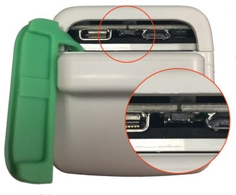
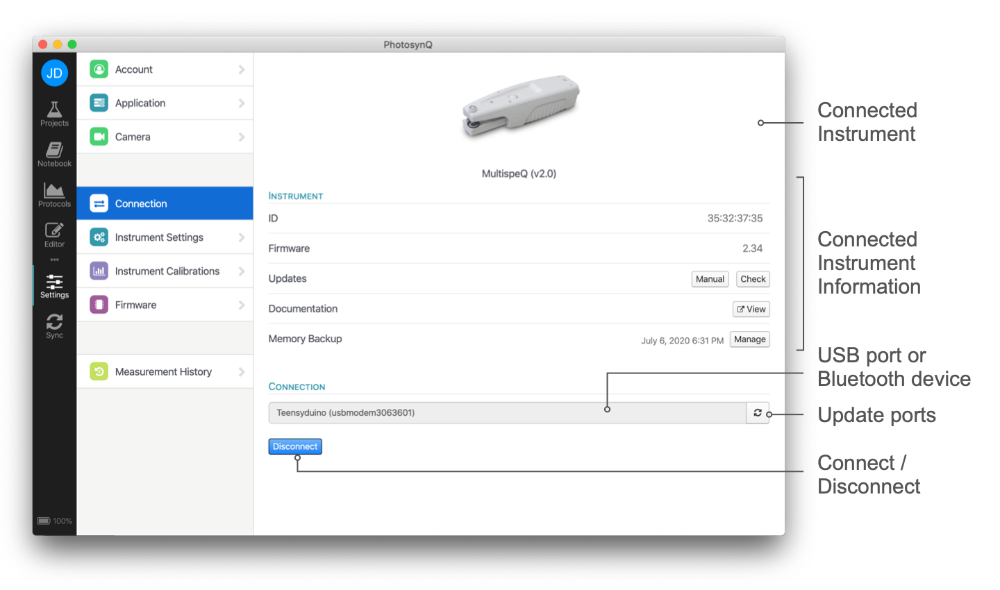

# Using the MultispeQ

Before you start using the MultispeQ, make sure the Instrument is fully charged. Charge it by lifting the green protective cover on the back of the instrument and plug the provided cord into the Micro-USB port on the right. Use a power supply with at least 500mA output and charge for about 8 hours before taking your first measurements.

## Create an Account

To have access to all the measurement Protocols that are shared by the community and using the platform to save measurements and create your protocols, you will need an account. Go to <https://photosynq.org> and you will be directed to the sign in page. Select **Sign Up** and follow the instructions to create an account. More details on how to set up the account and how to use your account you can find in the Chapter [Create an Account](../account/create-an-account.md).

## Install an Application

To use and operate the MultispeQ an application is needed. PhotosynQ is providing applications for Android devices as well as for Windows and Mac. Go to the [PhotosynQ Software Page](https://photosynq.com/software) and download the application for your system. Once you have installed the application, start the application and sign in using the email and password from your account. Since it is the fist time you start the application it will take some time to synchronize all the protocols and necessary information with the PhotosynQ platform. More information on the applications you can find in the Chapters [Mobile Application](../mobile-application/general.md) and [Desktop Application](../desktop-application/general.md).

## Turn the Instrument on/off

### Turn on Instrument

Turn on your MultispeQ by pressing the center of the green protective cover on the back of the instrument for at least 5 seconds. If you have a MultispeQ v2.0, you should see top indicator light flashing once you release the button, indicating it has booted and is ready to be connected. After that the light will flash about every 10 seconds as long as the instrument is on indicating the battery level by color (green - full, yellow - medium, red - low).

### Turn off Instrument

Your MultispeQ should **automatically turn off after 30 minutes**. You can adjust the time in the Settings of the desktop application. If you are using a USB connection, you can keep the instrument running (always on) until the USB connector gets unplugged.

If you would like to turn your instrument off manually, you can do so through the mobile or desktop apps. In the mobile app, click the MultispeQ icon on the top of the page. Here you should see your connected instrument and a slider to turn off your MultispeQ. Slide that bar to the left to turn off and disconnect your MultispeQ.

In the desktop app, navigate your way to the Settings tab on the left hand side of the window, then click on the Instrument Settings tab. Under the Power Management section, you will see an option labelled Power. Click the off button next to this option to immediately turn off your MultispeQ.

## Connect the Instrument

You can use Bluetooth or USB to connect your Instrument with your device. Depending on the Instrument and device, some connection options may not be available.
More details on this can be found in the Chapters [Connect an Instrument - Desktop Application](../desktop-application/connect-an-instrument.md) and [Connect an Instrument - Mobile Application](../mobile-application/connect-an-instrument.md).

Make sure the instrument is charged and turned on before you continue to connect your instrument.

:::: tabs type:card

::: tab Mobile Application

When using the mobile application only the connection via Bluetooth is available. The connection process consists of two steps, pairing (only needs to be done once) and connecting with the mobile device and the connecting with the app.

1. After signing in, select the instrument icon in the upper left corner
2. A list of available Bluetooth Instruments will appear.
3. Below the Instrument name will be its ID. This should match the MAC address on your Instrument (screen A, below)
   - If your Instrument does not appear, click on **SCAN DEVICES** (repeat if Instrument doesn't appear after scan)
4. Select on the appropriate Instrument.
5. If this is your first time connecting this MultispeQ, enter the PIN `1234` when requested.
6. After pairing the MultispeQ, you will be taken back to the Device list. Select your added MultispeQ from the list, if the screen B (below) appears your device is connected.

:::

::: tab Desktop Application

When using the desktop application, micro-USB and Bluetooth (depending on your computer) are available. We recommend using the micro-USB connection, but Bluetooth will work just as well.

1. Select **<i class="fa fa-sliders"></i> Settings** from the left menu bar.
2. Choose the **Connection** tab from the settings menu.
3. Pick the port the Instrument is connected to from the dropdown menu:
    - Windows: **COM{number}**
    - macOS: **usbmodem{number}**
    - Linux: **ACM{number}**
4. Connect the instrument by clicking on **Connect**.

:::

::::

## Taking a Measurement

Now that the Instrument is connected to the application the first measurement can be taken. For this demonstration, the MultispeQ is used to measure the ambient light intensity using the Protocol named **PAR only**, no plant or leaf is needed. The second measurement determines the Photosystem II quantum Efficiency.

:::: tabs type:card

::: tab Mobile Application

### Light Intensity Measurement (PAR)

1. Select **Quick Measurements** from the menu
2. Look for the **PAR only** protocol and tab to select it
3. When the protocol is done, the results will be displayed (here the longer RIDES protocol)

| Measurement Protocols | Measurement Results |
| :-------------------: | :-----------------: |
|  |  |

:::

::: tab Desktop Application

### Light Intensity Measurement (PAR)

1. Select **Protocols** from the sidebar on the left
2. Look for the **PAR only** protocol and click to select it
3. Click on **Run** in the sidebar with the protocol information. *Pro Tip:* Just double click the protocol in the table to start it right away
4. When the protocol is done, look for `PAR` in the displayed table.
5. To take another measurement, click on **Repeat** or **Discard** to return to the protocol list.

When the measurement is done, use the **Discard** button to return back to the protocol list. Now use a leaf to measure the Photosystem II Quantum Efficiency or Phi2.

### Photosystem II Quantum Efficiency

1. Select **Protocols** from the sidebar on the left
2. In the top menu bar select **Explore** and search for the Protocol `Phi2 - Tutorial` and select it
3. Click on **Run** in the sidebar with the protocol information.
4. Now clamp the leaf, the protocol is waiting until the leaf is clamped
5. When the protocol is done, look for `Phi2` and other related parameters including `PAR` in the displayed table.
6. To take another measurement, click on **Repeat** or **Discard** to return to the protocol list. The measurement can also be saved to the [Notebook](../desktop-application/notebook.md), which is explained in a later chapter.

### Other MultiseQ Parameters
Parameter	Description of Parameter
Phi2	The fraction of light energy captured by Photosystem II which is directed towards Photochemistry to make ATP and NADPH and ultimately sugar for the plant to grow. Typical range is 0 - 0.82.

PhiNPQ	The fraction of light energy captured by Photosystem II which is directed towards non-photochemical quenching and is dissipated as heat inside the leaf. The plant actively 'shedding' excess captured light to avoid photodamage. Typical range is 0 - 0.85.

PhiNO	The fraction of light energy captured by Photosystem II that is directed...somewhere. This generally represents light energy lost to unregulated processes that can damage Photochemistry. Typical range is 0.15 - 0.55.

Relative Chlorophyll Content	The concentration of chlorophyll in the leaf. It ranges from 0-80 and is a relative value so it has no units.

ECSt, vH+, gH+	These parameters describe the accumulation of protons in the thylakoid and their flow through ATP synthase which converts ADP to ATP, one of the main forms of transportable energy within the cell. This measurement often does not work well at low light intensities. Under these conditions it is common to get a pop-up message saying that the signal is too low or too noisy and you should accept the measurement. If you get this message under high light conditions, you may want to retake the measurement.

Leaf Temp Differential	The difference between leaf temperature and ambient temperature in degrees Celsius. The typical range is from  -5 to +10.

Light Intensity (PAR)	Photosynthetically Active Radiation in the 400 - 700 nanometer wavelengths that is used for photosynthesis. Typical ranges 0 to approximately 2000 microeinsteins (under full sun).

:::

::::

### Storing Measurement Results

In general, there are two options available to save measurement results, [Projects](../projects/what-are-projects.md) and the [Notebook](../desktop-application/notebook.md) (the third is a classic pen and paper, but we ignore that for now). In the mobile application, only Projects can be used to save data, in the desktop application, also the Notebook is available.

| Project | Notebook |
| :------ | :------- |
| Projects are best for large data collections and collaborations. The collected data is save in the cloud and easily sharable. Further, it can be viewed and analyzed online and packages for Python and R are available. | The notebook is great for a quick small set of measurements, or protocols that run for a long time and produce a large dataset. Further, it is intended to be used when developing new protocols. |
