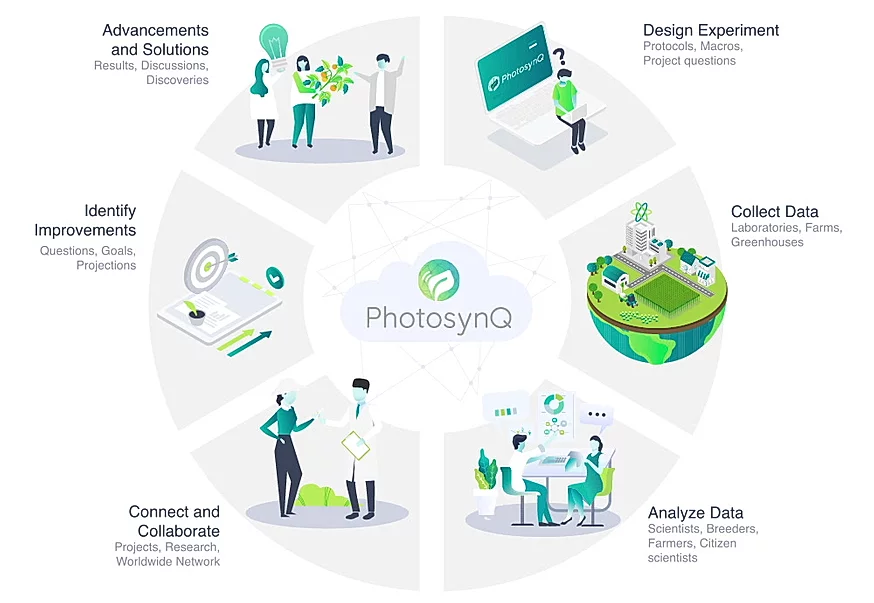

# What is PhotosynQ

## Design Experiment

The PhotosynQ platform allows you to [design experiments](./projects/create-a-new-project.md) called Projects and collecting custom sets of meta data with each measurement. This additional data, entered by answering Project questions can be used to filter a data set or be part of the data collected, like plant size, treatment, et cetera. [Additionally generated data](./projects/import-custom-data.md), like dry weight, yield or absolute chlorophyll content, can be added to the project post measurement data collection.

## Collect Data

The data collection is easy and fast using the MultispeQ together with the [Android Mobile Application](../mobile-application/general.md) in the field or with the [Desktop Application](../desktop-application/general.md) in the lab for bench top experiments. Both applications allow to collect measurements for set up Projects, but also single, quick measurements. The Desktop Application allows to save those quick measurements in a Notebook.

## Analyze Data

The collected data can be analyzed using the online data analysis tools. They allow the data set to be filtered, plot parameters in various ways, including scatter, line and density plots, histograms and box box plots. Also basic statistics are available. The data can also be [downloaded](./view-and-analyze-data/download-data.md) as a spreadsheet or using the provided [python or R](../view-and-analyze-data/external-libraries.md) libraries as data frames.

## Connect and Collaborate

Projects on PhotosynQ enables [collaboration](./projects/project-collaborators.md) allowing researchers from anywhere [contribute](./projects/join-a-project.md) to a research Project. Groups around the world can collect data simultaneously and compare results. The [forums](https://photosynq.org/forums) can be used to organize collaboration, or already existing PhotosynQ users can be [invited to the join](../account/project-invitations.md) Projects.

## Identify Improvements

Since the data is immediately analyzed, changes or adjustments to the Project can be made instantly. New data can be collected. Previously collected data can be [recalculated](./macros/create-edit-a-project.md) if necessary to improve the data analysis. The parameter SPAD (relative Chloropyll) can be used to decide when to apply fertilizer.

## Advancements and Solutions

You are able to connect and discuss results and research progress using the [Forums](https://photosynq.org/forums) or the Project Discussion. Results can be written up and attached to the Project on PhotosynQ. The Project data can be provided in publications as well.
