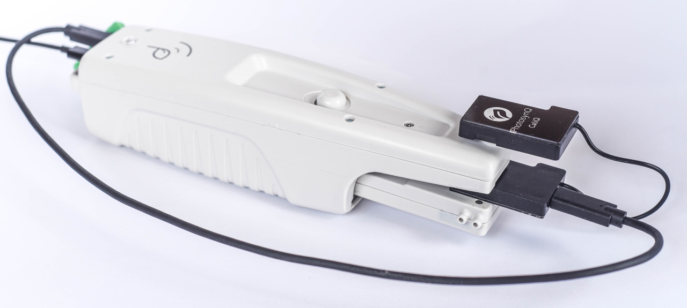
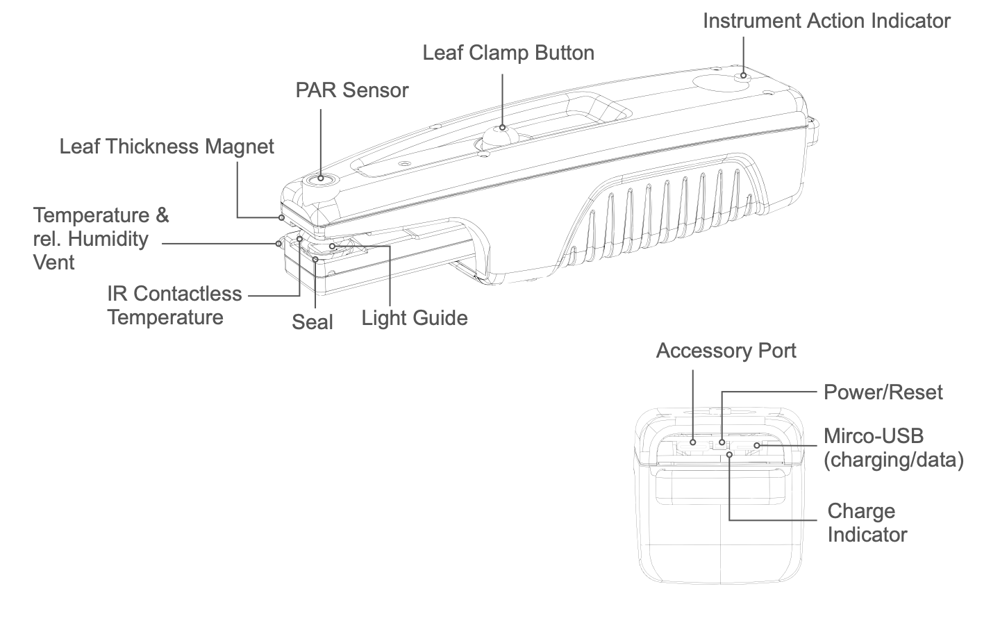
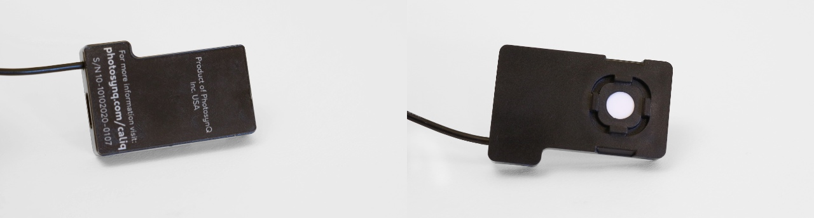
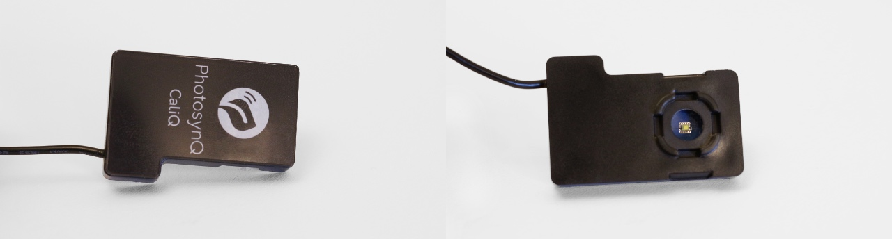
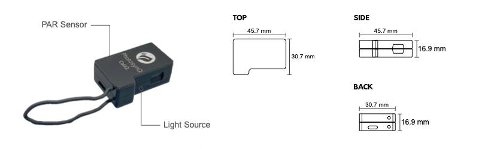
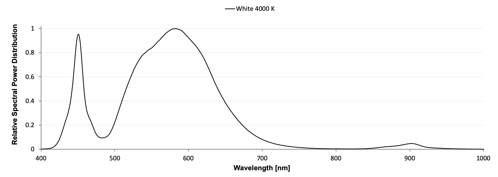

# CaliQ

## Getting Started

+ **Charging:** Before using your CaliQ, make sure the MultispeQ is fully charged. The CaliQ has no battery and is powered through the MultispeQ.
+ **Software:** Go to <https://photosynq.com/software> and download the Desktop Application.
+ **MultispeQ Firmware:** Make sure your MultispeQ is running the firmware version `v2.16` or greater. If not, update your MultispeQ before continuing ([Update Firmware](./firmware-updates.md)).
+ **Connection:**
  + Make sure, the MultispeQ is turned on.
  + Then connect the CaliQ with the MultispeQ as indicated under Setup.
+ **Test the connection:** Check if the CaliQ and MultispeQ communicate.

## Setup

The CaliQ is simply connected to the MultispeQ by using the provided USB-C cable and plugging it into the MultispeQ's USB-C port located on the back next to the micro-USB port. Attaching the PAR Sensor of the CaliQ or its Light Source is not required (shown for demonstration purposes only). The Calibration routines will prompt you when to do so. The CaliQ can be connected and disconnected at any time and doesn't require the MultispeQ to be powered down or restarted. To test for the correct cable orientation, follow the instructions below.

::: Warning MultispeQ v1.0 Users
Due to a hardware change, the MultispeQ v1.0 requires a CaliQ adapter, available in the shop, for connecting the CaliQ. This adapter plugs directly into the MultispeQ V1.0 on one side and the CaliQ cord attaches on the other side. Please see <[support@photosynq.org](https://www.photosynq.com/product-page/multispeq-version-1-caliq-adapter)> for further help in purchasing this item.
:::

## Test the Connection

Before starting to calibrate the MultispeQ, check if the instruments are communicating properly. In the Desktop Application, select **Settings** From the side menu on the left and navigate to **Instrument Settings** and select **CaliQ Connection** under **Instrument Tests**. The test will return a `1` when the connection works or a `0` if not. In case the connection is not established, change the USB-C cable orientation either on the MultispeQ or the CaliQ.

::: tip Assistant
When using a [Calibration Assistant](../instruments/instrument-calibrations.md), the connection will be tested as part of the Calibration Assistant.
:::

## About

<!--  -->

### PAR Sensor & Light Source

The CaliQ consists of two parts, a PAR (Photosynthetically Active Radiation) sensor and a calibrated light source.

#### PAR Sensor

#### Light Source

::: tip
You may need to clean the plastic window over the LED light source occasionally. Gently clean the light guides with a damp, soft cloth.
:::

::: danger
Do not submerge in water, do not use solvents or detergents, and do not use abrasive or rough cloths to clean light sources plastic window.
:::

### USB-C Port

The [USB-C](https://en.wikipedia.org/wiki/USB-C) port is located on the PAR sensor part of the CaliQ. Connect the CaliQ with the supplied cable to the Accessory Port of the MultispeQ.

::: danger
Do not connect the CaliQ to a power supply, computer, or mobile device using the USB-C cable as it might damage the CaliQ.
:::

## Configuration

| Body                    | Measurements                                 |
| :---------------------- | :------------------------------------------- |
| Size (stacked together) | 45.7 mm x 30.7 mm x 16.9 mm (l, w, h)        |
| Total Weight            | 24 g                                         |
| PAR Sensor Surface      | ⌀ 7.15 mm (40.15 mm²)                        |
| Light Source Surface    | ⌀ 8 mm (50.3 mm²)                            |
| Updates                 | Updates available through MultispeQ Firmware |

### PAR Sensor

The PAR sensor part is housing the PAR sensor as well as the [USB-C](https://en.wikipedia.org/wiki/USB-C) port to connect the CaliQ to the Accessory Port of the MultispeQ.

### Light

The LED part of the CaliQ is housing the calibrated light source with a single white LED.

|   #   | Color Temperature | Model                            |  Specifications  |
| :---: | :---------------: | -------------------------------- | :--------------: |
|   1   |       4000K       | LED (white), Lumileds, LXZ1-4070 | [view][LXZDS120] |

#### Emission Spectrum

[LXZDS120]: https://www.lumileds.com/uploads/404/DS120-pdf
