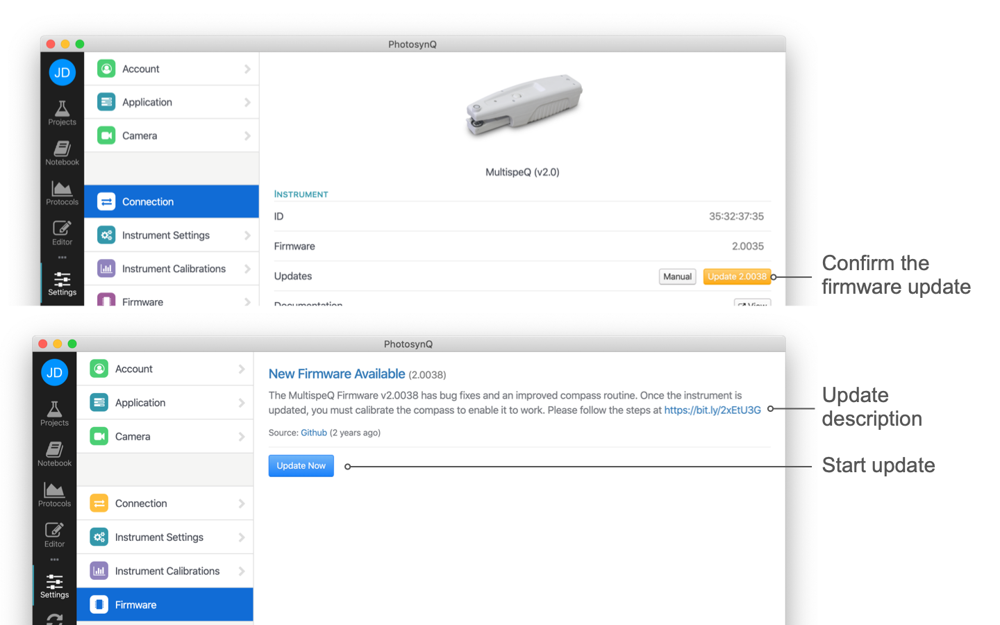

# Firmware Updates

Normally, the PhotosynQ app automatically notify you when there is a new firmware version available for your Instrument. In this case you can follow the instructions, and the app will download the correct version and install it on your Instrument.

::: warning Note
We do not recommend that anyone uploads any other versions of the firmware or from unknown sources, unless you know what you are doing!
:::

## Automatic Firmware Update

When you connect to an Instrument using the mobile app or the desktop app, you will be notified if there is a firmware update available. Firmware updates usually provide fixes as well as new features. Some new measurement protocols might require the latest firmware, so we strongly recommend installing the updates. Below you find instructions on how to install those updates using the Mobile App (Android) or the Desktop App.

## Desktop App

### Step 1

Open the Settings dialog from the left menu bar and connect your Instrument. If an update is available, click on the button labeled **"Update"**. You can check at any time by clicking on the **"Check"** button to see if an update is available.

### Step 2

If an update is available, the version and changes are listed. Select the **"Update Now"** button to start the update. Confirm that you want to install the update.

### Step 3

During the upload process, don't close the app, turn off your computer, or  turn off your Instrument.

### Step 4

If the installation is finished, wait for the Instrument to restart. When the restart is complete, the settings dialog will show up again.

### Step 5

After the update is finished the Instrument will restart. Check if the version number of the firmware has increased.

### Step 6

Most updates require to restore the Latest Backup after the Firmware Update has been successfully finished. Just click on "Continue" and the latest Backup is automatically selected and installed. When the protocol for restoring the Backup is ready, simply select **Save to Instrument** and confirm the popup dialog.

***

## Manual Firmware Update

**"Pre-releases"** of the firmware are not installed automatically on your Instrument. Go to [Github][Firmware-Github] to download the most recent firmware for your Instrument.

::: warning Note
Pre-Releases can only be installed using the Desktop app at your own risk.
:::

### Preparation

Make sure you have a verified .hex file from [PhotosynQ][Firmware-Github]. Select the file matching your Instrument name and version (e.g. `multispeq1.ino.hex` for MultispeQ v1.0). Place this file in an easy-to-find location (like your Desktop).

### Step 1

Connect your Instrument to a USB port. To avoid confusion, make sure it is the only Instrument connected to the USB.
Open the Settings dialog from the left menu bar and connect your Instrument.

### Step 2

Click on the **"Manual"** button and confirm that you want to update the firmware on your Instrument. Next, select the previously downloaded file and select open to start the firmware update.

### Step 3

During the upload process, don't close the app, turn off your computer, or turn off your Instrument.

### Step 4

If the installation is finished, wait for the Instrument to restart. When the restart is complete, the settings dialog will show up again.

Connect your Instrument and check if the firmware you wanted to install was installed properly.

## Mobile App (Android)

::: warning Not Available
The Mobile Application no longer provides firmware updates at this point. Please use the Desktop Application.
:::

## Known Issues

When the firmware is transferred to the Instrument, it might be necessary to restart it and/or the desktop app.
Sometimes you have to repeat this step because the Instrument may take a bit longer to boot up the first time.

[Firmware-Github]: https://github.com/Photosynq/MultispeQ-firmware/releases
