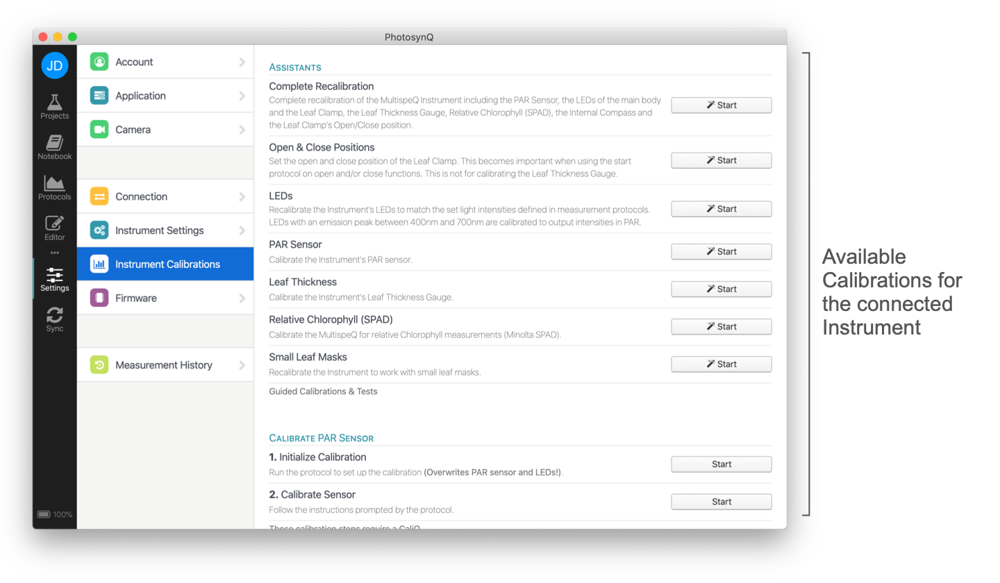

# Instrument Calibrations

PhotosynQ Instruments come pre-calibrated from the factory. Over time you can repeat the calibrations to ensure high quality measurements. Depending on the Instrument the available calibrations can vary. Currently you need to use the Desktop Application to adjust your Instrument settings.

::: warning Note
The Mobile Application does not support Instrument Settings.
:::

## Desktop App

When using the Desktop App in order to repeat the Instrument Calibrations, follow these steps to get started.

1. Connect your Instrument, using USB or Bluetooth.
2. Select **Instrument** from the **Settings** dialog.
3. Depending on the connected Instrument, you will see your available calibrations.

## Calibrations - MultispeQ

| Calibrate PAR Sensor | Description |
| -------------------- |-------------|
| ... | ... |
| ... | ... |

::: warning Note
These calibration steps require the CaliQ instrument
:::

| Calibrate LEDs | Description |
| -------------- |-------------|
| ... | ... |
| ... | ... |
| ... | ... |

::: warning Note
These calibration steps require the CaliQ instrument
:::

| Electronic Offsets | Description |
| ------------------ |-------------|
| ... | ... |
| ... | ... |

| Calibrate Leaf Thickness | Description |
| ------------------------ |-------------|
| ... | ... |

::: warning Note
These calibration steps require calibration cards
:::

| Calibrate Relative Chlorophyll | Description |
| ------------------------------ |-------------|
| ... | ... |
| ... | ... |
| ... | ... |

::: warning Note
These calibration steps require calibration cards
:::
