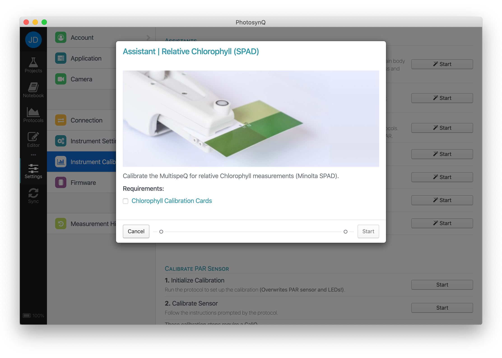

# Instrument Calibrations

PhotosynQ Instruments come pre-calibrated from the factory. Over time you can repeat the calibrations to ensure high quality measurements. Depending on the Instrument and the Firmware version, the available calibrations can vary.

::: warning Note
The Mobile Application does not support Instrument Calibrations.
:::

For detailed instructions on how to use the calibrations, please refer to the [Calibrations](../calibrations/overview.md) chapter.

## Desktop App

When using the Desktop Application to run Instrument calibrations, follow these steps to get started:

1. Connect your Instrument, using USB or Bluetooth.
2. Select **Instrument Calibrations** from the **Settings** menu.
3. Depending on the connected Instrument and Firmware version, you will see your available calibrations.
4. Select the **Calibration Assistant** or the **Protocol** you want run.

## Assistants

In order to guide you through the process of calibrating the Instrument, there are several assistants available describing each step required. This is the **easiest and safest** way to calibrate the Instrument.

## Manual Calibrations

If you are an advanced user and you prefer to run the calibrations protocols individually, or you want to run a specific calibration that is not covered by the available assistants, you can run the specific calibration protocols manually.

::: danger Trouble Shooting
+ When performing a calibration that has multiple steps, **always** start with **Step 1**.
+ Make sure the leaf clamp is completely closed when clamping cards before confirming the next step.
+ When calibrating any of the lights or the PAR sensor, make sure the battery level is **at least 50%**.
:::

### Saving Calibrations

After each calibration protocol, you have to save the calibration back to the Instrument. Use the **Save to Instrument** button from the top menu to bring up the confirmation dialog. Click on **OK** to confirm the data that is sent and saved to the Instrument.
