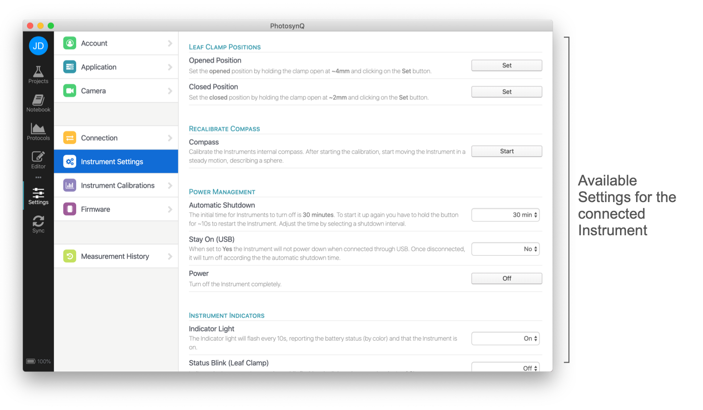

# Instrument Settings

PhotosynQ Instruments have adjustable settings to make the Instrument better fit you needs. They vary between Instruments. Currently you need to use the Desktop Application to adjust your Instrument settings.

::: warning Note
The Mobile Application does not support Instrument Settings.
:::

## Desktop Application

When using the Desktop App to change the Instrument settings, follow these steps to get started.

1. Connect your Instrument, using USB or Bluetooth.
2. Select **Instrument** from the **Settings** dialog.
3. Depending on the connected Instrument, you will see your available Settings.

::: warning Note
The available settings depend on the type and version of the Instrument connected, as well as on the version of the firmware installed on the Instrument.
:::

## Available Settings

:::: tabs type:card

::: tab MultispeQ (v1.0)

### MultispeQ (v1.0)

#### Leaf Clamp Positions

| Leaf Clamp Positions | Description | Firmware |
| :------------------- | :---------- | :------: |
| Open and Close Position | Calibrate the *open* and *close* position of the clamp. During the calibration follow the instructions of the protocol. | `1.17` `1.23` |

#### Power Management

| Power Management | Description | Firmware |
| :--------------- | :---------- | :------: |
| Power | Turn off the Instrument completely. | `all` |

#### Instrument Information

| Instrument Information | Description | Firmware |
| :--------------------- | :---------- | :------: |
| Stored Information (EEPROM) | Display all the information stored in the Instrument's internal memory. | `all` |

#### Instrument Tests

| Instrument Tests | Description | Firmware |
| :--------------- | :---------- | :------: |
| Instrument Connection | Check if the Instrument is connected and properly communicating. | `all` |

:::

::: tab MultispeQ (v2.0)

### MultispeQ (v2.0)

#### Leaf Clamp Positions

| Leaf Clamp Positions | Description | Firmware |
| :------------------- | :---------- | :------: |
| Opened Position | Set the **opened** position by holding the clamp open at **~4mm** and clicking on the **Set** button. | `all` |
| Closed Position | Set the **closed** position by holding the clamp open at **~2mm** and clicking on the **Set** button. | `all` |

#### Recalibrate Compass

| Recalibrate Compass | Description | Firmware |
| :------------------ | :---------- | :------: |
| Compass | Calibrate the Instruments internal compass. After starting the calibration, start moving the Instrument in a steady motion, describing a sphere. | `all` |

#### Power Management

| Power Management | Description | Firmware |
| :--------------- | :---------- | :------: |
| Automatic Shutdown | The initial time for Instruments to turn off is **30 minutes**. To start it up again you have to hold the button for ~10s to restart the Instrument. Adjust the time by selecting a shutdown interval. | `all` |
| Stay On (USB) | When set to **Yes** the Instrument will not power down when connected through USB. Once disconnected, it will turn off according the the automatic shutdown time. | `all` |
| Power | Turn off the Instrument completely. | `all` |

#### Instrument Indicators

| Instrument Indicators | Description | Firmware |
| :-------------------- | :---------- | :------: |
| Indicator Light | The Indicator light will flash every 10s, reporting the battery status (by color) and that the Instrument is on. | `all` |

#### Instrument Information

| Instrument Information | Description | Firmware |
| :--------------------- | :---------- | :------: |
| Stored Information (EEPROM) | Display all the information stored in the Instrument's internal memory. | `all` |
| Instrument Clock | Set the Instrument's clock to the computers time. | `>=2.1` |

#### Instrument Tests

| Instrument Tests | Description | Firmware |
| :--------------- | :---------- | :------: |
| Instrument Connection | Check if the Instrument is connected and properly communicating. | `all` |
| CaliQ Connection | Check if the CaliQ and Instrument are properly communicating. | `>=2.1` |

:::

::::
