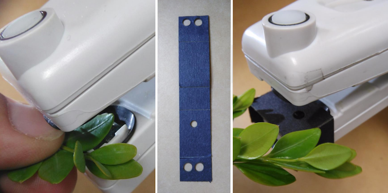
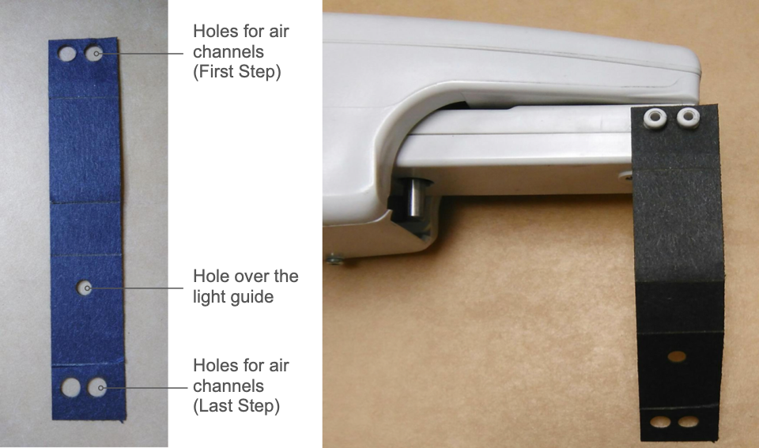
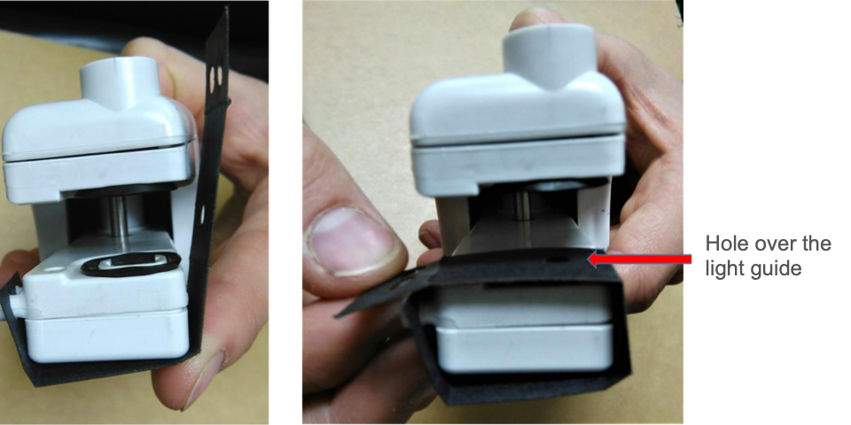

# Light Guide Mask

Measuring small leaves of plants like *Arabidopsis thaliana* can be tricky, since younger leaves or the leaves of mutants are not covering the light guide entirely. Another example are Monocots like *Oryza sativa* where the leaves are long but so thin that they are not covering the light guide.

Masking the light guide, so that the leaf is fully covering the opening becomes important, when absorbance based measurements for relative chlorophyl or the electrochromic shift (ECS) are used. Chlorophyll fluorescence based measurements like photosynthetic yield (Phi2) not require the leaf to fully cover the light guide, even though the signal might not be as good and values might not be as consistent compared to a fully covered light guide.

Reducing the surface of the light guide by masking parts of it can help overcome those issues.

## Make the Mask

The light guide mask can be cut out of black construction paper and a leather hole punch can be used to create the holes for the air channels and light guide. The holes for the air channels need to be 4.5mm in diameter. Depending on the size of plant being measured, the hole for the light guide can range from 2 – 4mm in diameter. If available, a laser cutter can be used with the template instead.

**Light Guide Mask Template:** [Download](https://photosynqprod.s3.amazonaws.com/files/specialfeatures/leaf-mask-file.pdf)

## Assembly

### Step 1

Pre-fold the perforated creases of the mask (along the red lines). Insert the set of holes over the air channels.

### Step 2

Fold the mask around the leaf clamp of the instrument. Continue wrapping the mask around the leaf clamp of the instrument so it covers the light guide.

### Step 3

Fold the end of the mask over the air channels. This will secure it onto the instrument. We recommend adding clear tape along the folds of the mask to increase longevity and stability on the MultispeQ.

::: warning
**Note:** Make sure when using tape not to cover the air channels or light guide.
:::

### Step 4

Depending on the measurement protocols, the instrument might need to be recalibrated.
