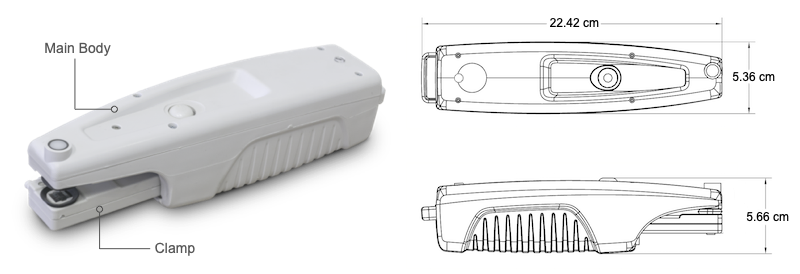
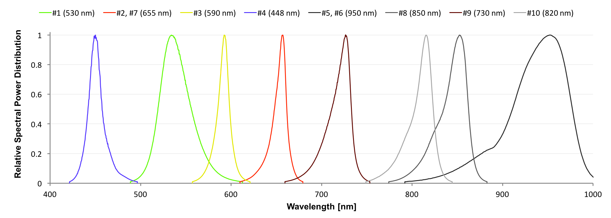

# MultispeQ v2.0 Configuration

| Body | Measurements |
|:----|:----|
| Size | 224.2 mm x 53.6 mm x 56.6 mm (l, w, h) |
| Total Weight | 340 g (incl. battery)|
| Light Guide Surface | 8 mm x 8 mm ( 64mm²) |
| Leaf Clamp Opening | 13 mm |
| Safety | Ring for leash |
| Updates | Firmware updates through Applications |

## Lights

There are sets of five LEDs each on the **main body** and the **leaf clamp**.

### Main Body

| # | Emission Peak | Model | Specifications |
|:---:|:---:|-----|:---:|
| 1 | 530nm | LED (green), Lumileds, LXZ1-PM01 | [view][LXZ1] |
| 2 | 655nm | LED (red), Lumileds, LXZ1-PA01 |[view][LXZ1] |
| 3 | 590nm | LED (amber), Lumileds, LXZ1-PL01 |[view][LXZ1] |
| 4 | 448nm | LED (blue), Lumileds, LXZ1-PR01 |[view][LXZ1] |
| 5 | 950nm | LED (NIR), OSRAM, SFH 4441 | [view][OSRAM SFH 4441] |

### Leaf Clamp

| # | Emission Peak | Model | Specifications |
|:---:|:---:|-----|:---:|
| 6 | 950nm | LED (NIR), OSRAM, SFH 4441 | [view][OSRAM SFH 4441] |
| 7 | 655nm | LED (red), Lumileds, LXZ1-PA01 |[view][LXZ1] |
| 8 | 850nm | LED (NIR), OSRAM, SFH 4451 | [view][OSRAM SFH 4451] |
| 9 | 730nm | LED (far red), Everlight, ELSH-Q61F1-0LPNM-JF3F8 | [view][ELSH-Q61F1-0LPNM-JF3F8] |
| 10 | 820nm | LED (NIR), OSRAM SFH 4786S | [view][SFH 4786S] |

### Emission Spectra for LEDs

## Detectors

The MultispeQ v2.0 comes with two detectors. One covering the near infrared on the **main body**, the other covering the visual range on the **leaf clamp**.

| # | Detection Range | Model | Specifications |
|:---:|:---:|-----|:---:|
| 1 | 700nm - 1150nm | Hamamatsu, S6775-01 (main body) | [view][S6775-01] |
| 3\* | 400nm - 700nm | Hamamatsu, S6775 (leaf clamp) | [view][S6775] |

::: warning
**\*Note:** The detector 3 is covered with a BG-18 bandpass filter with a center wavelength around 493 nm. If you are using the detector to detect signals on the edges of the detection range, expect the signal strength to be low.
:::

## Sensors

The MultispeQ v2.0 has a set of sensors to measure the environmental parameters

| Sensor | Model | Specifications |
|-----|-----|:---:|
| Ambient Temperature, Humidity, Pressure (2x) | BOSCH, BME280 | [view][BME280] |
| Contactless Temperature | Melexis, MLX90615SSG-DAG-000-TU | [view][MLX90615] |
| Accelerometer | Freescale, MMA8653FCR1 | [view][MMA8653FCR1] |
| Magnetometer | Freescale, MAG3110FCR1 | [view][MAG3110FCR1] |
| Hall Effect Sensor | TT Electronics, OHS3150U | [view][OHS3150U] |
| PAR light sensor | AMS-TAOS USA, TCS34715FN + 700nm low pass filter | [view][TCS34715FN] |

## Filters

The MultispeQ v2.0 has two filters, a Band Pass filter covering the visible light detector (#3) and a Low Pass filter used in the PAR sensor.

| Filter | Model | Specifications |
|-----|-----|:---:|
| Band Pass | Schott, BG-18 1mm thickness  | [view][BG-18] |
| Low Pass | UQC Optics, Hot Mirror HM-07 | [view][HMC-5051] |

## Indicator Lights

The MultispeQ v2.0 has now two indicator lights. One to indicate if the device is charging which is located next to the micro-USB port. The second one is located on top to indicate progress or required actions.

| LED | Model | Specifications |
|-----|-----|:---:|
| Charging Indicator |  | --- |
| Progress/Action Indicator | NeoPixel (RGB), SK6812 | [view][SK6812] |

## Battery

The MultispeQ v2.0 has a Li-ion battery which can be charged through the micro USB port.

| Battery | Model | Specifications |
|-----|-----|:---:|
| Main | Soshine Li-ion 26650 Protected Battery: 5500mAh 3.7V | [view][26650P-3.7-5500] |

### References

Kuhlgert, S., Austic, G., Zegarac, R. Osei-Bonsu, I.,Hoh, D., Chilvers, M. I., et al. (2016). **MultispeQ Beta: a tool for large-scale plant phenotyping connected to the open PhotosynQ network.** *R. Soc. Open Sci.* 3, 160592. [doi:10.1098/rsos.160592].

[LXZ1]: http://www.lumileds.com/products/color-leds/luxeon-z-colors

[OSRAM SFH 4441]: https://www.osram-os.com/osram_os/en/products/product-catalog/infrared-emitters%2c-detectors-andsensors/infrared-emitters/power-emitter-gt40mw/emitter-with-940-nm/sfh-4441/index.jsp

[OSRAM SFH 4451]: https://www.osram-os.com/osram_os/en/products/product-catalog/infrared-emitters%2c-detectors-andsensors/infrared-emitters/power-emitter-gt40mw/emitter-with-850-nm/sfh-4451/index.jsp

[ELSH-Q61F1-0LPNM-JF3F8]: https://media.digikey.com/pdf/Data%20Sheets/Everlight%20PDFs/Shuen1W_Series.pdf

[SFH 4786S]: https://dammedia.osram.info/media/resource/hires/osram-dam-4323044/SFH%204786S_2017-10-23.pdf

[S6775]: https://www.hamamatsu.com/us/en/product/alpha/S/4103/S6775/index.html

[S6775-01]: https://www.hamamatsu.com/us/en/product/category/3100/4001/4103/S6775-01/index.html

[BME280]: https://www.bosch-sensortec.com/bst/products/all_products/bme280

[MLX90615]: https://www.melexis.com/en/product/MLX90615/Digital-Plug-Play-Infrared-Thermometer-Ultra-Small-TO-Can

[MMA8653FCR1]: https://www.nxp.com/products/sensors/accelerometers/3-axis-accelerometers/2g-4g-8g-low-g-10-bit-digital-accelerometer:MMA8653FC?lang_cd=en

[MAG3110FCR1]: https://www.nxp.com/products/sensors/magnetometers/high-accuracy-3d-magnetometer:MAG3110?lang_cd=en

[OHS3150U]: https://media.digikey.com/pdf/Data%20Sheets/TT%20Electronics%20PDFs/OHS3150U,51U.pdf

[TCS34715FN]: https://ams.com/eng/Products/Light-Sensors/Color-Sensors/TCS34715

[BG-18]: https://www.us.schott.com/d/advanced_optics/380b879e-f6d3-4130-b7e9-52d794f9bc4b/1.2/schott-bandpass-bg18-jun-2017-en.pdf

[HMC-5051]: https://www.uqgoptics.com/pdf/Hot%20mirrors%20data%20sheet.pdf

[SK6812]: https://cdn-shop.adafruit.com/product-files/1138/SK6812+LED+datasheet+.pdf

[26650P-3.7-5500]: http://www.soshine.com.cn/a633.aspx

[doi:10.1098/rsos.160592]: https://dx.doi.org/10.1098/rsos.160592
