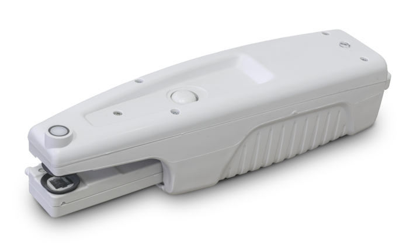
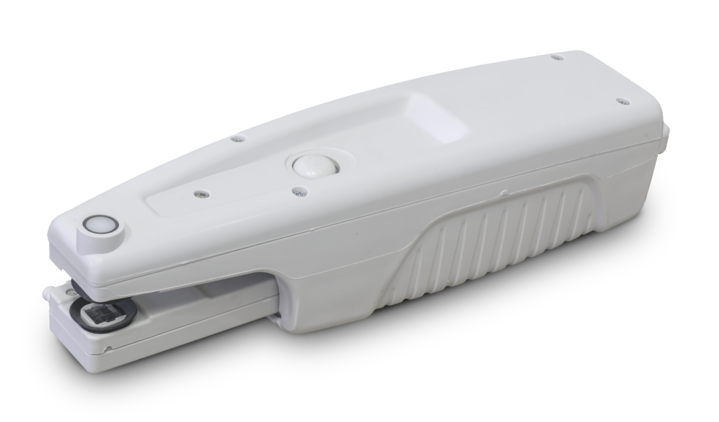
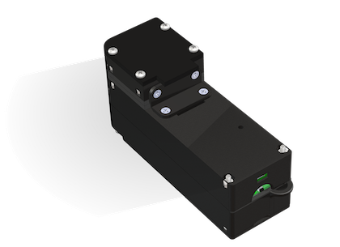
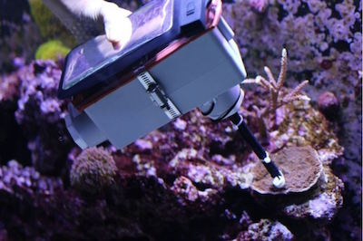
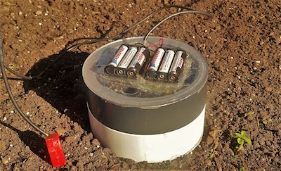
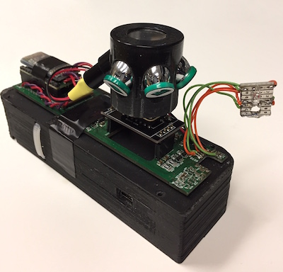
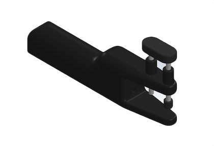

# Overview

> Instrumentation should be affordable, reliable, and easy to use to enable as many people as possible to contribute to research. The instrument is developed to work with PhotosynQ to try to bridge this chasm between what is currently available and the for mentioned goals.

## MultispeQ v2.0

The MultispeQ v2.0 is the next iteration of the MultispeQ v1.0. Improvements have been made to the case, electronics, and an LED has been replaced. Like the previous version, it measures fluorescence base parameters like qL, qP, ΦII, LEF, NPQ, and absorbance based parameters like vH⁺, gH⁺, ECSt, and relative chlorophyll content. It can collect environmental parameters like temperature, relative humidity, barometric pressure, leaf temperature, light intensity, cardinal direction, and tilt.

Internally, one of the sensors has been moved to improve measurements using a connected air pump. Further the 850 nm LED has been replaced with a 810 nm LED.

Now the instrument has a charging indicator and a RGB progress/action indicator LED.

::: tip More Information
+ [Getting Started](./multispeq-v2.0.md)
+ [Configuration](./multispeq-v2.0.md#configuration)
+ [Get an Instrument](https://photosynq.com/buy-now)
+ [References & Parameters](../view-and-analyze-data/references.md)
:::

### MultispeQ v1.0

The MultispeQ v1.0 is based on the experiences we gained from our development of the beta version. It measures fluorescence base parameters like qL, qP, PhiII, LEF, NPQ, and absorbance based parameters like vH⁺, gH⁺, ECSt, and relative chlorophyll content. It can collect environmental parameters like temperature, relative humidity, barometric pressure, leaf temperature, light intensity, cardinal direction, and tilt.

The signal quality has been increased to allow absorbance based measurements like the electrochromic shift in the field within a reasonable time. The ergonomics and the leaf clamping has been improved based on experiences in the field.

::: tip More Information
+ [Configuration](./multispeq-v1.0.md#configuration)
+ [References & Parameters](../view-and-analyze-data/references.md)
:::

::: warning
This version of the Instrument is no longer available.
:::

### MultispeQ beta

This instrument was the first developed as a proof of concept to show it is possible to measure photosynthetic parameters with an easy to use, field deployable instrument. This includes parameters like fluorescence base parameters like qL, qP, ΦII, LEF, NPQ, and absorbance based parameters like vH⁺, gH⁺, ECSt, and relative chlorophyll content. On top, it can collect environmental parameters like temperature, relative humidity, light intensity, and CO₂ concentration.

It has been a reliable workhorse for the last two years and is still used in several studies. For more details and our validation of the instrument, please read the publication (open access).

::: tip Reference
Kuhlgert, S., Austic, G., Zegarac, R. Osei-Bonsu, I.,Hoh, D., Chilvers, M. I., et al. (2016). **MultispeQ Beta: a tool for large-scale plant phenotyping connected to the open PhotosynQ network.** *R. Soc. Open Sci.* 3, 160592. [doi:10.1098/rsos.160592].
:::

::: warning
This version of the Instrument is *no longer available* and *no longer supported*.
:::

## Prototypes

Please contact us if you are interested and want to know more about the prototypes and future projects or start a collaboration.

### CoralspeQ

The CoralspeQ a portable hand held device used to monitor bleaching events in coral communities. The device is built on the beta MultispeQ circuitry and uses a Hamamatsu miniature spectrometer to take spectrally resolved fluorescence and color reflectance measurements.

::: tip
Updates on the development of the CoralspeQ can be found on the [PhotosynQ Blog](https://blog.photosynq.org/category/coralspeq/)
:::

### Soil CarbonspeQ

This instrument uses an accurate, low cost sensor to quickly measures changes in CO₂ over time, allowing users to estimate CO₂ evolution from soils. The instrument also includes a temperature/rH sensor, bluetooth, and a soil moisture probe.

### GrainSpeQ

The GrainspeQ is a portable handheld device that can measure PAM fluorescence, spectrally resolved fluorescence, and color reflectance. It is currently being developed to detect the presence of aflatoxin on whole grains and milling products.

### LeafthiQ

Determining the accurate leaf thickness could be useful to identify traits with significant differences, or getting an estimate of the biomass. This prototype allows to determine the leaf thickness with an accuracy of up to 10 microns. Currently, it only works through micro-USB which powers the instrument and transfers the data.

[doi:10.1098/rsos.160592]: https://dx.doi.org/10.1098/rsos.160592
