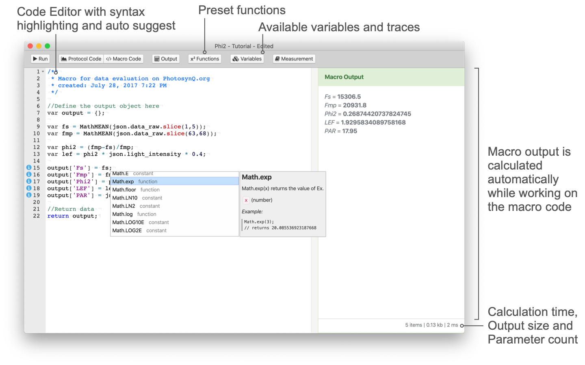

# Create / Edit a Macro

If you want to analyze a measurement using your own calculation, utilize a Macro to do the calculation for you. A Protocol has a Macro automatically associated which will calculate all parameters derived from the measurement immediately after the measurement is done. When the measurement is saved for a Project, the raw measurement is sent to the cloud where the macro will do the calculations again. If a Protocol/Macro gets changed, all values will be recalculated again.



## Create a Macro

1. Make sure you have the Desktop Application installed and you are signed in.
2. Select the **Protocol** you want to create the Macro for.
3. Attach a measurement to the Macro
   1. Select a measurement from the Notebook that was saved using the Protocol the Macro will be created for.
   2. Run the Protocol from the Protocol Editor and use the "Add To Editor" button after the measurement is done.
4. Start coding...

If you need more help on how to get started, please look at the [example](./create-edit-a-macro.md#example-calculating-photosystem-ii-efficiency) below.

## Edit a Macro

You can change or extend Macros connected to a Protocol at any time.

1. Select the **Protocol** you want to update the Macro for.
2. Click on **Edit** in the sidebar.
3. Make your changes to the code.
4. Select **Save...** from the File menu or use the shortcut <kbd>Ctrl/⌘</kbd>+<kbd>S</kbd>.
5. Update the description if needed.
6. Save the changes by **Save**.

## After Macro Updates

When updating a Macro for a Protocol that is used in a Project, the update will impact the data already collected. When opening the Project on the PhotosynQ website to view the data, you will be asked if the data should be reprocessed. This is only available to the Project Lead.

### Troubleshooting

If you have issues saving the macro, make sure you check these things first:

- When a Macro is done, make sure the output box is green, indicating that there was no error.
- Check several different measurements to make sure the Macro code works with different traces/numbers.

## Example - Calculating Photosystem II efficiency

In the [protocol example](../protocols/create-edit-protocol.md#example-photosystem-ii-efficiency) we built a protocol to measure photosystem II efficiency. Now we can build a simple macro to automatically calculate it every time you take a measurement.

### Initial Code

```javascript
/**
 * Macro for data evaluation on PhotosynQ.org
 * by: John Doe
 * created: June 4, 2018 4:00 PM
 */

 // Define the output object here
var output = {};

// Check if the key time exists in json
if (json.time !== undefined){
    // Add key time and value to output
    output.time = json.time;
}

// Return data
return output;
```

### Accessing the recorded Trace

In order to calculate the parameters **Fs** (steady state fluorescence) and **Fmp** (maximum fluorescence), you have to access the recorded fluorescence trace. The Macro editor allows you to select the regions, by using the graph of the trace. In the example below, check range and select the region of interest. Then click on the <i class="fa fa-arrows-h"></i> icon to add the selected range into your code, `json.data_raw.slice(63,68)` in this case. We use the already pre-defined method `MathMEAN( array )` from the Function Menu to calculate the mean of the values in the selected range.

| Select a Single Value | Select a Range of Values |
| ------------ | -------------- |
|  |  |

```javascript
var fs = MathMEAN(json.data_raw.slice(1,5));
var fmp = MathMEAN(json.data_raw.slice(63,68));
```

### Deriving values and adding them to the output

Now we can calculate Phi2 and LEF. For LEF we also need the light intensity. We can insert the light intensity by selecting `light_intensity` from the variables in the top menu.

#### Equations

(1) $\phi_{II} = \frac{ Fm' - Fs}{Fm'}$

(2) $LEF = \phi_{II} \times PAR \times 0.4$

#### Equations as Code

```javascript
var phi2 = (fmp-fs)/fmp;
var lef = phi2 * json.light_intensity * 0.4;
```

### Defining the Macro Output

Finally we can return the results by adding the calculated values to the `output` object.

```javascript
output['Fs'] = fs;
output['Fmp'] = fmp;
output['Phi2'] = phi2;
output['LEF'] = lef;
output['PAR'] = json.light_intensity;
```

### The Final Macro

```javascript
/**
 * Macro for data evaluation on PhotosynQ.org
 * by: John Doe
 * created: June 4, 2018 4:00 PM
 */

//Define the output object here
var output = {};

var fs = MathMEAN(json.data_raw.slice(1,5));
var fmp = MathMEAN(json.data_raw.slice(63,68));

var phi2 = (fmp-fs)/fmp;
var lef = phi2 * json.light_intensity * 0.4;

output['Fs'] = fs;
output['Fmp'] = fmp;
output['Phi2'] = phi2;
output['LEF'] = lef;
output['PAR'] = json.light_intensity;

//Return data
return output;
```

### Output

```
Fs = 5817.25
Fmp = 13056.6
Phi2 = 0.554
LEF = 3.770
PAR = 17
```

[JavaScript_URL]: https://www.w3schools.com/js/
[Desktop App]: https://photosynq.org/software#desktop

## Example - Advanced Macro

When building a Macro for a Protocol using the `_protocol_set_` command, you start of the same way as building a macro described in the previous example ([Building a Macro](./building-a-macro.md)). But since a protocol set was used, accessing the retuned Parameters has changed a little.

### The `json.set` Object (Variables)

The object `json` is no longer holding all the measured Parameters as shown in the previous tutorial. Instead it has a key called `set` with all Protocols from the Protocol Set. Since `json.set` is an array of Protocols, you have to provide the index as well. If you want to access the third Protocol for example, you simply use `json.set[2]`. This can get a bit confusing, when you are using multiple Protocols inside your Set. To make it more accessible, the Macro Editor provides a tree view for variables in each Protocol the side menu bar. To show the sidebar select the <i class="fa fa-cubes"></i> Variables button from the top menu. When selecting a variable, the value as well as the path (e.g. `json.set[2]`) is shown. If you use the `label` command inside each protocol, you will see the label in the tree view making the access easier. A double click will insert the path into your code.


### Simple Protocol Set Example

```javascript
/**
 * Macro for data evaluation on PhotosynQ.org
 * by: John Doe
 * created: June 4, 2018 4:00 PM
 */

 // Define the output object here
var output = {};

// Check if the key time exists in the third protocol of the set
if (json.set[2].time !== undefined){
    // Add key time and value to output
    output.time = json.set[2].time;
}

// Return data
return output;
```

### Multiple Detectors

In the previous [example](./create-edit-a-macro.md#example-calculating-photosystem-ii-efficiency) for a simple Macro only one detector was used. But it can happen, that a measurement requires multiple detectors. This can be accomplished in two different ways as described. The number of data-points within the `data_raw` element in both examples the same, but the way the data is collected is fundamentally different (see [Detectors - Output Examples](../protocols/detectors.md#examples)).

### One Detector per Pulse-Set

The detector readings in this example are sequential, so the first **20** pulses are recorded with **detector 1**, the next **20** pulses are recorded with **detector 3**. In the `data_raw` array, the first **20** values are the readings from **detector 1**, the next **20** from **detector 3**. Using the [JavaScript Array slice() Method](https://www.w3schools.com/jsref/jsref_slice_array.asp) the two readings can be easily separated in the analysis. Keep in mind, that the first value has the index `0`.

:::: tabs type:card

::: tab Protocol

```javascript
...
    pulses: [ 20, 20 ],
    detectors: [ [1], [3] ],
...
```

:::

::: tab Macro Code

```javascript
var detector1 = json.data_raw.slice(0,19);
var detector2 = json.data_raw.slice(20,39);
```

:::

::::

### Two or more Detectors per Pulse-Set

In this scenario, the detector readings alternate between **detector 1** and **detector 3**. The total number of pulses will be **20**, but since the detectors now alternate, the returned values in `data_raw` alternate as well. To separate the output of the two detectors you can use the provided function [ArrayNth](../macros/provided-functions.md#arraynth). The alternative is to loop through the `data_raw` array and extract the values yourself.

:::: tabs type:card

::: tab Protocol

```javascript
...
    pulses: [ 20 ]
    detectors: [ [ 1, 3 ] ],
...
```

:::

::: tab Macro Code

```javascript
// ArrayNth( <array>, <step size>, <start> )
var detector1 = ArrayNth(json.data_raw, 2, 0 );
var detector2 = ArrayNth(json.data_raw, 2, 1 );
```

:::

::::
