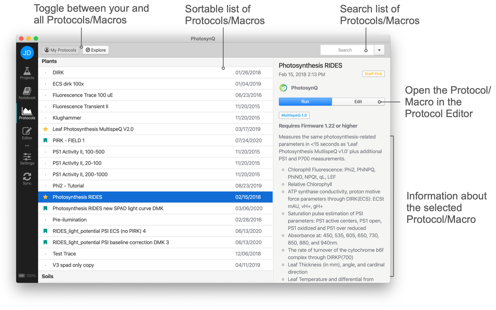

# Macro Basics

All the macros you have developed on PhotosynQ are accessible to you at any time.

Macros are small snippets of code, which run calculations based on your measurements. They are written in the popular script language [JavaScript]. After a measurement has been taken, the data is send from the Instrument to your device and the Macro is processing the data before showing all the calculated parameters. Not every measurement requires post processing (e.g. a simple temperature measurement), but if you want to calculate a parameter from the measurement **Trace** or want to compare parameters (e.g. ambient temperature vs. leaf temperature), a Macro will calculate the parameters of interest and display the results instantly on your mobile device (e.g. a phone).

::: tip Tip
PhotosynQ is providing a number of pre-build functions to make it easier to build Macros and to avoid writing the same code for standard problems like calculating an average over and over again.
:::

## Browser

1. Go to your user profile by clicking on your user name in the top menu bar. Make sure you are signed in first.
2. Select the **Macros** tab to get a list all of your Macros.
3. Click on a Macro to get to the Macro page with the Macro description, the Macro Code, the Measurement data and the Comments. On the right hand-side, you will further find the Protocol category, the connected macro and compatible Instruments.

## Desktop

1. Open you macros by selecting macros from the left menu bar or use the shortcut <kbd>Ctrl/⌘</kbd>+<kbd>4</kbd>.
2. Click on the **My Macros** to list all your macros, if it is not already available.
3. Click on a Macro in the list to show detailed information in the side bar.

::: tip Tip
In case you want to see the work of others, select **Explore** from the top menu.
:::

## Mobile Application

::: warning Note
Macros cannot be viewed or edited in the mobile application.
:::

[JavaScript]: https://www.w3schools.com/js/js_json_intro.asp
