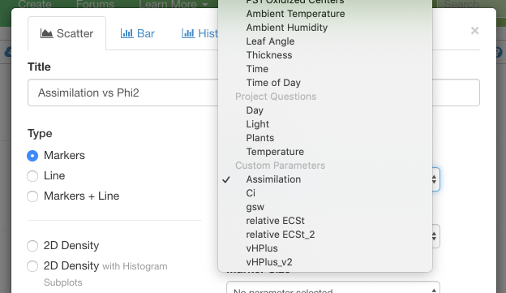
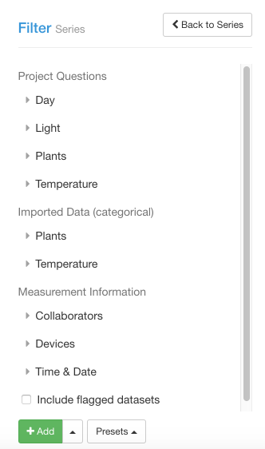

# Import Custom Data

PhotosynQ allows to collect a variety of information with a measurement, including automatic meta information including `time`, `location`, `user`, etc. as well as in form of Project Questions that need to be manually answered before each measurement. Further, photos and notes can be attached to each measurement. Sometimes though, additional data needs to be added, that is not available at the time of the measurement. This could be yield, the absolute amount of chlorophyll measured in the lab, data from other sensors, etc. Or you have some calculations made outside of the platform, that you would like to add into your dataset. Importing Custom Data allows you to do that.

## Adding Data

If you have created a Project (project lead) or you are an administrator, you can add additional data to a Project.

1. Go to <https://photosynq.org> and sign in to your account.
2. Navigate to the Project you want to add data to.
3. Select **Options** from the side bar and select **Import data**

Now follow the three steps to ensure that you upload the data correctly.

The first step is to download the spreadsheet template. It will contain several columns, including the unique ID for every measurement, the time the data was collected (UTC) and the project questions.

Open the file, with your preferred spreadsheet application like Excel, Numbers, Calc, etc. The first two columns, `ID` and `time`, are required and cannot be altered. The other columns are the Project questions with the given answers to help identifying the measurements.

Add a new column to add a new parameter to your dataset. The first row is the column header which will be the parameter name later on, e.g. `Yield [tons/ha]`. Add your data below.

When you are done you can remove the columns with the Project questions. Save your file and upload it to your project. If the upload was successful, the first 10 rows are displayed with the data added to your project.

Now the data is available for viewing and working with on the website, as well as the external libraries.

::: tip
**Tip:** If you are missing a dataset, leave the cell blank.
:::

::: warning
**Note:** The csv file that has been downloaded, is comma separated. When saving the additional data, make sure the data is still separated by a comma.
:::

## Updating Data

If you take more measurements, you want to add or remove a parameter or correct a mistake, select **Import data** from you Projects' options menu. Download the spreadsheet again. Now it contains all the data, that has been previously uploaded. Make your changes, save the file and re-upload it. The changes are available right away.

::: warning
**Note:** When uploading data, the old data will be overwritten without a warning.
:::

### Add a Parameter

Adding a parameter is easy. Just add a new column, where the first row is the parameter name. Add the parameter values underneath.

### Edit a Parameter

You can change the name of a parameter, by just changing the header name. You can also just change the values that need to be updated.

### Remove a Parameter

To remove a parameter, just delete the column with the parameter.

## Data Types

When it comes to viewing your data, it is important to understand how the import works. Data can be either `numerical` like `1` or `2.452` or `categorical` like `stressed`. When uploading categorical data, it can be used to filter your dataset or to group data in a plot. Numerical data can be used in scatter plots, for histograms, etc. but not for filtering a dataset. When mixing both types, it is assumed the type for the parameter is categorical. In case you are missing values for `numerical` data, just leave the cell empty instead of adding `N/A` or some other description. Otherwise the data will not be available for plotting.

## Viewing Data

The data imported into the project is available for viewing like the data generated from measurements.

### Plotting / Map

`Numerical` data can be used in plots as well as on the map when showing a heatmap. In the dropdown menu for selecting a parameter there is a category labeled **Custom Parameters**, which contains all available parameters from the imported data.

### Spreadsheet

When viewing the Project data, you can open the spreadsheet and select the **Imported Data (Custom Data)** option from the **Protocols** dropdown menu.

### Filtering

When categorical data is imported, it can be used to filter the data into series. This is a way of adding filters in addition to the Project Questions.

## Use Cases

**Yield** data is not available at the time of the measurement. When analyzing the data on PhotosynQ the yield data can be added later to analyze it with the previously taken measurements.

**Accession Numbers** can be complicated to enter while in the field or it is easy to make mistakes. The accession numbers can be added later and then used to filter datasets when viewing the data on PhotosynQ.

**Colors** can be useful in scatter plots or on a map using custom gradients or a specific coloring that would otherwise not be available. You can use the same way of defining colors as in macros using either the hexadecimal `#44BDBD`, RGB `rgb(68, 189, 189)` or RGBA `rgba(68,189,120,0.5)` notation.