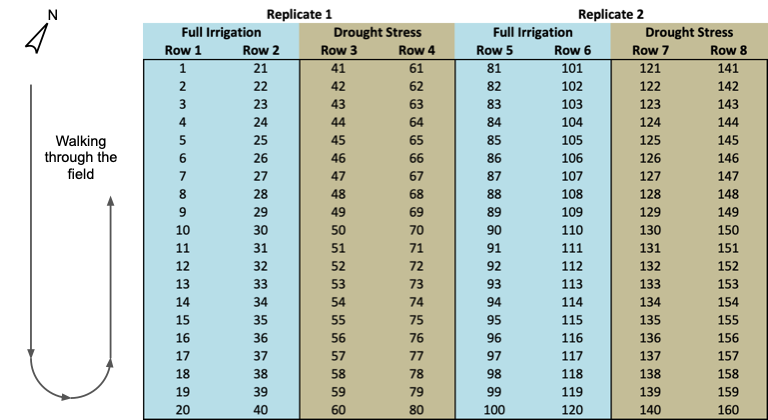
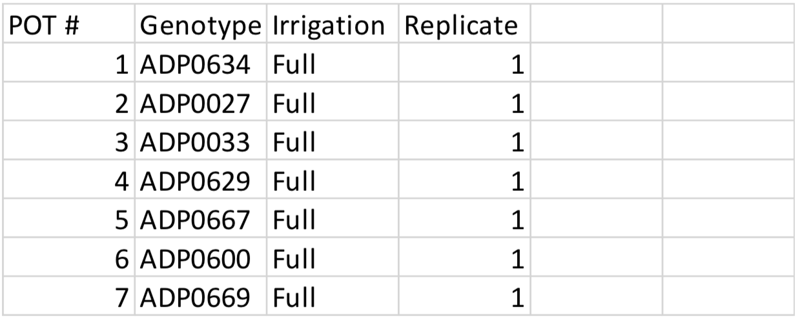

# Large Scale Projects

An important feature of the PhotosynQ platform is the ability to connect plant physiological data with key metadata such as genotype, treatment, etc. However, in large scale projects featuring 10’s to 100’s of different populations, it can be very time consuming for data collectors to scroll through long lists of options to answer project questions. To overcome this constraint you can upload a .csv file with the answers to project questions in order, allowing data collectors to use the *auto-increment* feature to drastically reduce the time spent answering project questions in the field.

## Planning Data Collection

### Setting up CSV File

Any spreadsheet software including Excel, Numbers, Calc, etc. can be used to create a csv file. When setting up the file to upload multiple Project Questions, the first row will be used as the question and all subsequent rows as answers. Each column represents a new question. Make sure, there is an equal number of answers to each question.

::: warning
**Note:** When saving the csv file, make sure to select a comma as a separator.
:::

### Ordering the Data

The order of the answers has to reflect the path the data collector would take through the field. That means that answers may not be in numerical order. When deciding on how to walk through a field make sure to minimize the walking distance and allow for more measurements.

### Example

The Based on the example field layout above, 4 Project Questions would be generated from the provided csv file: POT #, Genotype, Irrigation, Replicate

::: warning
**Note:** The example assumes there is only one measurement per pot. If more measurements are supposed to be collected, it needs to be reflected in the csv.
:::

## Setting up Project Questions

To set up Project Questions from a csv file, select **Upload Questions/Answers from spreadsheet (.csv)** from the **Add a question** dropdown menu during the **Questions for collaborators** step in the project creation.

## Taking Measurements

When using the Mobile Application for collecting measurements, Project questions have the option for *auto incrementing* answers. Check the **Auto Increment** box, to automatically add the next answer with each question.

Once the **Auto Increment** box has been checked, all available answers are listed. Select the answer that is supposed to be used as a **starting point**. Depending on the number of answers you will have to scroll a bit to find the answer that is needed. Repeat the steps with the rest of the answers to the Project Questions.

::: tip
**Tip:** When multiple people are collecting data in the field, they should start at different locations to randomize the data collection. This will be easier to accomplish when using the preset Question/Answer combinations as they guide the data collectors through the experiment.
:::

### New Measurement

After each measurement, the Mobile Application will automatically input the next answers when **New Measurement** is selected.

::: warning
**Note:** The Desktop Application is not supporting this function.
:::
