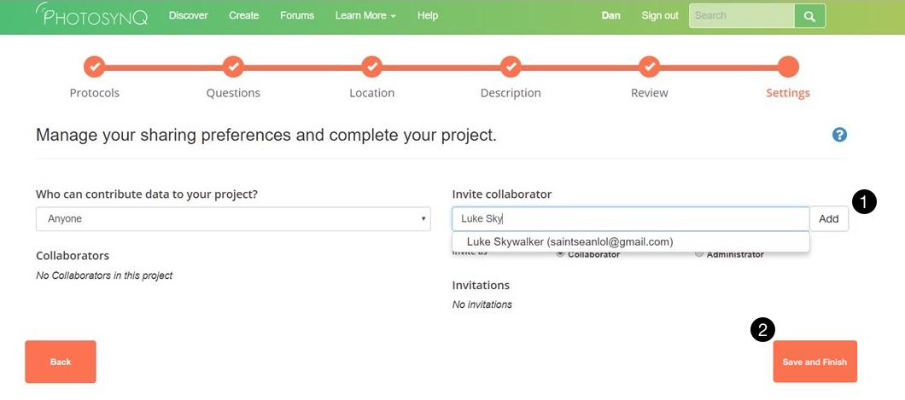
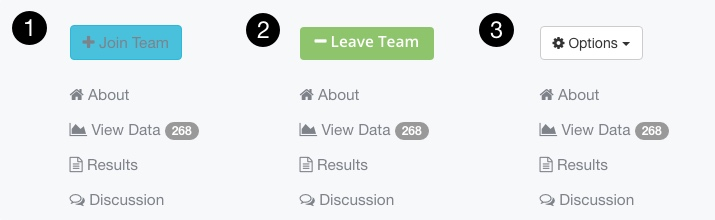

# Project Collaborators

You can invite collaborators to your Projects and others can invite you to collaborate on their Projects. You only have to invite others if your project is *not* open for everyone to join.

## Invite a Collaborator

You can invite collaborators to join your Project either when you are creating a Project, or invite them to an already created Project.

### While creating a Project

1. In the **Settings** tab, select **Collaborators only** from the "Who can contribute data to your Project" drop down menu
2. Enter the email address of the collaborator you are inviting in the **Invite collaborator** box
3. After typing in the email address, click the **Add** button. You can invite as many collaborators has you want, and you can choose if you want them to be a collaborator (meaning they can contribute data) or an administrator (meaning they can edit you Project)
4. Once you have finished inviting collaborators, click **Save and Finish** from the bottom of the page

### To an existing Project

1. Go to the Project homepage on <https://photosynq.org>
2. Click on the **Options** menu. The options menu will only be visible if you are the Project administrator
3. Select **Settings**
4. Follow steps 1-4 above to invite collaborators

::: tip Tip
If you have selected the **Anyone** option from the "Who can contribute data to your Project" menu, then you do not need to send an invitation to collaborators. Instead they can **join** the Project from the Project homepage by clicking the **Join Team** button.
:::

## Invite an Administrator

You can invite admins in the same way you invite a collaborator. In this case you select administrator when adding the user (see above). Administrators can make changes to the project just like the Project Lead (the creator of the Project) can.
