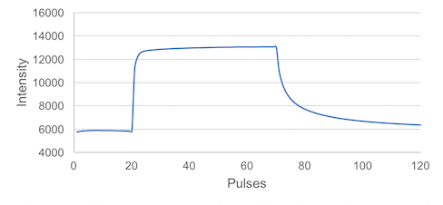

# Create / Edit a Protocol

When getting started using the PhotosynQ platform with an instrument like the MultispeQ, several preset measurement Protocols are provided. These Protocols have Macros connected that calculate a defined set of parameters from the measurement data. If your experiment requires more or different parameters or an altered Protocol, you can setup your own measurement Protocol or make changes to an existing one.

## Create New Protocol

1. Make sure you have the Desktop Application installed and you are signed in.
2. Navigate to **File → New Protocol...** to open the Protocol Editor and start a new Protocol.
3. Connect the Instrument you want to use the Protocol with.
4. Check out the documentation on individual commands in the [here](../protocols/commands.md).
5. Make sure you have your Instrument connected properly, so you can click on <code><i class="fa fa-play"></i> Run</code> or use the shortcut <kbd>Ctrl/⌘</kbd>+<kbd>↵</kbd> to test your Protocol
6. Now you can start building your Protocol...

::: tip Tip
Use **<i class="fa fa-play"></i> Run** or the shortcut <kbd>Ctrl/⌘</kbd>+<kbd>↵</kbd> to test your Protocol at any time.
:::

## Edit a Protocol

You can change one of your Protocols or extend an already existing one at any time.

1. Select **Protocols** from the left menu bar.
2. Click on the Protocol in the list and click on **Edit** in the sidebar.
3. Make your changes to the Protocol.
4. Select **Save as...** from the File menu or use the shortcut <kbd>Ctrl/⌘</kbd>+<kbd>Shift/⇧</kbd>+<kbd>S</kbd>.
5. Update the description if needed.
6. Save the changes by **Save As**.

::: tip Tip
Often it is easier to start altering an already existing Protocol. To save it change the name too and the only option available is **Save as**.
:::

## Save a Protocol

Once you have finished your Protocol, save your work to use it in your Projects and to share it with the community.

1. When you have the Protocol Editor open, select **Save** from the File menu or use the shortcut <kbd>Ctrl/⌘</kbd>+<kbd>S</kbd>.
2. In the save dialog, add a Protocol name, description and pick a Protocol category.
3. Make sure, the correct macro is connected (not mandatory)
4. Save the Protocol by selecting **Save**.

### Troubleshooting

If you have issues saving the Protocol, make sure you check these things first:

- When a Protocol is finished, no warnings or errors are indicated.
- Make sure you have a name, description and category.
- Check that the name is not already existing.

## Example - Photosystem II efficiency

In this tutorial, we show you how to acquire a simple Phi2 value using the MultispeQ. Before we start, lets take a look at the measurement.


**The Measurement can be divided up into three parts:**

1. **20** Pulses at ambient light intensity
2. **50** Pulses at a saturating light intensity
3. **20** Pulses at ambient light intensity

This is all we need to record the photosystem II quantum efficiency, or Phi2.

### Pulses

A measurement is divided into pulses. Pulses can be grouped into pulse sets. The example below shows a total of **90** pulses grouped into **3** pulse sets. Most of the following parameters require you to define those **3** groups. `pulses` defines those groups, `pulse_distance` defines how far apart each pulse is (in *µs*). The command `pulse_length` defines the pulse duration in *µs*.

```javascript
[
    {
        "pulses": [
            20, 50, 20
        ],
        "pulse_distance": [
            10000, 10000, 10000
        ],
        "pulse_length": [
            [ 30 ], [ 30 ], [ 30 ]
        ],
        ...
    }
]
```

### Pulsed lights

Once we have defined are pulse groups, we need to define the lights we want to use to probe the fluorescence. `pulsed_lights` defines which lights are pulsed during each pulse set. `0` means that there is no light pulsing, `3` uses the 605 nm LED (amber), Lumileds LXZ1-PL01. `pulsed_lights_brightness` defines the light intensity of each pulse. Since multiple lights can be pulsed, lights or brightness are written like `[3]` this and not simply like `3`. Multiple light would be written in this way: `[2,3]`.

```javascript
[
    {
        ...,
        "pulsed_lights": [
            [ 3 ], [ 3 ], [ 3 ]
        ],
        "pulsed_lights_brightness": [
            [ 2000 ], [ 2000 ], [ 2000 ]
        ],
        ...
    }
]
```

### Non Pulsed Lights

In this protocol we need an actinic light (which is not pulsed), so the plant has light available to continue doing photosynthesis during the measurement. To set the intensity we use the command `light_intensity` to reproduce the ambient light intensity, which is recorded by the PAR sensor. Light `2` is the 655 nm LED (red), Lumileds LXZ1-PA01.

```javascript
 [
    {
        ...,
        "nonpulsed_lights": [
            [ 2 ], [ 2 ], [ 2 ]
        ],
        "nonpulsed_lights_brightness": [
            [ "light_intensity" ], [ 4500 ], [ "light_intensity" ]
        ],
        ...
    }
 ]
```

### Detectors

Next we have to define the detector we want to use to record the fluorescence coming off the leaf. We use the command `detectors` to define which detector we will use for each pulse set. Since we can use multiple detectors per pulse set we use `[1]` instead of the `1` notation (using two detectors would look like this: `[1,2]`). When the detector is set to `0` no data is captured. Detector `1` is the 700 nm - 1150 nm, Hamamatsu S6775-01.

```javascript
[
    {
        ...,
        "detectors": [
            [ 1 ], [ 1 ], [ 1 ]
        ]
        ...,
    }
]
```

### Environmental Parameters

To record the ambient light intensity required for the non pulsed lights intensity, we have to add a command to include the PAR sensor using `light_intensity`. This is also where you could add other environmental parameters like temperature, relative humidity, etc, depending on the sensors available in your Instrument.

```javascript
[
    {
        ...,
        "environmental": [
            [ "light_intensity" ]
        ],
        ...
    }
]
```

### Starting the Measurement

To start the measurement as soon as we have clamped the leaf, in order to perturb it as little as possible, we add the following command: `1` indicates the measurement starts as soon as the clamp is closed and `0` starts the measurement as soon as you select `Start Measurement` on your device.

```javascript
[
    {
        ...,
        "open_close_start": 1
    }
]
```

### The final Protocol

Putting all the pieces together, the protocol to measure Phi2 looks like this:

```javascript
[
    {
        "pulses": [
            20, 50, 20
        ],
        "pulse_distance": [
            10000, 10000, 10000
        ],
        "pulse_length": [
            [ 30 ], [ 30 ], [ 30 ]
        ],
        "pulsed_lights": [
            [ 3 ], [ 3 ], [ 3 ]
        ],
        "pulsed_lights_brightness": [
            [ 2000 ], [ 30 ], [ 30 ]
        ],
        "nonpulsed_lights": [
            [ 2 ], [ 2 ], [ 2 ]
        ],
        "nonpulsed_lights_brightness": [
            [ "light_intensity" ], [ 4500 ], [ "light_intensity" ]
        ],
        "detectors": [
            [ 1 ], [ 1 ], [ 1 ]
        ],
        "environmental": [
            [ "light_intensity" ]
        ],
        "open_close_start": 1
    }
]
```

### Save the Protocol

Now it is time to save the Protocol so you can use it in the future. Select **Save** from the File menu or use the shortcut <kbd>Ctrl/⌘</kbd>+<kbd>S</kbd> to save the Protocol to the PhotosynQ platform. Provide a meaningful name, description and select a category your Protocol falls into. You don't have to select a Macro at this point, since you don't have one created yet.

### Take a Measurement

When you have saved your protocol, go ahead and take a Measurement using a plant, so you get realistic data. Once the Measurement is done, save it to your [Notebook](../desktop-application/notebook.md), so you can use it to create your Macro.

### Add a Macro

In order to process the Measurement and calculate you need to associate a Macro with your Protocol. See the tutorial [Building a Macro](./building-a-macro.md) on how to build a Macro and process the data coming out of the protocol you have just created.

[JSON_URL]: https://www.w3schools.com/js/js_json_intro.asp
[Desktop App]: https://photosynq.org/software#desktop

## Example - Advanced Protocol

In the previous tutorial we showed you how to write a Protocol for a simple Phi2 measurement. Make sure you are familiar with this first example, before you tackle this next tutorial. Here we want to explain to you how to build a complex Protocol, which combines simple Protocols like the Phi2 from the previous example into one set of Protocols, a **Protocol Set**.

::: tip Tip
The advantage of using a Protocol with a _Protocol set_, rather selecting multiple Protocols to be executed one after another is, that your Macro has access to all protocols inside that set.
:::

### Protocol Sets

The key to chain multiple Protocols together into one is the `_protocol_set_` command. In the example below, you see how the command is used inside a Protocol. All Protocols you would like to execute as one you can put into the `_protocol_set_` array. For example you can copy and paste existing protocols into the `_protocol_set_: [...]`. Make sure you remove the square brackets <code><s>[</s>{Protocol}<s>]</s></code> before you add the Protocol into the **Protocol Set**.

```javascript
[
    {
        "_protocol_set_": [
            // All your protocols go in here
        ]
    }
]
```

### Macro required!

In contrast to regular Protocols, when using Protocol Sets you have to use a Macro in order to output Parameters. That way, you have full control over the output of complex measurement Protocols (see [Building Advanced Macros](./building-advanced-macros.md)).

### Special Commands

There are a couple of commands to allow Protocols inside a **Protocol Set** to communicate with each other, meaning information like light intensity can be transferred from one Protocol to the next. This is *not possible* if regular Protocols are chained together (select multiple Protocols during Project creation).

### Labels

The command `label` allows to give every Protocol within a **Protocol Set** a name, so it is easier to identify when creating a Macro.

### Previous Light Intensity

The command `previous_light_intensity` allows to measure the light intensity in the first Protocol and re-use it in all the subsequent Protocols instead of measuring it each time. The light intensity used and displayed in the subsequent Protocols will be the same as in the first one.

### Building a Protocol Set

```javascript
[
    {
        "_protocol_set_": [
            {
                "label": "Phi2",
                "pulses": [
                    20, 50, 20
                ],
                "pulse_distance": [
                    10000, 10000, 10000
                ],
                "pulse_length": [
                    [ 30 ], [ 30 ], [ 30 ]
                ],
                "pulsed_lights": [
                    [ 3 ], [ 3 ], [ 3 ]
                ],
                "pulsed_lights_brightness": [
                    [ 2000 ], [ 2000 ], [ 2000 ]
                ],
                "nonpulsed_lights": [
                    [ 2 ], [ 2 ], [ 2 ]
                ],
                "nonpulsed_lights_brightness": [
                    [ "light_intensity" ], [ 4500 ], [ "light_intensity" ]
                ],
                "detectors": [
                    [ 1 ], [ 1 ], [ 1 ]
                ],
                "environmental": [
                    [ "light_intensity" ]
                ],
                "open_close_start": 1
            },
            ...
        ]
    }
]
```
