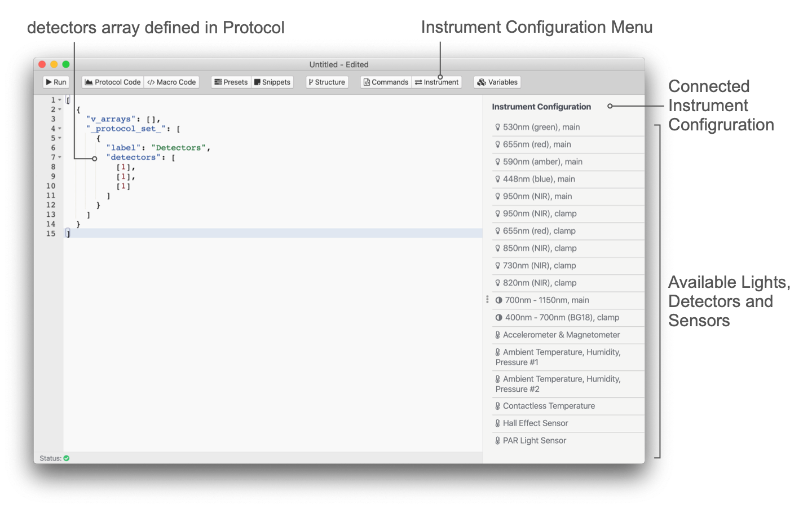

# Detectors

In protocols `detectors` is used to collect spectroscopic data. The command only defines, which detector is used for the detection. The duration for the detection is defined by `pulse_duration`. The signal intensity is accumulative, meaning a longer duration will result in a larger signal. Detectors are returning a signal intensity in a range from 0-65K.

::: tip
The MultispeQs have two detectors, one to cover the visible range (VIS) and one for the infrared (IR). The given range does not mean a spectrum returned for the given range, but any light detected is represented by the intensity.
:::

## Define Detectors

Detectors are defined using the `detectors` array. For each set of pulses an array is defined with at least one detector. If multiple detectors are defined, pulses are given for each detector as defined for the set. For clarification, please find the examples below.

```javascript
...
    {
        "detectors": [
            [ 1 ], [ 1 ], [ 1 ]
        ],
        ...
    }
...
```

::: tip
When setting up the detectors and lights, make sure, the positions of both match up with the type of measurement you would like to perform.
:::



The detectors are available in the protocol editor when an instrument is connected. Just select More from the sidebar and then Instrument to bring up a list of lights, detectors and sensors available for that instrument. Double click the sensor you would like to use and the number gets inserted into the code at the cursor position.

## Output

The data from the detectors is returned in an array called `data_raw`. It contains the numbers returned from the detector as they are defined within `detectors`. If more than one detector is used, the data of all detectors is returned the array `data_raw` and the signals need to be separated out in the macro.

::: tip
The detector data is send as a mixed stream, since the instrument is not able to cache the entire measurement before sending it to the device. The macro offers functions, that allow to entangle the detector streams pretty easily (see [Provided Functions](../macros/provided-functions.md)).
:::

### No output

When pulses are used, but the output from the detector is supposed to be omitted, the detector can be set to `0`.

### Examples

Depending on the combination of detectors used in a measurement in combination with different numbers of pulses, the output can be confusing. The table below visualizes simple examples of different combinations of pulses and detectors.

| Pulses `pulses` | Detectors `detectors` | Output `data_raw`      |
| :-------------- | :-------------------- | :--------------------- |
| `[ 2 ]`         | `[ [0] ]`             | `[ ]`                  |
| `[ 2 ]`         | `[ [1] ]`             | `[ 1, 1 ]`             |
| `[ 2, 1 ]`      | `[ [1], [1] ]`        | `[ 1, 1, 1 ]`          |
| `[ 2, 1 ]`      | `[ [3], [1] ]`        | `[ 3, 3, 1 ]`          |
| `[ 2 ]`         | `[ [1, 3] ]`          | `[ 1, 3, 1, 3 ]`       |
| `[ 2, 1 ]`      | `[ [1, 3], 1 ]`       | `[ 1, 3, 1, 3, 1 ]`    |
| `[ 2 ]`         | `[ [1, 3, 1] ]`       | `[ 1, 3, 1, 1, 3, 1 ]` |

See the [Building an Advanced Macro](../tutorials/building-an-advanced-macro.md#multiple-detectors) tutorial on how to extract and work with the data stream returned in `data_raw`.
