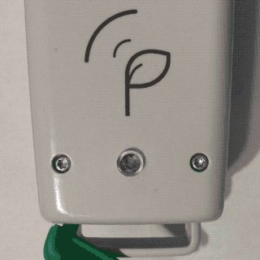

# Indicator Light

The MultispeQ has an indicator light on top to indicate the status of the Instrument. During measurements the indicator light can be used to communicate progress or certain actions using the Protocol command `indicator`.



:::warning Note
This feature is only available for MultispeQ v2.0.
:::

## Setting a Color

A color is defined by four channels, `red`, `green`, `blue` and `white`. The white channel is not used, but needs to be defined. The values for each channel range from `0` to `255` and only integers are allowed.

```javascript
"indicator": [red,green,blue,white] // (requires a list with 4 integers, from 0-255)
```

When a new color is set, it will stay that color until it is changed again, stopped by other events or turned off. In a protocol set (`_protocol_set_`) going to the next protocol will not change the indicator state.

### Default

When a protocol starts, the indicator light turns on <i class="fa fa-square" style="color:#0000FF"></i> **blue** by default. You can overwrite this color using the `indicator` command.

### Example

```javascript
// Turn on the Indicator light in Red
"indicator": [255,0,0,0]

// Turn on the Indicator light in Teal
"indicator": [0,128,128,0]

```

### Basic Colors

| Color                                              | Name              | `Red`,`Green`,`Blue`,`White` |
| :------------------------------------------------: | ----------------- | ---------------------------- |
| <i class="fa fa-square" style="color:#FFFFFF"></i> | White             | `255`,`255`,`255`,`0`        |
| <i class="fa fa-square" style="color:#FF0000"></i> | Red               | `255`,`0`,`0`,`0`            |
| <i class="fa fa-square" style="color:#00FF00"></i> | Lime              | `0`,`255`,`0`,`0`            |
| <i class="fa fa-square" style="color:#0000FF"></i> | Blue              | `0`,`0`,`255`,`0`            |
| <i class="fa fa-square" style="color:#FFFF00"></i> | Yellow            | `255`,`255`,`0`,`0`          |
| <i class="fa fa-square" style="color:#00FFFF"></i> | Cyan / Aqua       | `0`,`255`,`255`,`0`          |
| <i class="fa fa-square" style="color:#FF00FF"></i> | Magenta / Fuchsia | `255`,`0`,`255`,`0`          |
| <i class="fa fa-square" style="color:#800000"></i> | Maroon            | `128`,`0`,`0`,`0`            |
| <i class="fa fa-square" style="color:#808000"></i> | Olive             | `128`,`128`,`0`,`0`          |
| <i class="fa fa-square" style="color:#008000"></i> | Green             | `0`,`128`,`0`,`0`            |
| <i class="fa fa-square" style="color:#800080"></i> | Purple            | `128`,`0`,`128`,`0`          |
| <i class="fa fa-square" style="color:#008080"></i> | Teal              | `0`,`128`,`128`,`0`          |
| <i class="fa fa-square" style="color:#000080"></i> | Navy              | `0`,`0`,`128`,`0`            |
| None                                               | Turn Light Off    | `0`,`0`,`0`,`0`              |

## Turn Light Off

By default the light will turn off after the Protocol is done. If you want to turn off the indicator light earlier or in between the measurement, you can do so setting every channel to `0`.

```javascript
// Turn on the Indicator light off
"indicator": [0,0,0,0]
```
