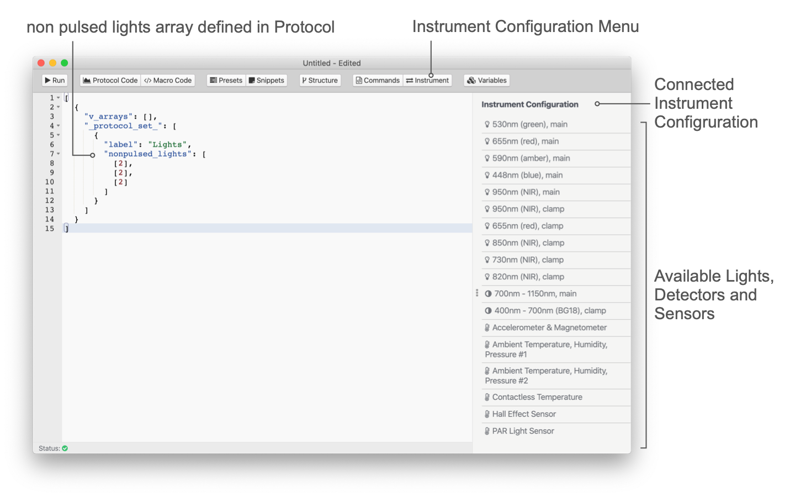

# Lights

In protocols `detectors` is used to collect spectroscopic data. The command only defines, which detector is used for the detection. The duration for the detection is defined by `pulse_duration`. The signal intensity is accumulative, meaning a longer duration will result in a larger signal. Detectors are returning a signal intensity in a range from 0-65K.

::: tip
The MultispeQs have two detectors, one to cover the visible range (VIS) and one for the infrared (IR). The given range does not mean a spectrum returned for the given range, but any light detected is represented by the intensity.
:::

## Pulsed Lights

The pulsed lights or measuring pulses are defined by `pulsed_lights`, an array where every pulse set is an array that defines which and how many lights (LEDs) are used for measurements. The `pulsed_lights_brightness` defines the intensity. In case more than one LED is selected, the light intensity for each LED needs to be set.

When more than one LED is defined, each LED will give a pulse consecutively and the procedure is repeated as defined by the pulse set. The same principle applies to the [detectors](../protocols/detectors.md).

```javascript
...
    {
        "pulsed_lights": [
            [ 3 ], [ 3 ], [ 3 ]
        ],
        "pulsed_lights_brightness": [
             [ 2000 ], [ 2000 ], [ 2000 ]
        ],
        ...
    }
...
```

::: tip
When setting up the detectors and lights, make sure, the positions of both match up with the type of measurement you would like to perform.
:::



The light are available in the protocol editor when an instrument is connected. Just select More from the sidebar and then Instrument to bring up a list of lights, detectors and sensors available for that instrument. Double click the sensor you would like to use and the number gets inserted into the code at the cursor position.

## Non Pulsed Lights

The `nonpulsed_lights` command is defining, which lights (LEDs) are constantly on during a pulse set. The `nonpulsed_lights_brightness` defines their light intensity. In case more than one LED is selected, the light intensity for each LED needs to be set.

::: tip
In contrast to pulsed lights, if more than one light is defined, the lights are turned on together and not consecutively.
:::

```javascript
...
    {
        "nonpulsed_lights": [
            [ 2 ], [ 2 ], [ 2 ]
        ],
        "nonpulsed_lights_brightness": [
            [ "light_intensity" ], [ 4500 ], [ "light_intensity" ]
        ],
        ...
    }
...
```

## Light Intensities

When using the commands `pulsed_lights_brightness` and `nonpulsed_lights_brightness` the intensity depends on the type of LED. When using a LED that is within the PAR range of 400nm to 700nm, the value provided, defines the intensity in µE * s⁻¹ * m⁻². For all other LEDs the values can be between 0 and 4096, where 4096 is the maximum intensity.

Two sensor commands can be used in combination with`nonpulsed_lights_brightness`, `light_intensity` and `previous_light_intensity`. These allow the replication of the ambient light inside the measurement chamber. This only works together with the red actinic light at 655nm at this point.

::: warning
Lights outside of the PAR range require a minimum voltage to operate. Make sure to test, what the minimum number for each LED is to be sure it is functioning at very low intensities.
:::

### No Lights

When pulses are used, but the output from the detector is supposed to be omitted, the `pulsed_lights` can be set to `0`.
