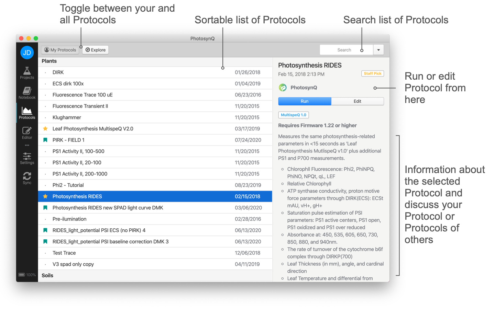
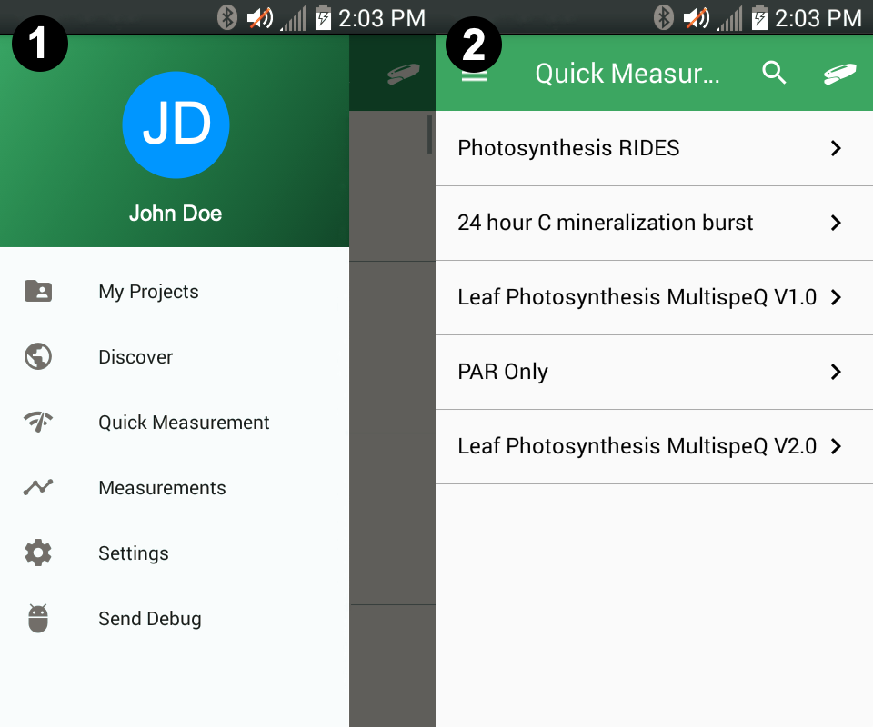

# Protocol Basics

Protocols are instructions for Instruments like the MultispeQ on how to run a measurement. Those instructions written in the **J**ava**S**cript **O**bject **N**otation or [JSON][JSON_URL]. PhotosynQ is providing preset Protocols indicated by a <i class="fa fa-star text-warning"></i> start icon called **Staff Picks**. They are listed in the applications as standard Protocols, as well as the standard Protocols when setting up a new Project. All Protocols developed on PhotosynQ are open and accessible through the website and the applications.

::: tip Tip
Protocols can be associated with **Macros** which are small pieces of code that help you analyze a measurement immediately after it has been collected. When a Macro is available, it is indicated on the Website as well as in the Desktop Application.
:::

## Browser

1. Go to your user profile by clicking on your user name in the top menu bar. If you are not signed in, do that first.
2. Select the **Protocols** tab to list all of your Protocols.
3. Click on a Protocol to get to the Protocol page with the Protocol description, the Protocol Code and the Comments. On the right hand-side, you will further find the Protocol category, the connected macro, and compatible Instruments.

## Desktop Application

1. Open your protocols by selecting **Protocols** from the left menu bar or using the shortcut <kbd>Ctrl/⌘</kbd>+<kbd>3</kbd>.
2. Click on **My Protocols** to list all your protocols, if it is not already available.
3. Click on a protocol in the list to show detailed information in the side bar.

::: tip Tip
In case you want to see the work of others, select **Explore** from the top menu.
:::

## Mobile Application

1. Tap the <i class="fa fa-bars"></i> overflow menu in the top left corner.
2. Select **Quick Measurements** from the menu.

## Protocol compatibility

Whether a Protocol will run on an Instrument depends on the type of Instrument, as well as on the version and configuration. Make sure to read the Protocol description to see if there are limitations. When you are creating a Protocol, make sure to mention which Instruments are supported. You can also use the discussion to check with the Protocol creator if it will be compatible with your instrument.

When a Protocol is run that is not compatible, it can cause the following issues:

+ The Instrument will crash and needs to be restarted to continue working with it.
+ The Protocol will run and return results but the wrong lights could be triggered.
+ No or wrong data/results is returned after the Protocol is done.

::: tip Tip
You might want to make sure your Instruments are able to run a Protocol prior to starting an experiment in the field since it might be difficult to change the Project when you are out of your office.
:::

[JSON_URL]: https://www.w3schools.com/js/js_json_intro.asp
