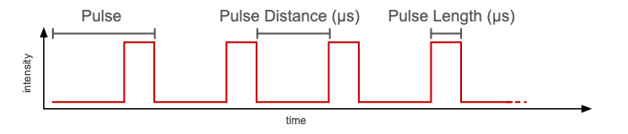
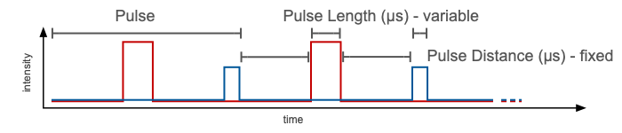

# Pulses

Pulses define the framework for a measurement protocol. The timing, lights and detectors are controlled by the pulses. The `pulses` element is an array in which each element, called a **pulse set**, with a number defines how many pulses are given. These pulses, also measurement pulses have a set distance, defined by the `pulse_distance` and a specific duration defined by `pulse_length`. In contrast to the other two, `pulse_length` is an array, in which each element is an array, allowing to define different durations, for example if different lights or detectors are used within one set.

## Pulse Sets

When defining a measurement protocol, it can be helpful, to group the measurement into different phases, each defined by a pulse set. The tutorial [Building a Protocol](../tutorials/building-a-protocol.md) provides a simple example on how to set up pulse sets for a photosynthetic yield measurement.

### Using a single Light Source

Most measurement protocols only require one light source at a time. The example is showing how to define pulses with a length of 30 µs and 10000 µs (10 ms) apart. How to set the intensity of the pulses is described in [Lights](./lights.md).

```javascript
...
    {
        "pulses": [
            20, 50, 20
        ],
        "pulse_distance": [
            10000, 10000, 10000
        ],
        "pulse_length": [
            [ 30 ], [ 30 ], [ 30 ]
        ],
        ...
    }
...
```

#### Timeline of Pulses from a single Light Source



### Using multiple Light Sources

In case you want to measure multiple kinetics at the same time using different light sources, you can define the sources as described in [Lights](./lights.md). When using multiple light sources, the **pulse distance is fixed**, but you can have a **different pulse length** for each light source. Since the different light sources are pulsed one after another and each is separated by the duration defined in `pulse_distance`, be aware that the timing for each individual light source changes. In the example with one light source, each pulse indicated by the red line is 10 ms apart. In the example below, each pulse of the light source indicated in red is now 20 ms apart, or to be exact, 20015 µs.

```javascript
...
    {
        "pulses": [
            20, 50, 20
        ],
        "pulse_distance": [
            10000, 10000, 10000
        ],
        "pulse_length": [
            [ 30, 15 ], [ 30, 15 ], [ 30, 15 ]
        ],
        ...
    }
...
```

#### Timeline of Pulses from multiple Light Sources


