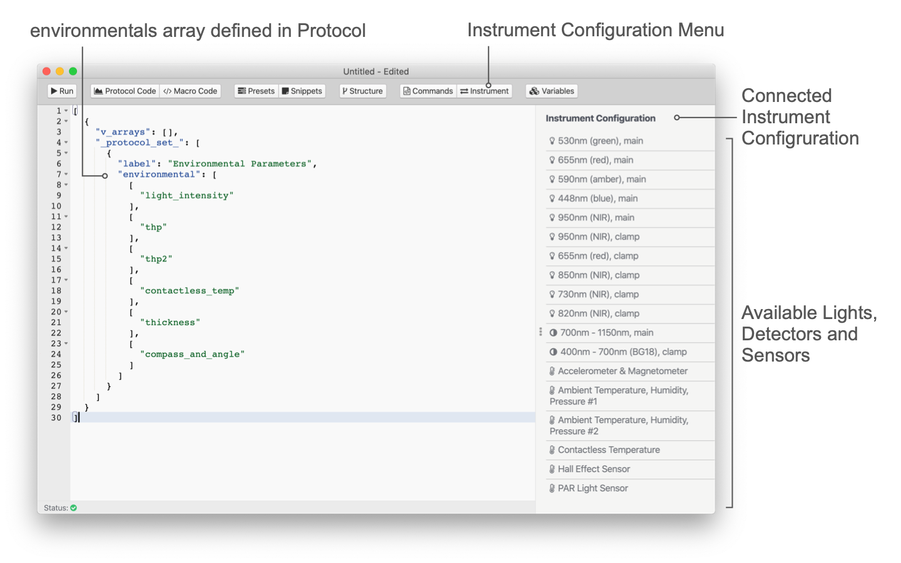

# Sensors

Instruments can have a set of sensors to capture information about the environment and to supplement measurements. This set of sensors can differ between instruments. Find the configuration of your instrument and the available sensors under **Instruments** → **Instrument configuration** (e.g. [MultispeQ v2.0](../instruments/multispeq-v2.0-configuration.md)).

::: tip
The light detectors used together with LEDs to perform spectroscopic measurements are not listed here. Please find them in the chapter about [Detectors](../protocols/detectors.md).
:::

## Add a Sensor

When writing a protocol, the sensors that are supposed to be included into a measurement go into the array of `environmentals`. Each sensor is added in the array notation. The first element of each array is the sensor name, the following ones are additional parameters for using the sensor.

```javascript
...
    "environmentals": [
        [ "sensor A" ],
        [ "sensor B" ],
        ...
    ]
...
```

## Sensor Commands

| Command                          | Data Returned                                                                |
| :------------------------------- | :--------------------------------------------------------------------------- |
| `light_intensity`                | Light intensity in µmol photons m⁻² s⁻¹ (PAR)                                |
| `previous_light_intensity`       | Light intensity from previous measurement (only in `_protocols_set_`)        |
| `temperature_humidity_pressure`  | Temperature (℃), rel. humidity (%), barometric pressure (mbar) - (sensor #1) |
| `temperature_humidity_pressure2` | Temperature (℃), rel. humidity (%), barometric pressure (mbar) - (sensor #2) |
| `contactless_temp`               | Contactless Temperature (℃)                                                  |
| `thickness`                      | Thickness (µm - microns)                                                     |
| `thickness_raw`                  | Thickness (raw values)                                                       |
| `compass_and_angle`              | Roll, pitch, angle and cardinal direction                                    |



The sensor commands are available in the protocol editor when an instrument is connected. Just select **More** from the sidebar and then **Instrument** to bring up a list of lights, detectors and sensors available for that instrument. Double click the sensor you would like to use and the command gets inserted into the code at the cursor position.

## Calibration

Not all sensors in PhotosynQ instruments need to be recalibrated like the contactless temperature sensor. They come factory calibrated. In case they do require re-calibration, like the PAR sensor, you will find instructions under [Instrument Calibrations](../instruments/instrument-calibrations.md).

::: tip Sensor Acclimation
Sensors like the temperature, rel. humidity and barometric pressure sensor need to acclimate to provide the correct ambient measurements. So when taking the instrument into an environment that is very different from the one it was stored in, make sure to provide an appropriate amount of time for acclimation.
:::
