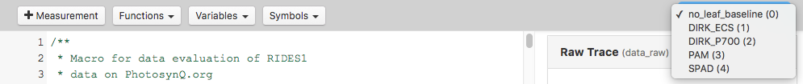

# Building an Advanced Macro

When building a Macro for a Protocol using the `_protocol_set_` command, you start of the same way as building a macro described in the previous example ([Building a Macro](./building-a-macro.md)). But since a protocol set was used, accessing the retuned Parameters has changed a little.

## The `json.set` Object

The object `json` is no longer holding all the measured Parameters as shown in the previous tutorial. Instead it has a key called `set` with all Protocols from the Protocol Set. Since `json.set` is an array of Protocols, you have to provide the index as well. If you want to access the third Protocol for example, you simply use `json.set[2]`. This can get a bit confusing, when you are using multiple Protocols inside your Set. To make it more accessible, the Macro Editor provides a dropdown menu in the top menu bar with all available Protocols inside a Set numbered starting from 0. If you use the `label` command inside each protocol, you will see the label in the dropdown menu making the access easier. After selecting the Protocol from the Set, use **Variables** from the top menu, to see and access all Parameters in the selected Protocol.



### Simple Protocol Set Example

```javascript
/**
 * Macro for data evaluation on PhotosynQ.org
 * by: John Doe
 * created: June 4, 2018 4:00 PM
 */

 // Define the output object here
var output = {};

// Check if the key time exists in the third protocol of the set
if (json.set[2].time !== undefined){
    // Add key time and value to output
    output.time = json.set[2].time;
}

// Return data
return output;
```

## Multiple Detectors

In the previous example for a simple for ([Building a Macro](./building-a-macro.md)) only one detector was used. But it can happen, that a measurement requires multiple detectors. This can be accomplished in two different ways as described. The number of data-points within the `data_raw` element in both examples the same, but the way the data is collected is fundamentally different (see [Detectors - Output Examples](../protocols/detectors.md#examples)).

### One Detector per Puls-Set

The detector readings in this example are sequential, so the first **20** pulses are recorded with **detector 1**, the next **20** pulses are recorded with **detector 3**. In the `data_raw` array, the first **20** values are the readings from **detector 1**, the next **20** from **detector 3**. Using the [JavaScript Array slice() Method](https://www.w3schools.com/jsref/jsref_slice_array.asp) the two readings can be easily separated in the analysis. Keep in mind, that the first value has the index `0`.

:::: tabs type:card

::: tab Protocol

```javascript
...
    pulses: [ 20, 20 ],
    detectors: [ [1], [3] ],
...
```

:::

::: tab Macro Code

```javascript
var detector1 = json.data_raw.slice(0,19);
var detector2 = json.data_raw.slice(20,39);
```

:::

::::

### Two or more Detectors per Puls-Set

In this scenario, the detector readings alternate between **detector 1** and **detector 3**. The total number of pulses will be **20**, but since the detectors now alternate, the returned values in `data_raw` alternate as well. To separate the output of the two detectors you can use the provided function [ArrayNth](../macros/provided-functions.md#arraynth). The alternative is to loop through the `data_raw` array and extract the values yourself.

:::: tabs type:card

::: tab Protocol

```javascript
...
    pulses: [ 20 ]
    detectors: [ [ 1, 3 ] ],
...
```

:::

::: tab Macro Code

```javascript
// ArrayNth( <array>, <step size>, <start> )
var detector1 = ArrayNth(json.data_raw, 2, 0 );
var detector2 = ArrayNth(json.data_raw, 2, 1 );
```

:::

::::
