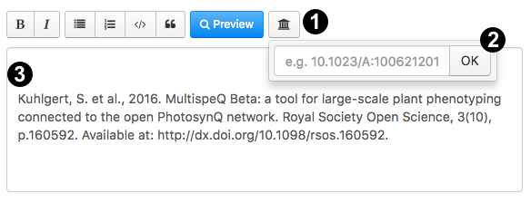

# How to Cite

**Congratulations on the progress you made in your research efforts!** We would like to give you some guidance on how to cite when you are writing up your findings, write up a description for a Protocol/Macro or starting a discussion using the PhotosynQ platform. Adding the proper citations will make it easier for your readers to gain a deeper understanding, follow your line of arguments... and it also is *good scientific practice*!

## Inserting Citations on PhotosynQ

We would like to make it as easy as possible for you to insert citations into your Project description, your Project results, even in Protocol or Macro descriptions and Forum posts. You will find next to the text formatting tools a <i class="fa fa-university"></i> Library icon. Click on the button (1) and add the DOI number of your reference (2). The reference including a link (3) will be added at the cursor position in the text.

## Using an Instrument

When you were using a MultispeQ and the PhotosynQ platform, please don't forget to cite us using the following reference:

Kuhlgert, S., Austic, G., Zegarac, R. Osei-Bonsu, I.,Hoh, D., Chilvers, M. I., et al. (2016). **MultispeQ Beta: a tool for large-scale plant phenotyping connected to the open PhotosynQ network.** *R. Soc. Open Sci.* 3, 160592. [doi:10.1098/rsos.160592].

[doi:10.1098/rsos.160592]: https://doi.org/10.1098/rsos.160592
