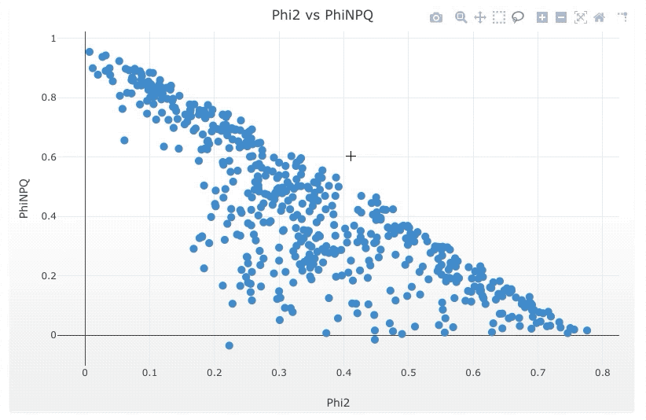

# Plot Data

The "first" step to look at your data is to plot parameters against each other. This is an easy way to identify trends, find outliers and identify low quality measurements.

## View Plots

1. Just select the **<i class="fa fa-area-chart"></i> Plot View** from the right menu underneath the Project name.
2. Select the type of plot and adjust the **Settings**.
3. Enter a plot title if you don't like the auto-suggestion.
4. Click on **Plot** to close the dialog and show the plot.

## Available Plot Types

### Scatter

You have a couple options for scatter plots, using **Makers**, **Lines** or **both**. The contour plots will only show lines.

+ Select the **Parameters** you would like to graph.
+ When you select markers, you can add additional parameters for marker size and color.

::: tip Tip
Adding **Marker Size and / or Color** will help to emphasize differences and trends, as well as show relationships between Parameters.
:::

### Bar

Bar charts are available to display averages. You can display the **standard deviation or error** along with the average.

+ Pick the **Parameter** you would like to average.
+ You can group the averages by a **Category**. Currently only the Project questions are available as categories.

### Histogram

There are two types of histograms, a **regular** bar chart and a **2D histogram** for two parameters. The values are displayed as a heat map. Further, you have **box plots** available.

+ Pick the **Parameter** from the dropdown menu.
+ Box plots can be grouped by a **Category**. Currently only the Project questions are available as categories.
+ For the 2D histograms, select a second Parameter and a color gradient.

### Scatter Plot Matrix (SPLOM) <Badge text="beta" type="warn"/>

The scatterplot matrix, or SPLOM, is a tool that uses multiple scatter plots to visualize correlations (if any) between a series of parameters. These scatter plots are then organized into a matrix, making it easier to find potential correlations.

+ Pick two or more parameters from the selection box.

## Working with Plots

### Navigation

- **Zoom in:** click on the <i class="fa fa-plus-square"></i> in the bar or draw a rectangle while holding down the left mouse button
- **Zoom out:** click on the <i class="fa fa-minus-square"></i> in the bar to zoom out in steps
- **Reset Zoom:** click on <i class="fa fa-arrows-alt"></i> in the bar or left double click on the plot to reset the zoom level
- **Scroll Zoom**: Use the scroll-wheel of your mouse to zoom in and out.
- **Pan**: Click on the <i class="fa fa-arrows"></i> icon from the bar to active the pan mode.

### Save Plot as an image

1. Select **Save** from above the plot and save the Plot as an image (.png)
2. Click on the <i class="fa fa-camera"></i> icon in the bar and save the Plot as an png.

### Save Plot data

1. Select **Save** from above the plot and save the Plot data as a comma (.csv) or tab (.txt) delimited file.

### Special functions (Scatter Plots)

Scatter plots, in contrast to the other available ones have an extended set of functionality.

## Measurement Details

Click on a marker of a **Scatter Plot** to open a new window and view the measurement details.

### Select Data Points

Scatter plots allow you to select data points by using the box or lasso selection tool from the bar. The dialog offers two options:

1. Add the selected data as a new Series.
2. Save the selected data points with the corresponding measurement ids, Project Questions and time stamps as a comma delimited file (.csv).

### Linear Regression

1. Select **Analysis** from above the plot to fit different linear regressions to your plot (only for scatter plots).
2. There will be one regression line per series.
3. The activity log will be displayed (or click on <i class="fa fa-bars"></i> and select activity log) displaying the equations. Further the equations are displayed in the plot legend.
