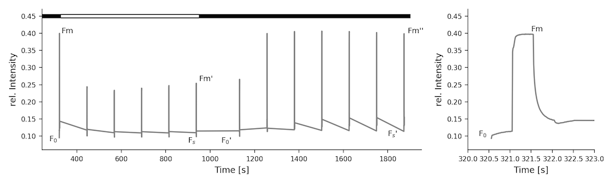

# References & Parameters

::: warning Note
This collection of references and equations is in no way complete nor is it intended to be. It is just a guideline to get you started in case you are working on your own calculations. If you use the equations, make sure to cite the publications accordingly.
:::

## Reviews & Articles

For a general purpose overview of fluorescence- and absorbance-based photosynthetic parameters, and their interpretation, we recommend the following sources:

Kramer, D.M., Cruz, J.A. and Kanazawa, A. (2003) **Balancing the central roles of the thylakoid proton gradient.** *Trends Plant Sci.* 8: 27-32 [doi:10.1016/S1360-1385(02)00010-9]

Baker, N.R., Harbinson, J., and Kramer, D.M. (2007) **Determining the limitations and regulation of photosynthetic energy transduction in leaves.** *Plant Cell Environ.* 30: 1107-1125 [doi:10.1111/j.1365-3040.2007.01680.x]

Baker, N.R. (2008) **Chlorophyll fluorescence: A probe of photosynthesis in vivo.** *Annu. Rev. Plant Biol.* 59: 89-113 [doi:10.1146/annurev.arplant.59.032607.092759]

Kramer, D. M., and Evans, J. R. (2011). **The importance of energy balance in improving photosynthetic productivity.** *Plant Physiol.* 155, 70–8. [doi:10.1104/pp.110.166652].

Kalaji, H. M., Schansker, G., Ladle, R. J., Goltsev, V., Bosa, K., Allakhverdiev, S. I., et al. (2014) **Frequently asked questions about in vivo chlorophyll fluorescence: practical issues.** *Photosynthesis Research* 122, 121–158.[doi:10.1007/s11120-014-0024-6].

Cruz, J. A., Savage, L. J., Zegarac, R., Hall, C. C., Satoh-Cruz, M., Davis, G. A., et al. (2016). **Dynamic Environmental Photosynthetic Imaging Reveals Emergent Phenotypes.** *Cell Syst.* 2, 365–377. [doi:10.1016/j.cels.2016.06.001].

Kalaji, H. M., Schansker, G., Brestic, M., Bussotti, F., Calatayud, A., Ferroni, L., et al. (2016) **Frequently asked questions about chlorophyll fluorescence, the sequel.** *Photosynthesis Research* 132, 13–66. [doi:10.1007/s11120-016-0318-y].

Cruz, J. A. & Avenson, T. J. (2021) **Photosynthesis: a multiscopic view.** *J Plant Res* 134, 665–682. [doi:10.1007/s10265-021-01321-4].
  

## Environmental Parameters

### Light

| Parameter | Details |
| --------- | ------- |
|Light Intensity (PAR)|Photosynthetically active radiation. Fraction of the incoming light (400 - 700 nm) which can be utilized for photosynthesis; µmol photons × s⁻¹ × m⁻²|
|R|The raw amount of red light captured by the PAR sensor|
|G|The raw amount of green light captured by the PAR sensor|
|B|The raw amount of blue light captured by the PAR sensor|

### Atmospheric Parameters

| Parameter | Details |
| --------- | ------- |
|Ambient Humidity|Relative humidity in percent (%)|
|Ambient Pressure|Atmospheric pressure (mbar) - This value is not corrected to sea level as found in weather reports |
|Ambient Temperature|Ambient temperature in degree Celsius (℃)|

### Leaf Parameters

| Parameter | Details |
| --------- | ------- |
|contactless_temp|Surface temperature in degree Celsius (℃) |
|Leaf Temperature Differential|  **Leaf Temperature** ( or **contactless_temp**) minus **Ambient Temperature**, negative numbers mean that the leaf is cooler than the surrounding air and vice versa. |
|Thickness| The thickness of the leaf as measured by the Hall Effect sensor in (µm)|

### Positional Information

| Parameter | Details |
| --------- | ------- |
|angle_direction, compass_direction|Abbreviated cardinal direction (e.g. NW - North West)|
|compass|Cardinal direction in degrees from North|
|Leaf Angle|The angle of the leaf, from 0 - 90 degrees|
|roll|Roll is the angle the Instrument is held along the long axis|
|pitch|Pitch is the angle the Instrument is held along the short axis|

## Chlorophyll Fluorescence (PAM)

Here you find commonly used equations to derive photosynthetic parameters from fluorescence changes measured using the Pulse-Amplitude-Modulation (PAM) method. Please be aware, that depending on the literature, the same parameters can have multiple names.

### Yield and Electron Transfer

#### Maximum Quantum Efficiency

(1) $\text{F}_{v} / \text{F}_{m} = \frac{ F_{m} - F_{0}}{Fm}$

#### Quantum Yield

(2) $\Phi_{II} = \frac{F_{m}' - F_{s}}{F_{m}'}$

+ Genty, B., Briantais, J.-M. & Baker, N.R. (1989). **The relationship between the quantum yield of photosynthetic electron transport and quenching of chlorophyll fluorescence** *Biochimica et Biophysica Acta (BBA) - General Subjects* 990(1), pp.87–92. [doi:10.1016/S0304-4165(89)80016-9].

#### Linear Electron Flow

(3) $\text{LEF} = \Phi_{II} \times \text{PAR} \times 0.4$

#### Non-regulatory Energy Dissipation

(4) $\Phi_{NO} = \frac{F_{s}}{F_{m}}$

+ Kuhlgert, S., Austic, G., Zegarac, R. Osei-Bonsu, I.,Hoh, D., Chilvers, M. I., et al. (2016). **MultispeQ Beta: a tool for large-scale plant phenotyping connected to the open PhotosynQ network.** *R. Soc. Open Sci.* 3, 160592. [doi:10.1098/rsos.160592].

### Non photochemical quenching (NPQ)

(7) $\text{NPQ} = \frac{F_{m}-F_{m}'}{F_{m}'}$

+ Genty, B., Briantais, J.-M. & Baker, N.R. (1989). **The relationship between the quantum yield of photosynthetic electron transport and quenching of chlorophyll fluorescence** *Biochimica et Biophysica Acta (BBA) - General Subjects* 990(1), pp.87–92. [doi:10.1016/S0304-4165(89)80016-9].

(8) $\Phi_{NPQ} = 1 - \Phi_{II}  -  \Phi_{NO}$

+ Kuhlgert, S., Austic, G., Zegarac, R. Osei-Bonsu, I.,Hoh, D., Chilvers, M. I., et al. (2016). **MultispeQ Beta: a tool for large-scale plant phenotyping connected to the open PhotosynQ network.** *R. Soc. Open Sci.* 3, 160592. [doi:10.1098/rsos.160592].

(9) $\text{NPQ}_{t} = (\frac{4.88}{\frac{F_{m}'}{F_{0}'}-1})-1$

+ Tietz, S., Hall, C. C., Cruz, J. A., Kramer, D. M. (2017) **NPQ(T): a chlorophyll fluorescence parameter for rapid estimation and imaging of non-photochemical quenching of excitons in photosystem-II-associated antenna complexes** *Plant. Cell Environ.* 40(8), 1243–1255. [doi:10.1111/pce.12924].

#### Energy-Dependent Quenching

(10) $\text{qE} = \frac{F_{m}''-F_{m}'}{F_{m}'}$

+ Weis, E., and Berry, J. A. (1987) **Quantum efficiency of Photosystem II in relation to “energy”-dependent quenching of chlorophyll fluorescence.** *Biochimica et Biophysica Acta (BBA) - Bioenergetics* 894, 198–208.

#### Stern-Volmer-coefficients of qE

(11) $\text{qE}_{SV} = \frac{F_{m}}{F_{m}'} - \frac{F_{m}}{F_{m}''}$

+ Doege, M., Ohmann, E. & Tschiersch, H. (2000). **Chlorophyll fluorescence quenching in the alga Euglena gracilis.** *Photosynthesis Research* 63, 159–170. [doi:10.1023/A:1006356421477]

#### Photo-Inhibitory Quenching

(12) $\text{q}_{I} = \frac{F_{m}-F_{m}''}{F_{m}''} = \frac{F_{m}}{F_{m}''}-1$

+ Quick, W. P., and Stitt, M. (1989). **An examination of factors contributing to non-photochemical quenching of chlorophyll fluorescence in barley leaves.** *Biochimica et Biophysica Acta (BBA) - Bioenergetics* 977, 287–296. [doi:10.1016/S0005-2728(89)80082-9]

### Photosystem II Redox State

#### "Puddle" model

(5) $\text{q}_{P} = \frac{F_{m}' - F_{s}}{F_{m}' - F_{0}'}$

+ Krause, G. H., Vernotte, C., and Briantais, J.-M. (1982) **Photoinduced quenching of chlorophyll fluorescence in intact chloroplasts and algae. Resolution into two components.** *Biochimica et Biophysica Acta (BBA) - Bioenergetics* 679, 116–124. [doi:10.1016/0005-2728(82)90262-6]

#### "Lake" model

(6) $\text{q}_{L} = \text{q}_{P} \times \frac{F_{0}'}{F_{s}}$

+ Kramer, D.M., Johnson, G., Kiirats, O., and Edwards, G.E. (2004) **New fluorescence parameters for the determination of QA redox state and excitation energy fluxes.** *Photosynth. Res.* 79: 209-218 [doi:10.1023/B:PRES.0000015391.99477.0d]

## Electrochromic Shift (ECS)

These are commonly used equations to derive ATP-Synthase activity by measuring the electrochromic shift using the Dark Interval Relaxation Kinetic (DIRK) method. The ECS signal at a given time after the start of the DIRK dark interval, ECSt is the maximum amplitude of the ECS DIRK signal, related to the light-dark difference in thylakoid *pmf*. Tau (τ) is the relaxation time for the ECS signal, which is inversely related to the activity of the ATP synthase. Note that for this fitting to work, the baseline for the ECS signal is taken to be the points just prior to the dark interval so that the ECS decay in the dark results in a negative signal.

### ECSt - Magnitude of Electrochromic Shift

(1) $\text{ECS} = \text{ECS}_{t} \times ( 1 - e^{ \frac{-1}{\tau}})$

+ Sacksteder, C. A., Kanazawa, A., Jacoby, M. E., Kramer, D. M. (2000). **The proton to electron stoichiometry of steady-state photosynthesis in living plants: A proton-pumping Q cycle is continuously engaged.** *Proc. Nat. Acad. Sci.* 97, 14283-14288. [doi:10.1073/pnas.97.26.14283]
+ Kramer, D. M., Sacksteder, C. A., Cruz, J. A. (1999). **How acidic is the lumen?** *Photosynthesis Res.* 60: 151-163 [doi:10.1023/A:1006212014787]
+ Cruz, J.A., Sacksteder, C.A., Kanazawa, A., and Kramer, D.M. (2001) **Contribution of electric field (delta psi) to steady-state transthylakoid proton motive force (*pmf*) in vitro and in vivo. Control of *pmf* parsing into delta psi and delta pH by ionic strength.** *Biochemistry* 40: 1226-1237 [doi:10.1021/bi0018741]

### gH⁺ - Proton conductivity

(2) $\text{gH}^{+} = \frac{1}{\tau}$

+ Kanazawa, A., Kramer, D. K. (2002). ***In vivo* modulation of nonphotochemical exciton quenching (NPQ) by regulation of the chloroplast ATP synthase.** *Proc. Nat. Acad. Sci.* 99: 12789-12794. [doi:10.1073/pnas.182427499]

### vH⁺ - Steady-State Proton Flux

(3) $\text{vH}^{+} = \text{gH}^{+} \times \text{ECS}_{t}$

+ Avenson, T. J., Kanazawa, A., Cruz, J. A., Takizawa, K., Ettinger, W.E., Kramer, D. K. (2005). **Integrating the proton circuit into photosynthesis: progress and challenges.** *Plant Cell Environ.* 28: 97-109. [doi:10.1111/j.1365-3040.2005.01294.x].

## Photosystem I Redox State

+ Harbinson, J., and Hedley, C.L., (1989) **The kinetics of P-700+ reduction in leaves: a novel in situ probe of thylakoid functioning.** *Plant, Cell. Environ.* 12: 357-369 [doi:10.1111/j.1365-3040.1989.tb01952.x]
+ Kanazawa, A., Ostendorf, E., Kohzuma, K., Hoh, D., Strand, D. D., Sato-Cruz, M., Savage, L., Cruz, J. A., Fisher, N., Froehlich, J. E., Kramer, D. K. (2017). **Chloroplast ATP Synthase Modulation of the Thylakoid Proton Motive Force: Implications for Photosystem I and Photosystem II Photoprotection.** *Front. Plant Sci.* 8:1-12. [doi:10.3389/fpls.2017.00719].

## Relative Chlorophyll

### SPAD - Special Products Analysis Division

Calculate the leaf's relative chlorophyll content from measuring the absorbance at 650 nm and 940 nm.

(1) $\text{rel. Chlorophyll} = \log_{10}(\frac{\text{Abs}_{940nm} / \text{ref. Abs}_{940nm}}{\text{Abs}_{650nm} / \text{ref. Abs}_{650nm}})$

(2) $\text{SPAD} = k \times \text{rel. Chlorophyll}$

$k$ is the arbitrary (and proprietary) correlation coefficient used in the Minolta SPAD, but approximated using the MultispeQ calibration cards.

+ Maas, S.J. & Dunlap, J.R. (1989). **Reflectance, Transmittance, and Absorptance of Light by Normal, Etiolated, and Albino Corn Leaves.** *Agronomy Journal*, 81(1), p.105. [doi:10.2134/agronj1989.00021962008100010019x]
+ Raymond Hunt, E., and Daughtry, C. S. T. (2014) **Chlorophyll Meter Calibrations for Chlorophyll Content Using Measured and Simulated Leaf Transmittances.** *Agronomy Journal* 106, 931–939. [doi:10.2134/agronj13.0322]

## Links

If you want to add a link to the platform, please use: <https://photosynq.org>

Also we would like to strongly encourage you to share the link(s) to your projects so others can see the data you have collected. This goes hand in hand with writing a short result section on the platform, perhaps including a link to your publication...

::: danger Parameter Availability & Calculation
The availability of parameters and how they are derived depends on the version and type of the Instrument, as well as on the Measurement Protocol. Please take that into consideration when analyzing your data.
:::

[doi:10.1016/S0304-4165(89)80016-9]: https://doi.org/10.1016/S0304-4165(89)80016-9

[doi:10.1016/S1360-1385(02)00010-9]: https://doi.org/10.1016/S1360-1385(02)00010-9

[doi:10.1111/j.1365-3040.2007.01680.x]: https://doi.org/10.1111/j.1365-3040.2007.01680.x

[doi:10.1146/annurev.arplant.59.032607.092759]: https:/doi.org/10.1146/annurev.arplant.59.032607.092759

[doi:10.1016/0005-2728(82)90262-6]: https://doi.org/10.1016/0005-2728(82)90262-6

[doi:10.1023/B:PRES.0000015391.99477.0d]: https://doi.org/10.1023/B:PRES.0000015391.99477.0d

[doi:10.1111/pce.12924]: https://doi.org/10.1111/pce.12924

[doi:10.1111/j.1365-3040.1989.tb01952.x]: https://doi.org/10.1111/j.1365-3040.1989.tb01952.x

[doi:10.1098/rsos.160592]: https://doi.org/10.1098/rsos.160592

[doi:10.1073/pnas.97.26.14283]: https://doi.org/10.1073/pnas.97.26.14283

[doi:10.1023/A:1006212014787]: https://doi.org/10.1023/A:1006212014787

[doi:10.1021/bi0018741]: https://doi.org/10.1021/bi0018741

[doi:10.1111/j.1365-3040.2005.01294.x]: https://doi.org/10.1111/j.1365-3040.2005.01294.x

[doi:10.1073/pnas.182427499]: https://doi.org/10.1073/pnas.182427499

[doi:10.3389/fpls.2017.00719]: https://doi.org/10.3389/fpls.2017.00719

[doi:10.2134/agronj1989.00021962008100010019x]: https://doi.org/10.2134/agronj1989.00021962008100010019x

[doi:10.1104/pp.110.166652]: https://doi.org/10.1104/pp.110.166652

[doi:10.1016/j.cels.2016.06.001]: https://doi.org/10.1016/j.cels.2016.06.001

[doi:10.2134/agronj13.0322]: https://doi.org/10.2134/agronj13.0322

[doi:10.1023/A:1006356421477]: https://doi.org/10.1023/A:1006356421477

[doi:10.1016/S0005-2728(89)80082-9]: https://doi.org/10.1016/S0005-2728(89)80082-9

[doi:10.1007/s11120-014-0024-6]: https://doi.org/10.1007/s11120-014-0024-6

[doi:10.1007/s11120-016-0318-y]: https://doi.org/10.1007/s11120-016-0318-y

[doi:10.1007/s10265-021-01321-4]: http://dx.doi.org/10.1007/s10265-021-01321-4
