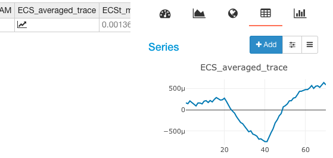

# The Spreadsheet

The spreadsheet allows you to view and download the data in the familiar spreadsheet layout.

## View the Spreadsheet

Just select the **<i class="fa fa-table"></i> Spreadsheet** from the right menu underneath the Project name.

## Protocols

Here you can find the different Protocols used in your Project. If you only use one Protocol, ignore this, if you have
multiple Protocols or you imported additional data, use the dropdown to select data for a specific protocol.

1. Select **Protocols** from above the spreadsheet.
2. Pick the protocol you want to view.
3. Select **More** from above the spreadsheet to select additional information including *Users*, *Device IDs*, *Notes*, *Photos*, *Location* and *Status (e.g. flagged)*

?> **Info:** When you add additional data to your measurements later on, the additional data will be available as
**Imported Data (Custom Data)**.

## More

Select additional data you want to include into the spreadsheet by checking the boxes. Close the menu, by clicking somewhere
outside of the dropdown. The spreadsheet is then updated and the columns with the additional information are appended to the
end. The additional information includes *Users*, *Device IDs*, *Notes*, *Photos*, *Location* and *Status (e.g. flagged)*.

?> **Info:** The settings are not saved, so next time you open this page, you have to make these selections again.

## Download Data

Select **Save** from above the spreadsheet and pick the format you want to use. Currently there are two options available:

1. Comma separated (csv) - Values separated by a comma (standard format to open in Excel)
2. Tab separated (tab) - Values are separated by a tab

## Special Functions

Some of the data in the spreadsheet columns is not just simple values, but a number of values, like a kinetic trace, an image,
a color or the measurement ID. These special cases are described below:

## Measurement ID (Measurement Details)

Click on the number in the **ID** column to navigate to the individual measurement. The measurement will be opened in a new tab.

!> **Note:** Measurement IDs are unique across the PhotosynQ platform, so they are helpful to specifically identify a measurement within your dataset.

## Traces

Some columns are may contain information, that is not just a single value, but a trace. An example would be a Phi2 fluorescence kinetic. In this case a trace <i class="fa fa-line-chart"></i> icon is shown. When hovering over the icon, the trace will be shown, overlaying the series menu on the right. Copying a trace from the spreadsheet, or saving the spreadsheet will return the values of the trace as a comma separated string.

## Images

If a measurement has an image saved with a measurement, either as an additional note or as an answer to a Project question, an image icon <i class="fa fa-picture-o"></i> is shown. When hovering over the icon, the image will be shown, overlaying the series menu on the right. Copying an image from the spreadsheet,  or saving the spreadsheet will return the link to the image on PhotosynQ.

## Color

In some cases, a color can be defined, to represent a value. These colors, can be used for example in scatter plots. In the spreadsheet, the cell background is colored in the specific color. If the color is copied from the spreadsheet, the color will be returned as it was defined, for example `rgba(66, 139, 202, 1)` (color in the spreadsheet <i style="color:rgba(66, 139, 202, 1)" class="fa fa-square"></i>)